# CallInterface、Endpoint 与 EndpointSet：入口及模型关系

核查日期：2026-09-14。基于当前 `codex/agent-model-consolidation` 未提交工作区，
其中 AgentSummary / AgentVersionInfo / AgentVersionSummary 已完成合并试改。
本文记录现有实现，用于下一轮模型评审；不改变 Java、Wire、存储或发现算法。
最新澄清的目标是 **CallInterface → EndpointSet → Endpoint** 三层主干，不计外层 AgentResult，
管理面参考 RAD 共用这套结构；此前移除 EndpointSet 的方向已撤回。
见 [模型关系记录 §12](MODEL_RELATIONSHIPS.md#12-评审后确认的范围与三层模型目标)。

本轮具体模型、调用链、存储/Schema 和测试的二次核对，见 [影响面核查](MODEL_ENDPOINT_IMPACT.md)。

## 1. 六类入口统一关系图

先按用途区分两个面：管理面读取/修改版本定义并查询运行状态；发现面提供同步 Discover、
Watch 以及发布者的注册/注销。**Runtime 是数据来源，不是 API 面的分类。**
`getRuntimeEndpoints` 属于管理面，不属于发现查询。Client `publishAgent` 虽然是 Client API
入口，执行的仍是定义写入，是按 URL/SDK 归属分类时需要单独说明的例外。

实线箭头表示字段包含；虚线表示操作、读取、转换或派生；继承另用带文字的虚线标注。
图中的“运行事实”和“发现组装”是处理过程/事实源，不是新增的公开 Model。
多个箭头指向同一节点表示共用 Java 类型，不表示共用同一个对象实例。

```mermaid
flowchart TB
    subgraph DEF["管理面：定义写入、版本读取、运行状态查询"]
        W["① 定义写入<br/>Admin / Console draft<br/>Client publishAgent"]
        V["② 精确版本读取<br/>getAgentVersion"]
        VD["AgentVersionDetail"]
        CI["AgentDefinitionCallInterface<br/>endpointSourceOrder"]
        W -. "请求携带 callInterfaces；保存版本" .-> CI
        W -. "返回" .-> VD
        V -. "返回" .-> VD
        VD -->|"callInterfaces[]"| CI
        Q["⑥ getRuntimeEndpoints<br/>Admin / Maintainer / Console"]
        CV["ConsoleRuntimeEndpointView<br/>另含 namingServiceRef"]
        S["RuntimeEndpointSnapshot<br/>agentName / protocol / version?"]
        I["RuntimeEndpointSnapshotItem<br/>state / enabled / healthy / lastUpdatedTime"]
        Q -. "Admin / Maintainer 返回" .-> S
        Q -. "Console 返回" .-> CV
        CV -->|"runtimeEndpointSnapshot"| S
        S -->|"items[]"| I
    end

    subgraph DISC["发现面：注册、同步发现、订阅"]
        P["③ register / deregister<br/>ClientRequest → Batch"]
        D["④ discoverAgent<br/>AgentReference + Filter"]
        H["⑤ subscribeAgent<br/>初始查询；变化提示后重查"]
        X["发现组装<br/>定义选择 / binding 匹配 / 来源顺序 / Filter"]
        DR["AgentDiscoveryResult<br/>agentName / version / contentDigest"]
        DC["AgentDiscoveryCallInterface"]
        ES["EndpointSet<br/>source / sourceRevision"]
        DE["AgentDiscoveryEndpoint"]
        H -. "复用 Discover；回调交付完整结果" .-> D
        D -. "执行" .-> X
        X -. "生成" .-> DR
        DR -->|"callInterfaces[]"| DC
        DC -->|"endpointSets[]：按来源顺序"| ES
        ES -->|"endpoints[]"| DE
    end

    R["共享的 Naming 运行事实<br/>发布者贡献 / binding / 状态"]
    B["base.AbstractAgentCallInterface<br/>protocol / protocolVersion<br/>descriptorMediaType / nativeDescriptor"]
    E["Endpoint<br/>uri / transport / priority / weight / metadata<br/>healthy：按场景使用"]
    RB["RuntimeVersionBinding<br/>runtimeVersion / versionRange"]

    CI -. "继承共同协议字段" .-> B
    DC -. "继承共同协议字段" .-> B
    CI -->|"declaredEndpoints[]"| E
    P -->|"请求 endpoints[]"| E
    P -. "完整替换或整份移除当前发布者贡献" .-> R
    R -. "按自然键聚合；可按 version 过滤" .-> S
    CI -. "协议描述 / 声明地址 / 来源顺序" .-> X
    R -. "运行地址 / 命中的 enabled bindings" .-> X
    DE -. "继承地址字段" .-> E
    DE -->|"bindings[]：仅 RUNTIME"| RB
    I -->|"endpoint"| E
    I -->|"bindings[]"| RB
```



图内①写入的具体对象是 `AgentDraftCreateAdminRequest`、`AgentDraftUpdateAdminRequest`
和 `AgentPublishClientRequest`。③对应 Registration / Deregistration 的
`ClientRequest` 和 `Batch`；SDK 注入 namespace 后形成传输对象，用户输入仍不含 namespace。
请求共同基类只复用字段，不再展开到图中。

`Search`、AgentSummary 和 VersionSummary 只提供目录、协议名或版本元数据，不返回完整
CallInterface/Endpoint，因此不进入图中的地址链路。版本 Artifact 导出复用②的定义内容；
历史 A2A 转换可接入①/③，但其兼容策略不在此次评审范围。

## 2. 各入口的实际职责

| 入口 | 地址内容 | 是否依赖已存在的版本定义 | 来源 / 状态的处理 |
| --- | --- | --- | --- |
| ① 创建/修改 draft、Client 发布定义 | CallInterface 的声明地址；不注册运行地址 | 首次可以同时创建 Agent/Version；后续遵守版本生命周期 | 定义保存来源顺序，不保存 runtime bindings/健康状态；发布不等于 Endpoint 注册 |
| ② 查询精确 Version | `AgentVersionDetail.callInterfaces[].declaredEndpoints[]` | 是，可读取管理权限允许的非 online Version | 不查询或混入运行地址；未提交摘要重构也没有改变这个边界 |
| ③ 注册/注销运行地址 | 一个 Agent + protocol 的 `endpoints[]` | 否，允许预注册 | 不提交 descriptor；整个注册 Batch 共用 runtimeVersion/versionRange；Register 不接受 healthy |
| ④ Discover | 选中定义的声明地址与匹配的运行地址 | 是，要求有效可见的 online 定义及来源允许 | 应用 Filter、来源顺序、版本范围；排除 disabled，保留 unhealthy |
| ⑤ Watch | 与④相同的完整 AgentDiscoveryResult | 成功快照遵守④；未找到可进入有界 pending 状态 | 传输通知是变化提示，不直接携带 Endpoint；重查后替换快照，不另定义 Watch Endpoint |
| ⑥ Runtime 管理查询 | 一个 Agent + protocol 的运行地址和管理状态 | 否 | 可包含 disabled；可按 version 匹配 binding；不应用 endpointSourceOrder，不包含 descriptor |

HTTP/gRPC 是这些操作的 Binding，不会各自定义一套 Endpoint。`Endpoint.transport` 表示
**调用目标 Agent 的传输类型**（例如 `HTTP+JSON`），和 Nacos SDK 用 HTTP 还是 gRPC 通信
是两个不同维度。`protocol` 例如 `a2a`，也不同于 URI 的 `https` scheme。

## 3. 四种地址外形，实际共享哪些字段

| 场景 | CallInterface 字段 | Endpoint 外形 | 版本与状态位置 |
| --- | --- | --- | --- |
| 定义 / VersionDetail | 四个共同协议字段 + endpointSourceOrder + declaredEndpoints | `declaredEndpoints[]: Endpoint` | 无 runtime bindings；healthy 禁止 |
| 注册 | 不携带 CallInterface 对象，只有 protocol | `endpoints[]: Endpoint` | runtimeVersion/versionRange 在 Batch 顶层；healthy 禁止 |
| 发现（含 Watch） | 四个共同协议字段 + endpointSets | `endpointSets[].endpoints[]: AgentDiscoveryEndpoint` | RUNTIME 的 bindings/healthy 平铺在 Endpoint 上；DECLARED 均省略 |
| Runtime 管理查询 | 不携带 CallInterface 对象，Snapshot 顶层有 protocol | `items[].endpoint: Endpoint` | bindings/healthy/enabled/state/lastUpdatedTime 在 item 上；内部 endpoint.healthy 被清空 |

这里有两组明确的类复用问题：

1. DefinitionCallInterface 和 DiscoveryCallInterface 已共享四个字段，只是地址集合的表达不同。
2. AgentDiscoveryEndpoint 仅比 Endpoint 增加 bindings；SnapshotItem 又在 endpoint 外重复组织
   bindings 和 healthy。三者表达的地址事实相关，但目前访问方式不同。

继承 `Endpoint` 不增加 JSON 层；`SnapshotItem.endpoint` 的组合会增加一层。
`bindings[]` 是同一地址的版本兼容说明，不应被理解成地址访问主干中的另一层 Version。

## 4. EndpointSet 究竟承载什么

EndpointSet **只用于发现结果及其组装**，不是注册 Batch，也不是运行时管理 Snapshot。
它的作用域是一个发现结果中的某个 CallInterface、某种来源：

| 内容 | 当前承载位置 | 用途 |
| --- | --- | --- |
| 来源 | `EndpointSet.source` | 区分 DECLARED/RUNTIME；不是地址的 transport |
| 来源优先顺序 | `callInterface.endpointSets[]` 的数组顺序 | 来自定义的 endpointSourceOrder；Filter 后保持相对顺序 |
| 来源集合变化标识 | `EndpointSet.sourceRevision` | 集合级相等性 token，不是 Endpoint ID，也不是递增序号 |
| 地址成员 | `EndpointSet.endpoints[]` | 同来源的完整发现地址；可以为空 |
| 已允许但暂无地址 | 存在 EndpointSet 且 `endpoints=[]` | 区别于来源未允许或被 Filter 排除后不返回该 Set |

每个接口最多有两种来源，每种只出现一次。一个 Set 内可以有多种 Endpoint.transport、
多个地址、多个兼容 binding；它不是按 transport、runtimeVersion 或发布者拆组。
同一地址在 DECLARED/RUNTIME 各出现一次时，仍属于不同来源，当前不会跨 Set 合并。

当前实现先构建来源集合/revision，再裁剪 transport、metadata Filter。DECLARED revision
取 Version contentDigest；RUNTIME revision 根据兼容目标命中的公开运行地址与 binding 计算。
完整发现 fingerprint 还包含来源顺序、sourceRevision、过滤后的地址以及协议内容，Watch
用它比较完整快照。因此只把 endpoints 数组取出，会丢失当前比较输入和空来源表达。

例如一个接口定义 `endpointSourceOrder=[RUNTIME, DECLARED]`：

```text
版本详情：
  declaredEndpoints = [固定地址 A]

发现结果（同一个接口）：
  endpointSets = [
    { source: RUNTIME,  sourceRevision: r1, endpoints: [运行地址 B, 运行地址 C] },
    { source: DECLARED, sourceRevision: d1, endpoints: [固定地址 A] }
  ]

运行地址全部消失后：
  endpointSets = [
    { source: RUNTIME,  sourceRevision: r0, endpoints: [] },
    { source: DECLARED, sourceRevision: d1, endpoints: [固定地址 A] }
  ]
```

其中 r0/r1/d1 为说明用 token 简写。版本内容没有变化，所以 d1 不变。
RUNTIME 为空没有删除这个来源偏好；真正调用时的健康筛选、fallback 和负载选择由消费者决定。

## 5. 注册与注销为何无需 EndpointSet

注册已经在请求顶层确定 Agent、protocol、runtimeVersion 和 versionRange，全部地址的来源
也固定为 RUNTIME，所以不需要再给每项地址套 CallInterface 或 EndpointSet。
同一个 Publisher 在 `(namespaceId, agentName, protocol)` 下只有一个完整期望 Batch。

例如一个 Publisher 注册 `[E1, E2, E3]`，再通过 SDK 注销 `[E1, E2]`：

1. SDK 按自然键从本地期望 Batch 中移除 E1/E2。
2. SDK 通过原 owner transport 注册完整剩余 Batch `[E3]`，保留原 runtimeVersion/versionRange。
3. 服务端替换该 Publisher 的贡献，不对整个 Agent 的所有发布者执行局部删除。
4. 如果其他 Publisher 仍贡献 E1/E2，发现聚合结果中它们仍可能存在。
5. 剩余列表为空时，才发送整份 Publication 注销；直接 HTTP DELETE/gRPC Deregister 也是整份注销。

自然键为 namespace + agentName + protocol + normalizedHost + effectivePort + transport。
URI path/query、priority、weight、metadata 不参与身份；不能靠不同 path 注册成两项自然键。
同自然键的多个运行贡献按 binding 聚合；payload 冲突会报错，不是任取一份覆盖。

## 6. 管理 Snapshot 为什么与发现有差异

“同步查询”和“订阅”不是两种数据模型：Client `discoverAgent` 返回的业务结果、
`subscribeAgent` 的初始结果以及后续 SNAPSHOT 回调内的结果，都是 `AgentDiscoveryResult`。
订阅只在外围增加事件类型和不可用状态。管理查询则指 `getRuntimeEndpoints`，属于另一个面。

两者读取同一组运行事实，但使用不同投影规则，不能直接把某次管理 Snapshot 转型成发现结果：

- Snapshot 可返回禁用贡献及其 bindings；Discover 只把匹配目标版本的 enabled bindings 放入结果。
- Snapshot 不要求定义存在，也不要求该协议的定义允许 RUNTIME；Discover 必须同时满足这些条件。
- Snapshot 的 state 由 enabled/healthy 派生，lastUpdatedTime 是 Naming Service 投影的观察时间，
  不是每个 Endpoint 独立的更新时间或 revision。同一 Snapshot 的各项共用该观察时间。
- 多个发布者的贡献聚合后可能形成多个 bindings；每个 binding 表示 runtimeVersion 及其
  可服务的 versionRange，不表示 publisher 身份。
- 声明地址不会进入 Runtime Snapshot，运行地址不会写入 Version content 或 contentDigest。

因此，后续可以共用地址类型，但“定义内容”“发现结果”“运维状态”仍需分别确定返回字段与校验。

### 6.1 两条读取链路与 Watch

管理查询：`Admin getRuntimeEndpoints → AgentRuntimeRegistryService.getRuntimeEndpointSnapshot
→ loadSnapshotItems → Naming ServiceStorage.getData`，返回 RuntimeEndpointSnapshot。
Console 内置部署调用同一 RuntimeRegistryService；独立部署经 Maintainer SDK 调用 Admin，
最后由 ConsoleRuntimeEndpointView 包装 Snapshot 和 Naming 页面所需的 service 引用。

发现查询：`Client discoverAgent → AgentDiscoveryApplicationService.discover
→ resolveCallInterfaces / resolveEndpointSets → AgentRuntimeRegistryService.getRuntimeEndpointSet
→ loadRuntimeEndpoints → Naming ServiceStorage.getData`。服务端直接读取运行事实并完成组装，
客户端不需要额外调用管理 API，也不先请求 RuntimeEndpointSnapshot。

Watch：SDK 初始读取和收到变化提示后的重查均复用 Discover。服务端为了生成变化提示，
使用 `projectCurrentFact → getCurrentRuntimeEndpointSet → ServiceStorage.getPushData` 计算当前投影，
避免依赖延迟刷新的 ServiceInfo 缓存；这个内部投影不是另一种公开结果，也不会直接作为业务
Endpoint 数据推给应用。两类正常查询共享事实源，不代表不同时刻的读取具有事务级快照一致性。

## 7. 下一轮模型收敛需要决定的事项

此处是待评审点，不是已生效的 Wire/存储契约。管理/发现复用 RAD 三层结构的方向已同步到
中英文 Agent 管理规范的 §6.1 评审草案；字段细节和 Schema 更新在实施前确定。

| 事项 | 现状造成的成本 | 下一轮需明确 |
| --- | --- | --- |
| 统一 AgentCallInterface | 两个具体类 + 一个只共享四个字段的 abstract 类 | 定义、运行管理与发现查询共用 endpointSets；保留管理定义的完整来源顺序配置 |
| 统一 Endpoint | Endpoint、DiscoveryEndpoint、SnapshotItem 对同一地址采用不同外形 | bindings 是否合入共同类型；管理状态保留外层组合还是继承，避免双份 healthy |
| 保留并复用 EndpointSet | 当前管理和发现使用不同地址容器 | 按 RAD 保留 CallInterface → EndpointSet → Endpoint；来源、空来源、revision 继续有归属 |
| 保留管理独立查询 | VersionDetail 和 Snapshot 不同入口 | VersionDetail 继续只返回声明地址时，两者仍能共享地址类型；不必强行增加实时聚合 |
| Wire 与存储适配 | 公共类用于序列化、校验、fingerprint、协议 Schema | 管理响应向 RAD 结构收敛；不为合并类型变更发现层级；存储显式排除 runtime/管理观测字段 |

仅减少 Java class 数量无法自动得到三层模型。最终要同时让消费者的访问路径统一，
并复用 EndpointSet 已有的来源级表达。方案确定后再同步中英文 RAD/管理/API
规范、Schema、canonical fingerprint、SDK 与 OpenAPI IT；不能直接删除类型后只修编译。

两类管理读取不必合成一个 API：VersionDetail 查询中的 CallInterface 可以只装载 DECLARED Set，
运行查询中的 CallInterface 只装载 RUNTIME Set；两者与发现结果使用同一组具体模型。
区别由查询上下文和 source 表达，不再由另一套 DefinitionCallInterface / SnapshotItem 地址结构表达。
管理查询可能含 disabled 地址、缺少版本定义，不能照搬 RAD Discover 的全部字段必填/筛选规则。
管理专用字段的具体归属，以及 management sourceRevision 的计算范围，属于下一步字段设计。

**MODEL-D01 继续延期**：未指定 version/label 时，当前 runtime 兼容目标包含全部 online
Version，但协议描述、来源顺序和声明地址仍取 latest；旧在线版本独有的协议/声明地址可能
缺失。此次图展示这个现状，不重新引入 `versions[]` 发现层，也不改变已确认的三层目标。

## 8. 核查依据

- [公共 Agent 模型](../../../api/src/main/java/com/alibaba/nacos/api/ai/model/agent)
- [Client 入口](../../../api/src/main/java/com/alibaba/nacos/api/ai/AgentDiscoveryService.java)
- [Client 定义发布](../../../api/src/main/java/com/alibaba/nacos/api/ai/AgentService.java)
- [Maintainer 入口](../../../maintainer-client/src/main/java/com/alibaba/nacos/maintainer/client/ai/AgentMaintainerService.java)
- [定义与运行地址组装](../../../ai/src/main/java/com/alibaba/nacos/ai/service/agent/AgentDiscoveryApplicationService.java)：resolveCallInterfaces / resolveEndpointSets / declaredEndpointSet
- [运行注册、Snapshot 与 EndpointSet](../../../ai/src/main/java/com/alibaba/nacos/ai/service/agent/runtime/AgentRuntimeRegistryService.java)：register / loadSnapshotItems / loadRuntimeEndpoints
- [Naming 运行状态转换](../../../ai/src/main/java/com/alibaba/nacos/ai/service/agent/runtime/AgentRuntimeEndpointMapper.java)：fromInstance / canonicalPayload
- [版本存储显式投影](../../../ai/src/main/java/com/alibaba/nacos/ai/service/agent/storage/AgentVersionContentSerializer.java)：toStorageProjection
- [完整发现 fingerprint](../../../api/src/main/java/com/alibaba/nacos/api/ai/utils/AgentDiscoveryCanonicalizer.java)：callInterfaceFrames / endpointSetFrames / endpointFrames
- [Watch 重查与回调](../../../client/src/main/java/com/alibaba/nacos/client/ai/watch/AgentWatchManager.java)
- [RAD 规范 §3、§5–6](../../../specs/zh-cn/ai/rad-protocol-spec.md)
- [管理规范 §5–6](../../../specs/zh-cn/ai/agent-management-spec.md)
- [HTTP、gRPC、SDK Binding](../../../specs/zh-cn/ai/agent-api-spec.md)

## 9. 下一轮测试方案

本图仍描述当前实现。最新确认的 healthy 可写、维护字段忽略，以及统一后的字段建议和 16 组验收，见 [MODEL_ENDPOINT_TEST_PLAN.md](MODEL_ENDPOINT_TEST_PLAN.md)。当前图表中的“Register 禁止 healthy”是改造前行为，不是新的目标契约。
