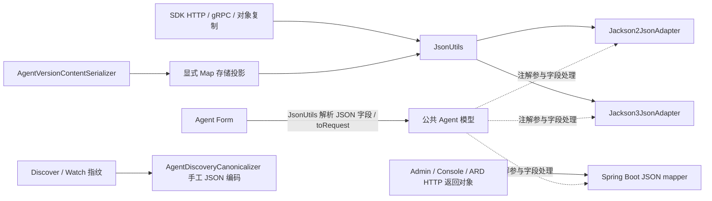

# Model / Form 的 Jackson 注解依赖审计

日期：2026-09-15。审计基线：`44112e45b79b616284440192f0c775fa8611b8fd`。

## 当前提交和本轮范围

用户要求的当前改动已合并为一个新 commit：`44112e45b`，
`Unify Agent endpoint models and request packages`，219 个文件。
提交前重新执行受影响模块 Spotless apply / check 和 48 模块 test-compile，全部通过，
这轮验证没有修改源文件。既有完整测试结果与 CONSOLE-ERR-01 延期待办均已包含在提交中。
没有推送或创建 PR。

本轮审计没有从生产代码移除注解；临时变体均编译到 `/tmp/nacos-jackson-annotation-audit/`。
重点完整覆盖 Agent 公共模型、Agent Form、内部存储模型及历史 A2A，并补充 AI Registry、
MCP、其他公共 DTO 的注解清单。以下区分实际序列化对照结论和仅由代码得出的影响判断。

## 结论

减少业务模型上的 Jackson 注解可行，但不能把“删注解”直接等同于“输出不变”。
应把格式策略落实在具体序列化边界，模型保留协议字段和业务规则。

- Agent 31 个 Java 模型文件中，28 个声明 NON_NULL，共有 2 处 JsonIgnore；另外 3 个为 enum。
- 6 处 NON_NULL 是父子类重复，可以在保留上游注解的前提下移除。本轮六条序列化路径对照一致。
- 其他 NON_NULL 在 JsonUtils 路径上有默认配置承接，但不能据此批量删除：Spring HTTP
  mapper 没有同样的 null 省略策略，且 Jackson 3 的 Map 内容 null 行为也受到注解影响。
- AgentVersionInfo 的两处 JsonIgnore 有明确协议作用，不能只删除；可以通过调整辅助方法命名
  或在 adapter 内配置字段规则移除对注解的依赖。
- 当前 Agent Form 区域 18 个 Java 文件、内部 agent/model 区域 3 个文件、历史 A2A 模型
  13 个文件均没有直接 Jackson import/注解。Form 通过 JsonUtils 解析、toRequest 组合模型，
  仍会间接使用被注解的公共模型，但不需要清理不存在的 Form 注解。

`jackson-annotations` 与 Jackson core/databind 不同：当前 Jackson 2 / 3 都使用这一组注解。
因此它不等于绑定 Jackson 2 实现，但确实让模型携带了 provider 专属元数据。
当前 sdk-java-json-adapter-spec 的 §3.1、§7 允许此依赖；若后续采用更强的模型中立原则，
应同步中英文规范，不能把现行“允许”误写成“已经禁止”。

## 序列化依赖链

- Jackson2JsonAdapter.createObjectMapper 设置 NON_NULL，canonical mapper 复用此设置。
- Jackson3JsonAdapterDelegate 对普通及 canonical mapper 都设置
  JsonInclude.Value(NON_NULL, NON_NULL)，同时控制 bean 值和内容值。
- 旧 JacksonUtils 也设置 NON_NULL。未来清理它不是移除模型注解的前置要求。
- Spring HTTP 使用独立 mapper；ConsoleWebConfig 的自定义目前只设置时区。
  当前仓库没有配置 spring.jackson.default-property-inclusion。
- 新增只作用于 JsonUtils 的规则，不能自动覆盖 Spring HTTP；反过来也一样。
- NacosJsonAdapter 目前只有通用读写和 subtype 注册，没有通用字段别名/枚举值/忽略字段的
  中立映射接口；换一个 provider 不会自动理解这些 Jackson 注解。

## 实际对照结果

临时编译四个变体：原始基线、只删六处继承重复 NON_NULL、删全部 Agent NON_NULL、
只删 AgentVersionInfo 的 JsonIgnore。生产源文件不变。

样本为 26 个可实例化 Agent 模型的空对象，以及 3 个针对性样本：Endpoint 的 Map null、
CallInterface 的 descriptor 内部 null、VersionInfo 的派生 getter。
六条路径为 Jackson 2 / 3 adapter、各自 canonical 输出、Spring Boot 4 自动配置 mapper、
普通 Jackson 2 ObjectMapper。共 4 × 29 × 6 组序列化输出，不计为仓库 UT/IT 数量。

| 临时变更 | 实测结果 | 判断 |
| --- | --- | --- |
| 仅删六处继承重复 NON_NULL | 六条路径的 29 个样本全部与基线一致 | 可清理重复声明，前提是保留上游策略 |
| 删全部 Agent NON_NULL | Spring Boot / 原生 Jackson 2 的 29 个样本全部发生输出变化 | 存在 HTTP 输出契约变化 |
| 删全部 Agent NON_NULL | Jackson 2 adapter 两条路径未变；Jackson 3 两条路径各有 2 个 Map 样本变化 | “adapter 已配 NON_NULL，所以全部冗余”不成立 |
| 删 JsonIgnore | 六条路径均额外输出 onlineCnt / latestVersion | 不是无行为变更的删除 |

例如，Spring mapper 对空 Endpoint 原来输出 `{}`，删除 NON_NULL 后会输出
`uri:null`、`transport:null`、`metadata:null`、`healthy:null`、`bindings:null` 等字段。
空对象样本用于确认 serializer 差异，本身不作为合法注册请求。
RAD 规范 §3.2 明确要求可选值缺失时省略，不能用显式 null 替代。

### 动态 Map null 是独立的兼容点

bean 的可选字段为 null，与 nativeDescriptor 自有 JSON 成员为 null，不能混为一件事。
Jackson 3 基线保留 `nativeDescriptor: {title: "example", optional: null}`；
去掉 NON_NULL 后，相同内存对象会变成 `nativeDescriptor: {title: "example"}`。
本轮另用通过 AgentModelValidator 和 RadModelValidator 的完整发现样本验证：

| 验证 | 原始模型 | 去掉 NON_NULL |
| --- | --- | --- |
| Jackson 3 序列化/反序列化后重算发现指纹 | 与内存指纹一致 | 与内存指纹不一致 |
| Jackson 2 序列化/反序列化后重算发现指纹 | 已不一致 | 仍不一致 |
| 相同内存对象直接计算指纹 | 两个变体一致 | 两个变体一致 |
| 相同定义的存储投影 bytes | 两个变体一致 | 两个变体一致 |

这说明删除注解会给 Jackson 3 引入明确回归，同时暴露当前 Jackson 2 对该样本已有的
动态 null 丢失问题。不能把原有 Jackson 2 问题归因于本次删除，也不能将其忽略后宣称
两套 adapter 完全等价。

Endpoint.metadata 的 null value 被业务校验禁止，该样本仅作 serializer 行为对照；
上面发现指纹验证使用的是允许包含 null 成员的 nativeDescriptor，并已通过领域校验。

AgentVersionContentSerializer 已显式转换成 Map 再写入，所以不能笼统说删除模型注解必然
改变存储 bytes/contentDigest。本轮实测未变。后续如果修改全局 Map 过滤规则，则必须重新
验证 bytes、digest、Artifact 和迁移比较。发现指纹采用自己的编码器；实际风险来自
传输时丢字段后，接收方持有的对象与发送方不同。

## Agent 模型逐项判断

### 2026-09-16：返回形态、descriptor 保真与指纹的补充澄清

此前“不能直接删除”指没有配套调整时不能保证契约不变，不代表显式 null 或派生字段
在技术上不能返回，更不能据此推断现有客户端都会故障。

1. **普通响应字段的 null。** 对没有特殊默认值的 Java 引用字段，缺省和显式 null
   通常都得到 null；宽松消费者可能完全不受影响。区别主要发生在严格 Schema 校验、
   判断 property 是否存在以及区分缺省/显式空值的消费者。当前共享 Endpoint 在 DECLARED
   场景下没有 healthy/bindings/state 等返回字段；全量输出 null 不仅改变可选值，还会输出
   该场景不允许的 property。可以明确修改响应契约并同步 Schema，也可以在序列化边界
   保持省略规则，不能仅凭“多了 null”断定业务必然故障。
2. **nativeDescriptor 当前不是原始 JSON 字符串。** AgentCallInterface 的字段类型是 Object，
   通常持有 Map/List/标量。AgentVersionContentSerializer 将它放入显式 Map 投影，然后
   整体序列化为存储 bytes；“最终以 JSON 内容存储”不意味着内部 descriptor 文本不再解析或
   序列化。合法 JSON 值中的成员 null 必须保留，不能与 Nacos 可选 bean 字段的 null
   省略混为一谈。已有实测还确认：原始基线的 Jackson 2 往返 JSON，以及本次 probe 的
   storageBytes 都丢失了 descriptor.optional:null。前文“存储 bytes 未变”只是两个注解
   变体之间一致，不能理解为存储已保留该成员。这是现有数据保真问题，应在序列化边界修复，
   不应依靠业务模型上的 NON_NULL 注解偶然维持某个 provider 的行为。
3. **两种摘要的含义不同。** AgentDiscoveryCanonicalizer 不调用普通 JSON serializer
   生成指纹，而是递归按 key 排序对象、规范数字表达、保持数组顺序并保留 null。
   既有 UT mapOrderIsIgnoredButContractArrayOrderChangesFingerprint 覆盖嵌套 Map
   换序不改变指纹、契约数组换序改变指纹。该结论是在其他快照字段（包括 contentDigest）
   不变时成立；如果重写存储令 contentDigest 改变，完整发现指纹也会随该字段改变。
   contentDigest 则计算实际存储 bytes 的 SHA-256，读取时校验原始 bytes，不反序列化再
   重算。等价 JSON 的不同字节表达可以有不同 contentDigest，这是现行存储契约。
4. **onlineCnt/latestVersion 是派生值。** 两个 getter 分别计算 onlineVersions.size()
   和 labels.get("latest")，没有额外持久化状态，不存在必须双写同步的两份数据。
   返回它们本身没有业务逻辑错误，但当前 AgentVersionInfo 的管理和 RAD Schema 都设置
   additionalProperties:false，且没有这两个字段，因此严格契约校验会失败。若选择公开，
   应同步 Schema 并接受新增两个长期 API 字段；若希望维持模型简化，可以将辅助方法改为
   非 JavaBean getter 命名，移除 JsonIgnore 而不增加 JSON 字段。
5. **MCP 字段映射主要位于 api 模块。** 包为 api.ai.model.mcp 及其 registry 子包，
   包括 McpTool._meta、McpRegistryServerDetail.$schema/_meta、ServerResponse._meta
   和 McpRegistryServerList.Metadata 的 next_cursor 输入别名。
   ai-registry-adaptor 中核对到的 $schema 注解属于 Skills 的 WellKnownSkillsIndex。
6. **展开字段及多态的具体对象。** JsonAnyGetter/Setter 在 McpRegistryServerDetail.Meta
   的 extensionMeta 和 ServerResponse.Meta 的 additionalMetadata 上，将动态 namespace
   键直接放在 _meta 下；删除会改变输出层级或丢失未知输入键。MCP 多态在 Argument
   （NamedArgument/PositionalArgument）和 Package.transport
   （StdioTransport/StreamableHttpTransport/SseTransport）上，根据 type 选择具体类。
   这些不属于本次 AgentCallInterface/Endpoint 模型。全库扩大检查还涉及 Naming 的
   AbstractHealthChecker 以及 Selector/AbstractSelector，应与 Agent 清理范围分别评估。

本次补充仅核对代码、Schema、既有 UT 和上一轮实验输出，没有修改生产序列化行为或运行新的 IT。

### Schema 的使用位置和指纹差异的实际影响

这里的 Schema 指审计基线中的 Agent Management/RAD 0.1.0（历史内容通过 Git 追溯）。
当前文件路径为 specs/schemas/ai/agent/agent-management.schema.json 和
specs/schemas/ai/rad/rad-protocol.schema.json。当时两份文件的 DeclaredEndpoint 与
AgentVersionInfo 定义使用 additionalProperties:false。当前并未发现生产 HTTP/SDK
响应链路加载这两个文件执行统一 JSON Schema 拦截；不能把“不符合 Schema”写成“服务端
必然拒绝响应”。ai-registry-adaptor 的 AgentEndpointSchemaContractTest.loadSchemas
明确从仓库加载这些文件，并选择具体 $defs 校验。既有运行时领域校验器是 Java 校验代码，
不是动态加载这两个 Schema 的通用 validator。

删除注解的直接实测影响是部分 serializer 会改变 descriptor 内的 null 成员；没有此类
成员时，这一特定问题不触发。普通 API 仍可能成功，但用户取回的协议 JSON 已经不同。
若丢失发生在入库时，服务端和客户端可能都使用同一份缺损内容，指纹仍一致；若发生在
发送给客户端的响应序列化时，服务端原对象与客户端对象的指纹就可能不同。

后一种情况对 Watch 的影响依据当前代码推导如下，尚未单独端到端复现：

- HTTP：AgentHttpWatchWaiter.addChangedIds 将客户端 materializedFingerprint 与服务端
  projection fingerprint 比较；不同立即返回 changed。客户端刷新后若仍得到同样的
  缺损内容，下次提交仍不同，形成反复立即结束的长轮询和 Discover 刷新，增加请求负载。
- gRPC：AgentGrpcWatchService.response 在订阅/重连时根据同样的比较设置
  refreshRequired，可能引入多余刷新；不能由此推断 gRPC 会自动无限推送。
- Listener：AgentWatchManager.handleRefreshSuccess 比较的是客户端前后两份快照指纹。
  如果客户端一直取得同一份缺损内容，会判定 unchanged，因此重复远程刷新不等于重复回调。
- 存储校验：仅删除模型注解的实验中显式 Map 存储投影 bytes 未变，也未证明触发
  contentDigest 校验失败。两种摘要的说明不是新增故障清单；实际需要解决的是数据保真，
  以及由收发内容不同造成的 Watch 无效刷新。

### 对正常存储—发现链路的再次验证：收窄 Watch 风险结论

用户指出，如果入库时 descriptor 的 null 成员已经丢失，随后读取同一存储内容的各方应当
得到一致对象。本轮沿实际代码核对后，这个推理符合当前常规链路：

- AgentPersistenceService.getAgentVersion 通过 AgentVersionStorageService.load 读取并解码
  存储 bytes，再用读回的 CallInterface 构建详情。
- AgentDiscoveryApplicationService.loadOnlineVersion 的缓存由上述读取结果填充，没有发现
  将发布请求中的原始 descriptor 直接填入该发现缓存的路径。
- Discover 和 Watch projection 都从 loadOnlineVersion 返回的定义构造 descriptor。

因此，前述直接将含 null 的内存 AgentDiscoveryResult 序列化再重算指纹的实验，不能替代
这条真实的存储读取链路，也不能据此确认当前正常链路存在 Watch 循环刷新。
序列化不会修改传入的原始 Java 对象：原对象仍包含 null，但输出 JSON 可以不包含，
这正是前一实验中两边不同的来源；并非同一个稳定流程随机保留或丢失 null。

新增临时 StoredDiscoveryProbe 使用当前生产 AgentVersionContentSerializer 完成序列化、
读回，再按发现结构组织 EndpointSet 并使用实际适配器往返和 canonicalizer 计算指纹。
分别验证原模型/删除 NON_NULL、Jackson 2/3 存储、Jackson 2/3 发现序列化，共 8 组组合：

| 模型 | 存储适配器 | 读回 descriptor 是否保留 null 成员 | 两种发现适配器收发指纹 |
| --- | --- | --- | --- |
| 原始注解 | Jackson 2 | 否 | 均一致 |
| 原始注解 | Jackson 3 | 否 | 均一致 |
| 删除 NON_NULL | Jackson 2 | 否 | 均一致 |
| 删除 NON_NULL | Jackson 3 | 否 | 均一致 |

这是进程内存储字节往返实验，没有启动完整服务端或执行 HTTP Watch IT。实验和代码核对
支持的结论是：当前常规链路已有 descriptor 内容丢失，但删除注解并未在本样本中新增
收发指纹差异。前节的 Watch 循环仅是“服务端对象与线上传输值确实不同”条件下的逻辑推演，
该条件在本次验证的常规链路中不成立，不应作为阻塞移除注解的已确认故障。
若未来决定修复 descriptor 保真，应同时验证存储和各输出边界的内容保持与指纹一致性。

证据位于 /tmp/nacos-jackson-annotation-audit/StoredDiscoveryProbe.java、
stored-discovery-results.json 和两个变体目录的 stored-discovery-jackson2/jackson3.log。

### 0.1.1 契约与派生方法的讨论建议

- Endpoint 可以在新的 RAD/Agent 管理 Schema 0.1.1 中声明共享状态字段，并明确它们是否
  允许 null。healthy、enabled、state 未观测/不适用时不能凭空生成“健康”事实；bindings
  表示运行版本关联来源，并非健康状态，声明地址可以为空/缺省。扩大 JSON 字段集合不自动
  引入声明地址的健康探测、运行状态持久化或 endpoint 选择语义。
- 当前 RadModelValidator.validateEndpointSet 对 DECLARED 使用 FORBIDDEN health 规则，
  validateDiscoveryBindings 拒绝 DECLARED 非 null bindings，validateEndpoint 拒绝发现结果
  中非 null enabled/state。仅允许这些字段显式 null 不改变现有 Java 校验；若要返回真实值，
  则需要同步调整 Java 校验及投影，不能只修改 Schema。
- 如果目标是允许删除 NON_NULL 后的普通 HTTP 输出，应同时梳理其他可选字段的 null
  规则、规范文本、Schema 引用和契约测试；只加入 healthy 一项不足以覆盖所有输出变化。
- 当前 AgentCard.tsx 用 versionInfo.labels.latest 和 onlineVersions.length，Agent 详情页
  同样从这两处派生展示值。前端不依赖 versionInfo.onlineCnt/latestVersion JSON 字段。
  建议将 Java 辅助方法改为 onlineCnt()/latestVersion()，前者缺省返回 0、后者可为 null，
  并同步服务端、索引、存储投影和 SDK 测试的调用点；这条方案不需要为两个派生 JSON 字段
  扩大 AgentVersionInfo Schema。若选择公开这两个 JSON 字段，则需要相应的 0.1.1 定义。

上述为本轮讨论建议，本轮没有新增 Schema 版本或修改生产模型。

### 后续确认：本轮去注解范围及 Endpoint 默认值

用户确认采用非 JavaBean 派生方法：onlineCnt() 缺省返回 0，latestVersion() 可返回 null，
移除对应 JsonIgnore，不将两个派生字段加入公开 JSON。用户同时明确 MCP 注解单独讨论，
并倾向于移除 Agent 普通注解，让 serializer 按自身策略处理；本轮不把 descriptor null
保真修复混入删除注解，不扩大为全库 JSON adapter 行为变更。既有 null 成员丢失仍记录为
当前行为，8 组存储往返实验不能解释为任意协议业务都不区分 null 和字段缺省。

Endpoint 默认值建议参考 Naming Instance，并在模型层直接体现：

| 属性 | 建议类型/默认值 | 规则 |
| --- | --- | --- |
| priority | int / 0 | 0..2147483647，越小越优先；保留当前规范化后的有效默认值 |
| weight | double / 1 | 0..10000，同 priority 内的负载权重 |
| healthy | boolean / true | Runtime 注册初始值，运行结果由 Naming 当前健康事实覆盖 |
| enabled | boolean / true | 默认启用，运行结果由 Naming 运维状态覆盖，提交时仍按只读管理字段处理 |

现行 RAD 规范已定义 priority=0、weight=1；缺口是 POJO 本身未给出默认值及清晰 Javadoc。
默认值不会使 DECLARED 地址自动获得健康探测；声明地址的默认 true 应明确为默认可用候选，
不可描述为已经探测通过。由于健康字段从按来源存在变为共有非空属性，建议公共 RAD/管理
Schema 使用 0.2.0，同时同步校验、投影和契约测试，不仅是新增 nullable property。
声明地址上的非默认健康/启用值如何处理及是否构成版本定义，仍须在 Endpoint 语义中明确，
不能在实现时隐式改变存储事实边界。

落地影响须覆盖：DECLARED 健康字段禁止规则、发现结果管理字段禁止规则、注销共享 Endpoint
自带默认字段后的自然键提取、存储显式投影、前端读取类型、SDK 参数默认行为及相关 IT。
本段记录已确认范围与 Endpoint 细化建议，没有实施生产模型或 Schema 变更。

### Agent 落地时的规范同步清单与 MCP 分工

后续目录 review 已决定：公开 Agent/RAD Schema 只保留固定路径下的当前定义，历史修订
通过 Git tag/commit 追溯，文件内契约版本仍为 0.3.0。下面的旧版本和冻结目录描述保留为
原审计阶段记录；当前规则以 specs/schemas/README.md 为准。

用户接受先保持现行 priority=0，最初确认公共 Schema 使用 0.2.0；后续 review 已确认将本轮 RAD、Watch、管理与 Artifact 的公开契约统一为 0.3.0。以下旧版本关系记录的是审计基线。
Schema 与协议正文必须在同一变更中同步，不能只修改机器可读定义：

1. 中英文 rad-protocol-spec：Endpoint 默认值与优先级方向、来源相关字段约束、普通可选值
   的 null 规则、注册/注销及发现选择语义、示例和 Schema 版本引用。
2. 中英文 agent-management-spec、agent-api-spec：统一 Endpoint、管理/客户端输出约定、
   非 getter 派生方法的 SDK 约定及相关请求校验。
3. 中英文 agent-storage-spec：确认默认值与存储投影、运行状态不进入版本内容的边界一致。
   若实际存储字节规则不变，不仅因为公共 Schema 升版就无故升级内部存储版本。
4. sdk-java-json-adapter-spec 仅在确有必要时补充 Agent 模型的去注解边界，不把局部清理
   写成全库禁止注解，不改变本轮保持既有全局序列化器策略的约束。
5. 同步 Schema 索引、$id/$ref、示例和契约测试。当前 agent-artifact 0.2.0 引用管理
   Schema 0.1.0；RAD watch binding 0.1.0 引用 RAD 0.1.0。逐项判断新输出是否仍符合旧引用，
   有影响时为对应契约新增版本或明确版本选择，不覆盖已经冻结的旧 Schema。
6. 同步 OpenAPI / Java SDK 场景矩阵和覆盖登记，并完成针对新输出和旧调用入口的验证。

本线程继续负责 Agent/RAD；MCP 注解由用户交给另一个线程独立讨论处理。
已生成独立交接 Prompt：
`Codex/design/nacos-mcp-json-annotations/HANDOFF_PROMPT.md`。
MCP 线程只读参考本审计，不修改 Agent 模型、RAD Schema 或本线程的未提交工作；涉及全局
JsonUtils 或共享 Spring mapper 的方案需要单列协调，避免并行改动互相覆盖。

“S”表示当前注解可以直接去重但需保留上游注解；“B”表示需核对/迁移序列化边界，
不能批量视为冗余。B 中的输入专用 Request 在 JsonUtils / 显式 Form 路径上更容易清理，
但不能由此保证直接交给 Spring 或原生 mapper 的 JSON 输出仍一致。

| 模型 | 直接注解 | 判断和依赖 |
| --- | --- | --- |
| [AgentCallInterface.java](/Users/xiweng.yy/Documents/java/vibecoding/vscode/nacos/api/src/main/java/com/alibaba/nacos/api/ai/model/agent/AgentCallInterface.java:29) | NON_NULL | B：需由对应 adapter / HTTP mapper 承接 null 省略策略；另核对 Map 内容 null |
| [AgentDiscoveryFilter.java](/Users/xiweng.yy/Documents/java/vibecoding/vscode/nacos/api/src/main/java/com/alibaba/nacos/api/ai/model/agent/AgentDiscoveryFilter.java:30) | NON_NULL | B：需由对应 adapter / HTTP mapper 承接 null 省略策略；另核对 Map 内容 null |
| [AgentDiscoveryRequest.java](/Users/xiweng.yy/Documents/java/vibecoding/vscode/nacos/api/src/main/java/com/alibaba/nacos/api/ai/model/agent/AgentDiscoveryRequest.java:28) | NON_NULL | B：需由对应 adapter / HTTP mapper 承接 null 省略策略 |
| [AgentDiscoveryResult.java](/Users/xiweng.yy/Documents/java/vibecoding/vscode/nacos/api/src/main/java/com/alibaba/nacos/api/ai/model/agent/AgentDiscoveryResult.java:29) | NON_NULL | B：需由对应 adapter / HTTP mapper 承接 null 省略策略 |
| [AgentEndpointRegistrationBatch.java](/Users/xiweng.yy/Documents/java/vibecoding/vscode/nacos/api/src/main/java/com/alibaba/nacos/api/ai/model/agent/AgentEndpointRegistrationBatch.java:29) | NON_NULL | B：需由对应 adapter / HTTP mapper 承接 null 省略策略 |
| [AgentOverview.java](/Users/xiweng.yy/Documents/java/vibecoding/vscode/nacos/api/src/main/java/com/alibaba/nacos/api/ai/model/agent/AgentOverview.java:29) | NON_NULL | B：需由对应 adapter / HTTP mapper 承接 null 省略策略 |
| [AgentProvider.java](/Users/xiweng.yy/Documents/java/vibecoding/vscode/nacos/api/src/main/java/com/alibaba/nacos/api/ai/model/agent/AgentProvider.java:28) | NON_NULL | B：需由对应 adapter / HTTP mapper 承接 null 省略策略 |
| [AgentReference.java](/Users/xiweng.yy/Documents/java/vibecoding/vscode/nacos/api/src/main/java/com/alibaba/nacos/api/ai/model/agent/AgentReference.java:28) | NON_NULL | B：需由对应 adapter / HTTP mapper 承接 null 省略策略 |
| [AgentSearchRequest.java](/Users/xiweng.yy/Documents/java/vibecoding/vscode/nacos/api/src/main/java/com/alibaba/nacos/api/ai/model/agent/AgentSearchRequest.java:29) | NON_NULL | B：需由对应 adapter / HTTP mapper 承接 null 省略策略 |
| [AgentSummary.java](/Users/xiweng.yy/Documents/java/vibecoding/vscode/nacos/api/src/main/java/com/alibaba/nacos/api/ai/model/agent/AgentSummary.java:32) | NON_NULL | S：继承 AbstractAgentMetadata 的同一规则，已实测去重无差异 |
| [AgentVersionDetail.java](/Users/xiweng.yy/Documents/java/vibecoding/vscode/nacos/api/src/main/java/com/alibaba/nacos/api/ai/model/agent/AgentVersionDetail.java:28) | NON_NULL | S：继承 AgentVersionSummary 的同一规则，已实测去重无差异 |
| [AgentVersionInfo.java](/Users/xiweng.yy/Documents/java/vibecoding/vscode/nacos/api/src/main/java/com/alibaba/nacos/api/ai/model/agent/AgentVersionInfo.java:31) | NON_NULL；JsonIgnore × 2 | B：需由对应 adapter / HTTP mapper 承接 null 省略策略；另核对 Map 内容 null；两处派生 getter 不能直接取消忽略 |
| [AgentVersionSummary.java](/Users/xiweng.yy/Documents/java/vibecoding/vscode/nacos/api/src/main/java/com/alibaba/nacos/api/ai/model/agent/AgentVersionSummary.java:33) | NON_NULL | B：需由对应 adapter / HTTP mapper 承接 null 省略策略 |
| [AgentWatchBatchItem.java](/Users/xiweng.yy/Documents/java/vibecoding/vscode/nacos/api/src/main/java/com/alibaba/nacos/api/ai/model/agent/AgentWatchBatchItem.java:28) | NON_NULL | B：需由对应 adapter / HTTP mapper 承接 null 省略策略 |
| [AgentWatchBatchRequest.java](/Users/xiweng.yy/Documents/java/vibecoding/vscode/nacos/api/src/main/java/com/alibaba/nacos/api/ai/model/agent/AgentWatchBatchRequest.java:29) | NON_NULL | B：需由对应 adapter / HTTP mapper 承接 null 省略策略 |
| [AgentWatchBatchResponse.java](/Users/xiweng.yy/Documents/java/vibecoding/vscode/nacos/api/src/main/java/com/alibaba/nacos/api/ai/model/agent/AgentWatchBatchResponse.java:29) | NON_NULL | B：需由对应 adapter / HTTP mapper 承接 null 省略策略 |
| [AgentWatchEventType.java](/Users/xiweng.yy/Documents/java/vibecoding/vscode/nacos/api/src/main/java/com/alibaba/nacos/api/ai/model/agent/AgentWatchEventType.java:1) | 无 | 无注解可移除 |
| [Endpoint.java](/Users/xiweng.yy/Documents/java/vibecoding/vscode/nacos/api/src/main/java/com/alibaba/nacos/api/ai/model/agent/Endpoint.java:30) | NON_NULL | B：需由对应 adapter / HTTP mapper 承接 null 省略策略；另核对 Map 内容 null |
| [EndpointSet.java](/Users/xiweng.yy/Documents/java/vibecoding/vscode/nacos/api/src/main/java/com/alibaba/nacos/api/ai/model/agent/EndpointSet.java:29) | NON_NULL | B：需由对应 adapter / HTTP mapper 承接 null 省略策略 |
| [EndpointSource.java](/Users/xiweng.yy/Documents/java/vibecoding/vscode/nacos/api/src/main/java/com/alibaba/nacos/api/ai/model/agent/EndpointSource.java:1) | 无 | 无注解可移除 |
| [RuntimeEndpointSnapshot.java](/Users/xiweng.yy/Documents/java/vibecoding/vscode/nacos/api/src/main/java/com/alibaba/nacos/api/ai/model/agent/RuntimeEndpointSnapshot.java:28) | NON_NULL | B：需由对应 adapter / HTTP mapper 承接 null 省略策略 |
| [RuntimeEndpointState.java](/Users/xiweng.yy/Documents/java/vibecoding/vscode/nacos/api/src/main/java/com/alibaba/nacos/api/ai/model/agent/RuntimeEndpointState.java:1) | 无 | 无注解可移除 |
| [RuntimeVersionBinding.java](/Users/xiweng.yy/Documents/java/vibecoding/vscode/nacos/api/src/main/java/com/alibaba/nacos/api/ai/model/agent/RuntimeVersionBinding.java:28) | NON_NULL | B：需由对应 adapter / HTTP mapper 承接 null 省略策略 |
| [admin/AgentDraftCreateRequest.java](/Users/xiweng.yy/Documents/java/vibecoding/vscode/nacos/api/src/main/java/com/alibaba/nacos/api/ai/model/agent/admin/AgentDraftCreateRequest.java:28) | NON_NULL | S：继承 AbstractAgentDraftRequest → AbstractAgentMetadata 的同一规则，已实测去重无差异 |
| [admin/AgentDraftUpdateRequest.java](/Users/xiweng.yy/Documents/java/vibecoding/vscode/nacos/api/src/main/java/com/alibaba/nacos/api/ai/model/agent/admin/AgentDraftUpdateRequest.java:33) | NON_NULL | B：需由对应 adapter / HTTP mapper 承接 null 省略策略 |
| [admin/AgentLabelsUpdateRequest.java](/Users/xiweng.yy/Documents/java/vibecoding/vscode/nacos/api/src/main/java/com/alibaba/nacos/api/ai/model/agent/admin/AgentLabelsUpdateRequest.java:30) | NON_NULL | B：需由对应 adapter / HTTP mapper 承接 null 省略策略；另核对 Map 内容 null |
| [admin/AgentUpdateRequest.java](/Users/xiweng.yy/Documents/java/vibecoding/vscode/nacos/api/src/main/java/com/alibaba/nacos/api/ai/model/agent/admin/AgentUpdateRequest.java:30) | NON_NULL | S：继承 AbstractAgentMetadata 的同一规则，已实测去重无差异 |
| [admin/AgentVersionRequest.java](/Users/xiweng.yy/Documents/java/vibecoding/vscode/nacos/api/src/main/java/com/alibaba/nacos/api/ai/model/agent/admin/AgentVersionRequest.java:30) | NON_NULL | B：需由对应 adapter / HTTP mapper 承接 null 省略策略 |
| [base/AbstractAgentDraftRequest.java](/Users/xiweng.yy/Documents/java/vibecoding/vscode/nacos/api/src/main/java/com/alibaba/nacos/api/ai/model/agent/base/AbstractAgentDraftRequest.java:30) | NON_NULL | S：继承 AbstractAgentMetadata 的同一规则，已实测去重无差异 |
| [base/AbstractAgentMetadata.java](/Users/xiweng.yy/Documents/java/vibecoding/vscode/nacos/api/src/main/java/com/alibaba/nacos/api/ai/model/agent/base/AbstractAgentMetadata.java:32) | NON_NULL | B：需由对应 adapter / HTTP mapper 承接 null 省略策略；另核对 Map 内容 null |
| [client/AgentPublishRequest.java](/Users/xiweng.yy/Documents/java/vibecoding/vscode/nacos/api/src/main/java/com/alibaba/nacos/api/ai/model/agent/client/AgentPublishRequest.java:28) | NON_NULL | S：继承 AbstractAgentDraftRequest → AbstractAgentMetadata 的同一规则，已实测去重无差异 |

六处 S 只是减少重复，不是完成模型去 Jackson 化。若父类的注解也删除，S 的前提随之消失。

AgentVersionInfo 更适合将辅助方法改为非 JavaBean getter，例如 `onlineCount()`、
`latestVersion()`，并修改内部调用，或者将派生计算移入已有工具类。
这样可以保留简化后的字段集合，不需要为了忽略两个方法新增一套模型。
这些是公开方法，实施前仍须核对消费者；“忽略 3.3-BETA 兼容”不能作为全库已发布 API
任意重命名的理由。

## 不能直接移除的其他注解

下表为静态依赖分析。它们可以迁移到 serializer/provider 配置或显式协议转换，但在替代
规则就位前直接删除会丢失协议语义。本轮没有修改这些模型或声称已跑过全套反序列化 IT。

| 注解 | 具体模型/字段 | 不能直接删除的原因 |
| --- | --- | --- |
| NON_NULL | ARD 的 ArdCatalog、ArdCatalogEntry、ArdExploreResponse 及内部类、ArdHostInfo、ArdListResponse、ArdSearchResponse；WellKnownSkillEntry、WellKnownSkillsIndex；AiResourceSearchItem/Response | HTTP 直接返回这些对象；省略与 null 的规则必须在 HTTP 边界接替 |
| NON_NULL | MCP registry 的 Input、Icon、McpRegistryServerDetail、McpRegistryServerList、NamedArgument、PositionalArgument、OfficialMeta、Remote、SseTransport、StdioTransport、StreamableHttpTransport 及相应内部类/属性 | 输入与输出共用，包含继承和 Map；需逐边界接替，不能只依赖某一个 mapper 的配置 |
| JsonIgnore | AgentVersionInfo.onlineCnt/latestVersion；ServiceInfo 的派生/内部属性、健康检查方法及 HealthCheckInstancePublishInfo 的派生属性 | 删除会让辅助 getter 或内部属性进入 JSON；需要改方法形态或显式排除规则 |
| JsonProperty | McpTool.meta → `_meta`；McpRegistryServerDetail.schema/meta → `$schema`/`_meta`；其 Meta.publisherMeta → `io.modelcontextprotocol.registry/publisher-provided`；ServerResponse.meta 和 Meta.officialMeta；WellKnownSkillsIndex.schema；SkillWellKnownImportService 的内部索引 schema | Wire key 与 Java 名称不一致，直接删除会改字段名，且读取现有协议字段可能丢数据 |
| JsonAnyGetter / JsonAnySetter | McpRegistryServerDetail.Meta、ServerResponse.Meta 的 extensionMeta | 动态 namespace 元数据需在当前 JSON 层展开和收集；删除会产生 extensionMeta 包装层或丢未知扩展 |
| JsonAlias | McpRegistryServerList.Metadata.nextCursor 的 `next_cursor` | 承担旧字段名读取兼容；删除后旧分页游标不能按原字段读取 |
| JsonTypeInfo / JsonSubTypes / JsonTypeName | MCP Argument、NamedArgument、PositionalArgument、Package.transport、StdioTransport、SseTransport、StreamableHttpTransport | 决定 `type` 和具体子类。Argument 是接口；Package.transport 是 Object，删除后可能无法创建接口实例或变成 Map，丢失类型化结果 |
| JsonTypeInfo / JsonSubTypes | Naming AbstractHealthChecker 及其子类、Selector/AbstractSelector | 已有 subtype 注册需要和 discriminator 规则配合，注册子类本身不等于配置如何读 type |
| JsonValue / JsonCreator | Icon.MimeType、Icon.Theme | Java enum 名称与 `image/png`、`light` 等协议值不同；需要 adapter 负责编码和解析规则 |
| JsonIgnoreProperties(ignoreUnknown=true) | MCP registry 相关类，完整声明见下方清单 | JsonUtils 已忽略未知字段，但严格 mapper/外部 Registry 响应依赖此容错；继承重复可进一步去重，不能全局关闭注解后假定兼容 |
| JsonFormat(STRING) | ConfigBasicInfo、ConfigInfoBase、ConfigHistoryInfo、Capacity 的 long id | 输出类型会从字符串变为数字，可能造成浏览器大整数精度丢失 |
| JsonProperty | StsCredential 中 AccessKeyId、AccessKeySecret、SecurityToken 等 | 外部返回字段大小写不同，删除会使凭据解析不完整 |

还有两类应细分：

- `McpRegistryServerList.Metadata` 的 `JsonProperty("nextCursor")` 与 Bean 属性同名，
  在当前默认命名策略下属于去重候选；必须保留 `JsonAlias("next_cursor")`。
- `Icon.src` 的 JsonProperty 虽然同名，但带 `required=true` 元数据，不能仅按同名判定
  没有作用。也不能声称它一定能校验普通 setter POJO 的必填性：需要分别核对运行时校验和
  元数据使用者，再决定删除。

Naming 的 Instance、ServiceInfo、MetricsInfo 与 MetricsInfoVo 也声明了 NON_NULL。
它们属于全库扩展范围，需单独验证发布版本兼容；不把 Agent 六处实测结论推广到这些对象。

## 建议的后续改造顺序与验证

1. 清理已有父类规则覆盖的重复声明，优先六处 Agent NON_NULL；不改变 JSON 策略。
2. 将 Agent / RAD / ARD 的空值策略统一到具体 adapter 与 HTTP mapper 边界，明确区分
   bean 字段 null、Map 成员 null、空数组/空 Map、false 和 0。避免一次全局切换波及
   Config/Naming；针对当前 Map null 差异先建立明确契约和回归。
3. 调整 AgentVersionInfo 的辅助方法，使模型无需 JsonIgnore；完成实际消费者核对。
4. MCP 特殊 key、展开字段、枚举和多态属于独立协议绑定，可以在后续 provider 的
   MixIn/codec 或显式转换中承接。MixIn 仍是 Jackson 实现细节，应留在实现模块，并同时
   接入 SDK 与 HTTP converter；不要只移动 import 却漏一条入口。
5. 不建议为了删除 Jackson 注解新建一组一一对应的 NacosJsonInclude/NacosJsonIgnore 注解，
   或复制整套 DTO。它们会增加新的维护体系，却不能消除协议映射本身。

实施前同步 sdk-java-json-adapter-spec 中英文本对模型依赖与 null 策略的说明；保持 RAD
现有“缺失可选字段省略”和 descriptor 任意 JSON 值契约，不把新输出当作规范默认接受。
不能只因为现有 API 未再引用 core/databind，就移除 api/pom.xml 的 jackson-annotations：
其他公共模型仍使用它。

验收矩阵至少包括：

| 层次 | 必测内容 |
| --- | --- |
| JSON adapter | Jackson 2 only / Jackson 3 only / 共存 auto；普通与 canonical；缺失、null、空集合、false/0、嵌套 Map null；输入对象复制往返 |
| Schema | RAD/Agent/ARD 正反例；缺失与显式 null 区别；派生字段不透出；特殊 key、枚举、多态、别名与未知扩展 |
| SDK | 默认与 Jackson 3 的 Agent 发布/搜索/发现/Watch/注册/注销；非法输入保留校验错误，不能因序列化删掉非法值而绕过校验 |
| HTTP | Admin、Client、合并 Console、独立 Console 和 ARD 各自实际 mapper 的输出；保留已记录的 Console 错误码延期项，不能与注解修改混合归因 |
| 存储与派生数据 | 同输入 bytes/digest、Artifact、A2A 迁移比较、Agent 索引及 Watch 指纹；端到端传输后重算一致 |
| 公共消费者 | 六处继承、辅助方法调用和已发布其他模型的源码/二进制契约；不以第三方自定义 mapper 行为代替 Nacos 边界验收 |

## 完整注解声明清单

全仓已跟踪生产 Java 中，共发现 73 个含 Jackson 注解声明的文件，其中 59 个位于 AI / AI
Registry 相关区域。清单包含 DTO 命名以外的 pojo、selector 和内部嵌套对象，避免只按 model
目录漏掉依赖。列出的都是声明位置，继承影响另按上文分析；不是宣称这 73 个文件都已动态
验证。未发现生产模型使用 JsonSerialize/JsonDeserialize 绑定 databind 实现类。

| 文件 | 直接注解（去重） |
| --- | --- |
| [ai-registry-adaptor/src/main/java/com/alibaba/nacos/airegistry/model/ard/ArdCatalog.java](/Users/xiweng.yy/Documents/java/vibecoding/vscode/nacos/ai-registry-adaptor/src/main/java/com/alibaba/nacos/airegistry/model/ard/ArdCatalog.java:29) | JsonInclude |
| [ai-registry-adaptor/src/main/java/com/alibaba/nacos/airegistry/model/ard/ArdCatalogEntry.java](/Users/xiweng.yy/Documents/java/vibecoding/vscode/nacos/ai-registry-adaptor/src/main/java/com/alibaba/nacos/airegistry/model/ard/ArdCatalogEntry.java:31) | JsonInclude |
| [ai-registry-adaptor/src/main/java/com/alibaba/nacos/airegistry/model/ard/ArdExploreResponse.java](/Users/xiweng.yy/Documents/java/vibecoding/vscode/nacos/ai-registry-adaptor/src/main/java/com/alibaba/nacos/airegistry/model/ard/ArdExploreResponse.java:31) | JsonInclude |
| [ai-registry-adaptor/src/main/java/com/alibaba/nacos/airegistry/model/ard/ArdHostInfo.java](/Users/xiweng.yy/Documents/java/vibecoding/vscode/nacos/ai-registry-adaptor/src/main/java/com/alibaba/nacos/airegistry/model/ard/ArdHostInfo.java:28) | JsonInclude |
| [ai-registry-adaptor/src/main/java/com/alibaba/nacos/airegistry/model/ard/ArdListResponse.java](/Users/xiweng.yy/Documents/java/vibecoding/vscode/nacos/ai-registry-adaptor/src/main/java/com/alibaba/nacos/airegistry/model/ard/ArdListResponse.java:29) | JsonInclude |
| [ai-registry-adaptor/src/main/java/com/alibaba/nacos/airegistry/model/ard/ArdSearchResponse.java](/Users/xiweng.yy/Documents/java/vibecoding/vscode/nacos/ai-registry-adaptor/src/main/java/com/alibaba/nacos/airegistry/model/ard/ArdSearchResponse.java:29) | JsonInclude |
| [ai-registry-adaptor/src/main/java/com/alibaba/nacos/airegistry/model/skills/WellKnownSkillEntry.java](/Users/xiweng.yy/Documents/java/vibecoding/vscode/nacos/ai-registry-adaptor/src/main/java/com/alibaba/nacos/airegistry/model/skills/WellKnownSkillEntry.java:28) | JsonInclude |
| [ai-registry-adaptor/src/main/java/com/alibaba/nacos/airegistry/model/skills/WellKnownSkillsIndex.java](/Users/xiweng.yy/Documents/java/vibecoding/vscode/nacos/ai-registry-adaptor/src/main/java/com/alibaba/nacos/airegistry/model/skills/WellKnownSkillsIndex.java:29) | JsonInclude, JsonProperty |
| [api/src/main/java/com/alibaba/nacos/api/ai/model/agent/AgentCallInterface.java](/Users/xiweng.yy/Documents/java/vibecoding/vscode/nacos/api/src/main/java/com/alibaba/nacos/api/ai/model/agent/AgentCallInterface.java:29) | JsonInclude |
| [api/src/main/java/com/alibaba/nacos/api/ai/model/agent/AgentDiscoveryFilter.java](/Users/xiweng.yy/Documents/java/vibecoding/vscode/nacos/api/src/main/java/com/alibaba/nacos/api/ai/model/agent/AgentDiscoveryFilter.java:30) | JsonInclude |
| [api/src/main/java/com/alibaba/nacos/api/ai/model/agent/AgentDiscoveryRequest.java](/Users/xiweng.yy/Documents/java/vibecoding/vscode/nacos/api/src/main/java/com/alibaba/nacos/api/ai/model/agent/AgentDiscoveryRequest.java:28) | JsonInclude |
| [api/src/main/java/com/alibaba/nacos/api/ai/model/agent/AgentDiscoveryResult.java](/Users/xiweng.yy/Documents/java/vibecoding/vscode/nacos/api/src/main/java/com/alibaba/nacos/api/ai/model/agent/AgentDiscoveryResult.java:29) | JsonInclude |
| [api/src/main/java/com/alibaba/nacos/api/ai/model/agent/AgentEndpointRegistrationBatch.java](/Users/xiweng.yy/Documents/java/vibecoding/vscode/nacos/api/src/main/java/com/alibaba/nacos/api/ai/model/agent/AgentEndpointRegistrationBatch.java:29) | JsonInclude |
| [api/src/main/java/com/alibaba/nacos/api/ai/model/agent/AgentOverview.java](/Users/xiweng.yy/Documents/java/vibecoding/vscode/nacos/api/src/main/java/com/alibaba/nacos/api/ai/model/agent/AgentOverview.java:29) | JsonInclude |
| [api/src/main/java/com/alibaba/nacos/api/ai/model/agent/AgentProvider.java](/Users/xiweng.yy/Documents/java/vibecoding/vscode/nacos/api/src/main/java/com/alibaba/nacos/api/ai/model/agent/AgentProvider.java:28) | JsonInclude |
| [api/src/main/java/com/alibaba/nacos/api/ai/model/agent/AgentReference.java](/Users/xiweng.yy/Documents/java/vibecoding/vscode/nacos/api/src/main/java/com/alibaba/nacos/api/ai/model/agent/AgentReference.java:28) | JsonInclude |
| [api/src/main/java/com/alibaba/nacos/api/ai/model/agent/AgentSearchRequest.java](/Users/xiweng.yy/Documents/java/vibecoding/vscode/nacos/api/src/main/java/com/alibaba/nacos/api/ai/model/agent/AgentSearchRequest.java:29) | JsonInclude |
| [api/src/main/java/com/alibaba/nacos/api/ai/model/agent/AgentSummary.java](/Users/xiweng.yy/Documents/java/vibecoding/vscode/nacos/api/src/main/java/com/alibaba/nacos/api/ai/model/agent/AgentSummary.java:32) | JsonInclude |
| [api/src/main/java/com/alibaba/nacos/api/ai/model/agent/AgentVersionDetail.java](/Users/xiweng.yy/Documents/java/vibecoding/vscode/nacos/api/src/main/java/com/alibaba/nacos/api/ai/model/agent/AgentVersionDetail.java:28) | JsonInclude |
| [api/src/main/java/com/alibaba/nacos/api/ai/model/agent/AgentVersionInfo.java](/Users/xiweng.yy/Documents/java/vibecoding/vscode/nacos/api/src/main/java/com/alibaba/nacos/api/ai/model/agent/AgentVersionInfo.java:31) | JsonInclude, JsonIgnore |
| [api/src/main/java/com/alibaba/nacos/api/ai/model/agent/AgentVersionSummary.java](/Users/xiweng.yy/Documents/java/vibecoding/vscode/nacos/api/src/main/java/com/alibaba/nacos/api/ai/model/agent/AgentVersionSummary.java:33) | JsonInclude |
| [api/src/main/java/com/alibaba/nacos/api/ai/model/agent/AgentWatchBatchItem.java](/Users/xiweng.yy/Documents/java/vibecoding/vscode/nacos/api/src/main/java/com/alibaba/nacos/api/ai/model/agent/AgentWatchBatchItem.java:28) | JsonInclude |
| [api/src/main/java/com/alibaba/nacos/api/ai/model/agent/AgentWatchBatchRequest.java](/Users/xiweng.yy/Documents/java/vibecoding/vscode/nacos/api/src/main/java/com/alibaba/nacos/api/ai/model/agent/AgentWatchBatchRequest.java:29) | JsonInclude |
| [api/src/main/java/com/alibaba/nacos/api/ai/model/agent/AgentWatchBatchResponse.java](/Users/xiweng.yy/Documents/java/vibecoding/vscode/nacos/api/src/main/java/com/alibaba/nacos/api/ai/model/agent/AgentWatchBatchResponse.java:29) | JsonInclude |
| [api/src/main/java/com/alibaba/nacos/api/ai/model/agent/Endpoint.java](/Users/xiweng.yy/Documents/java/vibecoding/vscode/nacos/api/src/main/java/com/alibaba/nacos/api/ai/model/agent/Endpoint.java:30) | JsonInclude |
| [api/src/main/java/com/alibaba/nacos/api/ai/model/agent/EndpointSet.java](/Users/xiweng.yy/Documents/java/vibecoding/vscode/nacos/api/src/main/java/com/alibaba/nacos/api/ai/model/agent/EndpointSet.java:29) | JsonInclude |
| [api/src/main/java/com/alibaba/nacos/api/ai/model/agent/RuntimeEndpointSnapshot.java](/Users/xiweng.yy/Documents/java/vibecoding/vscode/nacos/api/src/main/java/com/alibaba/nacos/api/ai/model/agent/RuntimeEndpointSnapshot.java:28) | JsonInclude |
| [api/src/main/java/com/alibaba/nacos/api/ai/model/agent/RuntimeVersionBinding.java](/Users/xiweng.yy/Documents/java/vibecoding/vscode/nacos/api/src/main/java/com/alibaba/nacos/api/ai/model/agent/RuntimeVersionBinding.java:28) | JsonInclude |
| [api/src/main/java/com/alibaba/nacos/api/ai/model/agent/admin/AgentDraftCreateRequest.java](/Users/xiweng.yy/Documents/java/vibecoding/vscode/nacos/api/src/main/java/com/alibaba/nacos/api/ai/model/agent/admin/AgentDraftCreateRequest.java:28) | JsonInclude |
| [api/src/main/java/com/alibaba/nacos/api/ai/model/agent/admin/AgentDraftUpdateRequest.java](/Users/xiweng.yy/Documents/java/vibecoding/vscode/nacos/api/src/main/java/com/alibaba/nacos/api/ai/model/agent/admin/AgentDraftUpdateRequest.java:33) | JsonInclude |
| [api/src/main/java/com/alibaba/nacos/api/ai/model/agent/admin/AgentLabelsUpdateRequest.java](/Users/xiweng.yy/Documents/java/vibecoding/vscode/nacos/api/src/main/java/com/alibaba/nacos/api/ai/model/agent/admin/AgentLabelsUpdateRequest.java:30) | JsonInclude |
| [api/src/main/java/com/alibaba/nacos/api/ai/model/agent/admin/AgentUpdateRequest.java](/Users/xiweng.yy/Documents/java/vibecoding/vscode/nacos/api/src/main/java/com/alibaba/nacos/api/ai/model/agent/admin/AgentUpdateRequest.java:30) | JsonInclude |
| [api/src/main/java/com/alibaba/nacos/api/ai/model/agent/admin/AgentVersionRequest.java](/Users/xiweng.yy/Documents/java/vibecoding/vscode/nacos/api/src/main/java/com/alibaba/nacos/api/ai/model/agent/admin/AgentVersionRequest.java:30) | JsonInclude |
| [api/src/main/java/com/alibaba/nacos/api/ai/model/agent/base/AbstractAgentDraftRequest.java](/Users/xiweng.yy/Documents/java/vibecoding/vscode/nacos/api/src/main/java/com/alibaba/nacos/api/ai/model/agent/base/AbstractAgentDraftRequest.java:30) | JsonInclude |
| [api/src/main/java/com/alibaba/nacos/api/ai/model/agent/base/AbstractAgentMetadata.java](/Users/xiweng.yy/Documents/java/vibecoding/vscode/nacos/api/src/main/java/com/alibaba/nacos/api/ai/model/agent/base/AbstractAgentMetadata.java:32) | JsonInclude |
| [api/src/main/java/com/alibaba/nacos/api/ai/model/agent/client/AgentPublishRequest.java](/Users/xiweng.yy/Documents/java/vibecoding/vscode/nacos/api/src/main/java/com/alibaba/nacos/api/ai/model/agent/client/AgentPublishRequest.java:28) | JsonInclude |
| [api/src/main/java/com/alibaba/nacos/api/ai/model/mcp/McpTool.java](/Users/xiweng.yy/Documents/java/vibecoding/vscode/nacos/api/src/main/java/com/alibaba/nacos/api/ai/model/mcp/McpTool.java:41) | JsonProperty |
| [api/src/main/java/com/alibaba/nacos/api/ai/model/mcp/registry/Argument.java](/Users/xiweng.yy/Documents/java/vibecoding/vscode/nacos/api/src/main/java/com/alibaba/nacos/api/ai/model/mcp/registry/Argument.java:28) | JsonTypeInfo, JsonSubTypes |
| [api/src/main/java/com/alibaba/nacos/api/ai/model/mcp/registry/Icon.java](/Users/xiweng.yy/Documents/java/vibecoding/vscode/nacos/api/src/main/java/com/alibaba/nacos/api/ai/model/mcp/registry/Icon.java:38) | JsonInclude, JsonIgnoreProperties, JsonProperty, JsonValue, JsonCreator |
| [api/src/main/java/com/alibaba/nacos/api/ai/model/mcp/registry/Input.java](/Users/xiweng.yy/Documents/java/vibecoding/vscode/nacos/api/src/main/java/com/alibaba/nacos/api/ai/model/mcp/registry/Input.java:29) | JsonInclude, JsonIgnoreProperties |
| [api/src/main/java/com/alibaba/nacos/api/ai/model/mcp/registry/InputWithVariables.java](/Users/xiweng.yy/Documents/java/vibecoding/vscode/nacos/api/src/main/java/com/alibaba/nacos/api/ai/model/mcp/registry/InputWithVariables.java:28) | JsonIgnoreProperties |
| [api/src/main/java/com/alibaba/nacos/api/ai/model/mcp/registry/KeyValueInput.java](/Users/xiweng.yy/Documents/java/vibecoding/vscode/nacos/api/src/main/java/com/alibaba/nacos/api/ai/model/mcp/registry/KeyValueInput.java:26) | JsonIgnoreProperties |
| [api/src/main/java/com/alibaba/nacos/api/ai/model/mcp/registry/McpErrorResponse.java](/Users/xiweng.yy/Documents/java/vibecoding/vscode/nacos/api/src/main/java/com/alibaba/nacos/api/ai/model/mcp/registry/McpErrorResponse.java:26) | JsonIgnoreProperties |
| [api/src/main/java/com/alibaba/nacos/api/ai/model/mcp/registry/McpRegistryServerDetail.java](/Users/xiweng.yy/Documents/java/vibecoding/vscode/nacos/api/src/main/java/com/alibaba/nacos/api/ai/model/mcp/registry/McpRegistryServerDetail.java:34) | JsonInclude, JsonIgnoreProperties, JsonProperty, JsonAnySetter, JsonAnyGetter |
| [api/src/main/java/com/alibaba/nacos/api/ai/model/mcp/registry/McpRegistryServerList.java](/Users/xiweng.yy/Documents/java/vibecoding/vscode/nacos/api/src/main/java/com/alibaba/nacos/api/ai/model/mcp/registry/McpRegistryServerList.java:31) | JsonInclude, JsonIgnoreProperties, JsonProperty, JsonAlias |
| [api/src/main/java/com/alibaba/nacos/api/ai/model/mcp/registry/NamedArgument.java](/Users/xiweng.yy/Documents/java/vibecoding/vscode/nacos/api/src/main/java/com/alibaba/nacos/api/ai/model/mcp/registry/NamedArgument.java:28) | JsonTypeName, JsonIgnoreProperties, JsonInclude |
| [api/src/main/java/com/alibaba/nacos/api/ai/model/mcp/registry/OfficialMeta.java](/Users/xiweng.yy/Documents/java/vibecoding/vscode/nacos/api/src/main/java/com/alibaba/nacos/api/ai/model/mcp/registry/OfficialMeta.java:27) | JsonInclude, JsonIgnoreProperties |
| [api/src/main/java/com/alibaba/nacos/api/ai/model/mcp/registry/Package.java](/Users/xiweng.yy/Documents/java/vibecoding/vscode/nacos/api/src/main/java/com/alibaba/nacos/api/ai/model/mcp/registry/Package.java:30) | JsonIgnoreProperties, JsonTypeInfo, JsonSubTypes |
| [api/src/main/java/com/alibaba/nacos/api/ai/model/mcp/registry/PositionalArgument.java](/Users/xiweng.yy/Documents/java/vibecoding/vscode/nacos/api/src/main/java/com/alibaba/nacos/api/ai/model/mcp/registry/PositionalArgument.java:28) | JsonTypeName, JsonInclude, JsonIgnoreProperties |
| [api/src/main/java/com/alibaba/nacos/api/ai/model/mcp/registry/Remote.java](/Users/xiweng.yy/Documents/java/vibecoding/vscode/nacos/api/src/main/java/com/alibaba/nacos/api/ai/model/mcp/registry/Remote.java:29) | JsonInclude, JsonIgnoreProperties |
| [api/src/main/java/com/alibaba/nacos/api/ai/model/mcp/registry/Repository.java](/Users/xiweng.yy/Documents/java/vibecoding/vscode/nacos/api/src/main/java/com/alibaba/nacos/api/ai/model/mcp/registry/Repository.java:26) | JsonIgnoreProperties |
| [api/src/main/java/com/alibaba/nacos/api/ai/model/mcp/registry/ServerResponse.java](/Users/xiweng.yy/Documents/java/vibecoding/vscode/nacos/api/src/main/java/com/alibaba/nacos/api/ai/model/mcp/registry/ServerResponse.java:33) | JsonIgnoreProperties, JsonProperty, JsonInclude, JsonAnySetter, JsonAnyGetter |
| [api/src/main/java/com/alibaba/nacos/api/ai/model/mcp/registry/ServerVersionDetail.java](/Users/xiweng.yy/Documents/java/vibecoding/vscode/nacos/api/src/main/java/com/alibaba/nacos/api/ai/model/mcp/registry/ServerVersionDetail.java:33) | JsonIgnoreProperties |
| [api/src/main/java/com/alibaba/nacos/api/ai/model/mcp/registry/SseTransport.java](/Users/xiweng.yy/Documents/java/vibecoding/vscode/nacos/api/src/main/java/com/alibaba/nacos/api/ai/model/mcp/registry/SseTransport.java:31) | JsonTypeName, JsonInclude, JsonIgnoreProperties |
| [api/src/main/java/com/alibaba/nacos/api/ai/model/mcp/registry/StdioTransport.java](/Users/xiweng.yy/Documents/java/vibecoding/vscode/nacos/api/src/main/java/com/alibaba/nacos/api/ai/model/mcp/registry/StdioTransport.java:28) | JsonTypeName, JsonInclude, JsonIgnoreProperties |
| [api/src/main/java/com/alibaba/nacos/api/ai/model/mcp/registry/StreamableHttpTransport.java](/Users/xiweng.yy/Documents/java/vibecoding/vscode/nacos/api/src/main/java/com/alibaba/nacos/api/ai/model/mcp/registry/StreamableHttpTransport.java:31) | JsonTypeName, JsonInclude, JsonIgnoreProperties |
| [api/src/main/java/com/alibaba/nacos/api/ai/model/search/AiResourceSearchItem.java](/Users/xiweng.yy/Documents/java/vibecoding/vscode/nacos/api/src/main/java/com/alibaba/nacos/api/ai/model/search/AiResourceSearchItem.java:31) | JsonInclude |
| [api/src/main/java/com/alibaba/nacos/api/ai/model/search/AiResourceSearchResponse.java](/Users/xiweng.yy/Documents/java/vibecoding/vscode/nacos/api/src/main/java/com/alibaba/nacos/api/ai/model/search/AiResourceSearchResponse.java:30) | JsonInclude |
| [api/src/main/java/com/alibaba/nacos/api/config/model/ConfigBasicInfo.java](/Users/xiweng.yy/Documents/java/vibecoding/vscode/nacos/api/src/main/java/com/alibaba/nacos/api/config/model/ConfigBasicInfo.java:43) | JsonFormat |
| [api/src/main/java/com/alibaba/nacos/api/naming/pojo/Instance.java](/Users/xiweng.yy/Documents/java/vibecoding/vscode/nacos/api/src/main/java/com/alibaba/nacos/api/naming/pojo/Instance.java:39) | JsonInclude |
| [api/src/main/java/com/alibaba/nacos/api/naming/pojo/ServiceInfo.java](/Users/xiweng.yy/Documents/java/vibecoding/vscode/nacos/api/src/main/java/com/alibaba/nacos/api/naming/pojo/ServiceInfo.java:37) | JsonInclude, JsonIgnore |
| [api/src/main/java/com/alibaba/nacos/api/naming/pojo/healthcheck/AbstractHealthChecker.java](/Users/xiweng.yy/Documents/java/vibecoding/vscode/nacos/api/src/main/java/com/alibaba/nacos/api/naming/pojo/healthcheck/AbstractHealthChecker.java:35) | JsonTypeInfo, JsonSubTypes, JsonIgnore |
| [api/src/main/java/com/alibaba/nacos/api/naming/pojo/healthcheck/impl/Http.java](/Users/xiweng.yy/Documents/java/vibecoding/vscode/nacos/api/src/main/java/com/alibaba/nacos/api/naming/pojo/healthcheck/impl/Http.java:74) | JsonIgnore |
| [api/src/main/java/com/alibaba/nacos/api/naming/pojo/maintainer/MetricsInfo.java](/Users/xiweng.yy/Documents/java/vibecoding/vscode/nacos/api/src/main/java/com/alibaba/nacos/api/naming/pojo/maintainer/MetricsInfo.java:28) | JsonInclude |
| [api/src/main/java/com/alibaba/nacos/api/selector/AbstractSelector.java](/Users/xiweng.yy/Documents/java/vibecoding/vscode/nacos/api/src/main/java/com/alibaba/nacos/api/selector/AbstractSelector.java:33) | JsonTypeInfo |
| [api/src/main/java/com/alibaba/nacos/api/selector/Selector.java](/Users/xiweng.yy/Documents/java/vibecoding/vscode/nacos/api/src/main/java/com/alibaba/nacos/api/selector/Selector.java:39) | JsonTypeInfo |
| [client-basic/src/main/java/com/alibaba/nacos/client/auth/ram/identify/StsCredential.java](/Users/xiweng.yy/Documents/java/vibecoding/vscode/nacos/client-basic/src/main/java/com/alibaba/nacos/client/auth/ram/identify/StsCredential.java:30) | JsonProperty |
| [config/src/main/java/com/alibaba/nacos/config/server/model/ConfigHistoryInfo.java](/Users/xiweng.yy/Documents/java/vibecoding/vscode/nacos/config/src/main/java/com/alibaba/nacos/config/server/model/ConfigHistoryInfo.java:34) | JsonFormat |
| [config/src/main/java/com/alibaba/nacos/config/server/model/ConfigInfoBase.java](/Users/xiweng.yy/Documents/java/vibecoding/vscode/nacos/config/src/main/java/com/alibaba/nacos/config/server/model/ConfigInfoBase.java:37) | JsonFormat |
| [config/src/main/java/com/alibaba/nacos/config/server/model/capacity/Capacity.java](/Users/xiweng.yy/Documents/java/vibecoding/vscode/nacos/config/src/main/java/com/alibaba/nacos/config/server/model/capacity/Capacity.java:34) | JsonFormat |
| [naming/src/main/java/com/alibaba/nacos/naming/core/v2/pojo/HealthCheckInstancePublishInfo.java](/Users/xiweng.yy/Documents/java/vibecoding/vscode/nacos/naming/src/main/java/com/alibaba/nacos/naming/core/v2/pojo/HealthCheckInstancePublishInfo.java:76) | JsonIgnore |
| [naming/src/main/java/com/alibaba/nacos/naming/model/vo/MetricsInfoVo.java](/Users/xiweng.yy/Documents/java/vibecoding/vscode/nacos/naming/src/main/java/com/alibaba/nacos/naming/model/vo/MetricsInfoVo.java:30) | JsonInclude |
| [plugin-default-impl/nacos-default-ai-importer-plugin/src/main/java/com/alibaba/nacos/plugin/ai/importer/defaultimpl/skill/SkillWellKnownImportService.java](/Users/xiweng.yy/Documents/java/vibecoding/vscode/nacos/plugin-default-impl/nacos-default-ai-importer-plugin/src/main/java/com/alibaba/nacos/plugin/ai/importer/defaultimpl/skill/SkillWellKnownImportService.java:694) | JsonProperty |

## 证据与限制

- 提交前检查：/tmp/nacos-jackson-annotation-audit/spotless-apply.log、spotless-check.log、test-compile.log。
- 注解静态清单：annotation-inventory.json。
- 四变体序列化样本：AnnotationProbe.java、run-probe.py、probe-results.json、probe-summary.json。
- 合法发现样本：FingerprintProbe.java、fingerprint-results.json 及 baseline/non_null_removed 的 fingerprint.log。
- 路径均位于 /tmp/nacos-jackson-annotation-audit/，未加入仓库测试；实验没有启动 HTTP 服务。
  Spring 样本使用当前依赖的 JacksonAutoConfiguration 创建 mapper，不等同于完整外部 HTTP IT。
- 指纹样本首轮缺 sourceRevision，被领域校验拒绝；补齐与 contentDigest 一致的 DECLARED
  sourceRevision 后完成对照。只以修正后通过领域校验的结果作为合法样本证据。
- 本轮没有删除生产注解、调整全局 JSON 配置或实施 CONSOLE-ERR-01。
