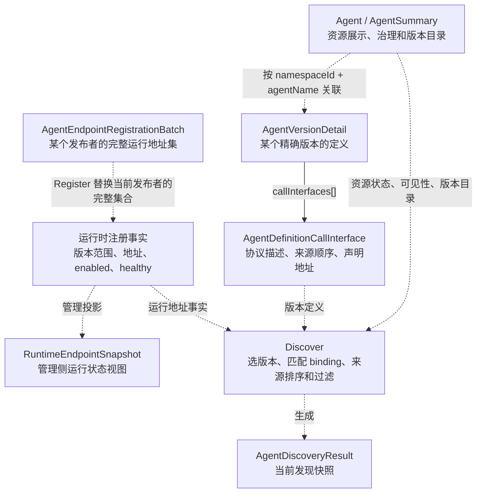
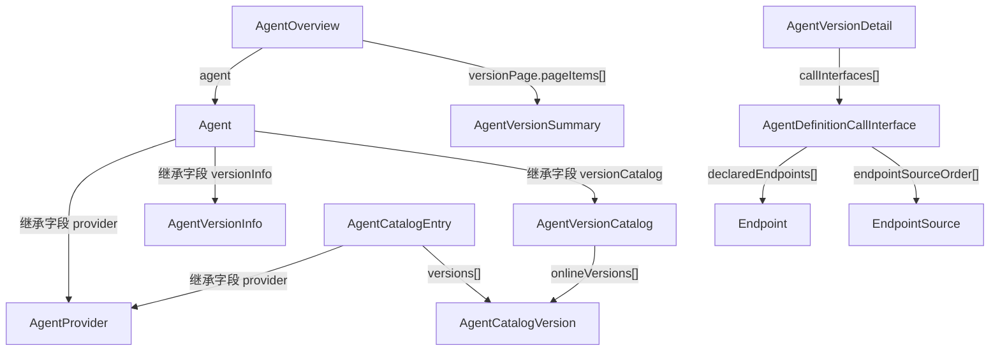
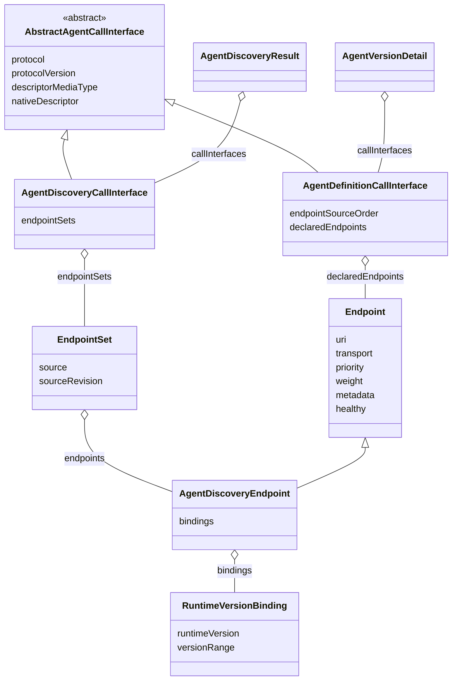
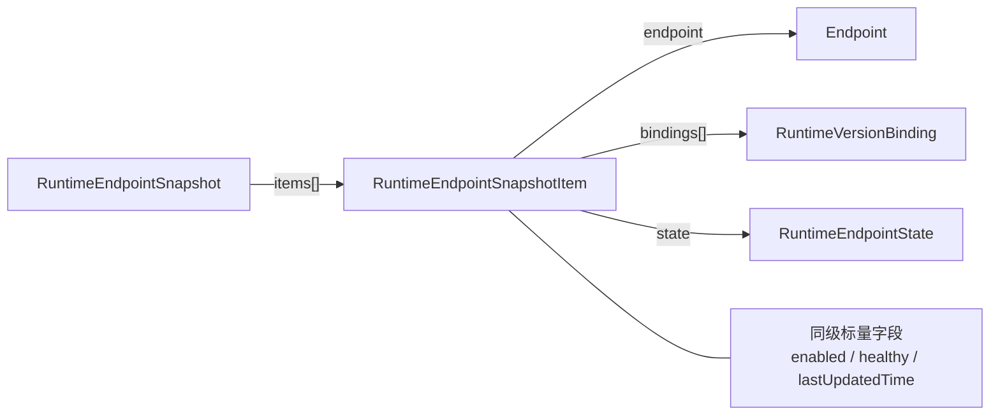
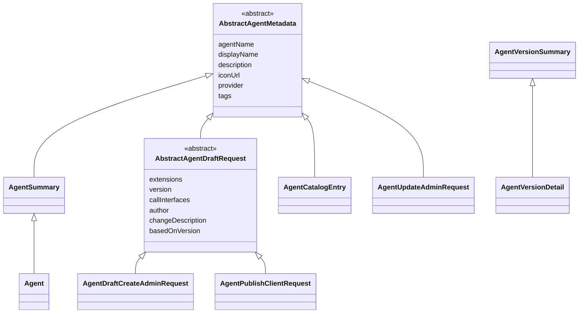
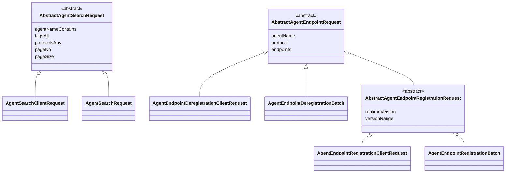
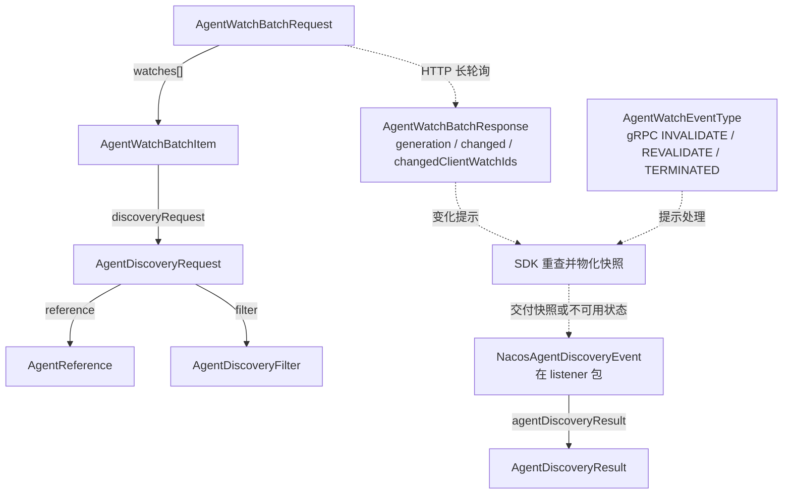

# Agent 模型关系图与复杂度复核

> 2026-09-15 请求模型后续核查：5 个 Admin、4 个 Client 请求的分包、命名、调用方和 base 复用建议，见 [请求分包核查](MODEL_REQUEST_PACKAGES.md)。该分包提案尚未实施。

> 2026-09-15：地址主干已统一为 `AgentCallInterface → EndpointSet → Endpoint`，Agent 包模型现为 39 个。当前实现和验证分别见 [最新关系图](MODEL_ENDPOINT_PATHS.md)、[执行记录](MODEL_ENDPOINT_VALIDATION.md)；下文保留历史评审过程。

> 2026-09-14：资源与版本摘要已按 [本次合并记录](MODEL_SUMMARY_MERGE.md) 继续收敛；下文原模型图是前一版快照，Interface/Endpoint 讨论仍保留。

> CallInterface / Endpoint / EndpointSet 的当前六类入口统一图及细节，见 [入口关系梳理](MODEL_ENDPOINT_PATHS.md)。

核查日期：2026-09-14。对象是 `codex/agent-model-consolidation` 工作区中尚未提交的试改，
不是 upstream/develop 的模型。本文只梳理现状和提出评审选项，不修改 Java 实现或现行协议。
历史 `model.a2a` 不纳入合并；公共类型 `ClientLivenessInfo` 单独列出。

§1–11 保留试改代码的现状图谱；后续讨论确认的收敛方向见 §12。
§12 优先于前文的可选设计建议，但尚未实施到 Java 模型或线上协议。

## 1. 先看数量和关系的含义

`model.agent` 当前有 47 个 Java 文件：37 个具体 DTO、6 个抽象基类、3 个枚举、
1 个包内校验工具。另有移到 `api.ai.model` 的 `ClientLivenessInfo`。
上一版减少了字段重复，但也增加了类型；不能用字段行数下降直接证明使用成本下降。

本文区分三种关系：

- **包含**：某对象的字段或列表元素是另一个对象，是实际 Java/JSON 数据结构。
- **继承**：复用父类字段；Jackson 输出仍是平铺字段，不额外增加 JSON 层级。
- **派生/使用**：服务把事实转换成另一种结果，或一个操作使用某个 DTO；不代表对象包含关系。

`base` 只是 Java 字段复用层，不是一个完整的“RAD 领域模型底座”。例如
`AbstractAgentDraftRequest` 仍依赖根包的 `AgentDefinitionCallInterface`，
`AbstractAgentMetadata` 依赖根包的 `AgentProvider`。抽到子包并没有形成单向依赖的架构层。

## 2. 同一个 Agent 的三个事实/视图

下图的虚线是业务派生关系，实线标明实际包含关系。Agent 与 Version 按身份关联，
`Agent` 本身不内嵌完整的 Version 列表。



同级对象的用途：

| 对象 | 回答的问题 | 与同级对象的区别 |
| --- | --- | --- |
| `Agent` / `AgentSummary` | 这个资源是什么、归谁管、有哪些版本？ | Agent 详情比 Summary 多 extensions；均不装载协议内容 |
| `AgentCatalogEntry` | 消费者可以搜索到哪些在线 Agent/版本？ | 发现目录经过可见性、在线状态和搜索规则筛选，不暴露 owner/scope |
| `AgentVersionDetail` | 指定版本定义了什么？ | 持久化内容视图，不包含实时运行地址 |
| `AgentDiscoveryResult` | 本次选择得到什么协议与地址？ | 由在线定义和运行事实派生，不是另存的一份 Agent 定义 |
| `RuntimeEndpointSnapshot` | 某协议的注册端点当前是什么状态？ | 可包含禁用项，不应用 endpointSourceOrder，不承诺最终可发现性 |

注意：RAD RUNTIME 结果排除 disabled 发布者，但可以返回 `healthy=false` 的 Endpoint。
不能把 Discovery 简化解释成“全部健康可用的地址”。管理 Snapshot 和 Discovery 读取相同运行事实，
Discovery 并不是简单把一个已返回的 Snapshot 对象转型。

## 3. 实际包含关系：管理信息与目录



`AgentSummary` 也有图中 Agent 的 provider/versionInfo/versionCatalog，
`AgentVersionDetail` 继承 `AgentVersionSummary` 的元数据；这里省略继承箭头以突出包含关系。

三个容易混淆的“版本摘要”实际上不同：

| 类型 | 自身字段 | 用途 |
| --- | --- | --- |
| `AgentVersionInfo` | editingVersion、reviewingVersion、onlineCnt、labels Map | 整个 Agent 的版本生命周期和标签指向 |
| `AgentVersionCatalog` | latestVersion、onlineVersions[] | 整个 Agent 的在线版本目录容器 |
| `AgentCatalogVersion` | version、labels List、protocols List | 单个在线版本的目录条目，已由管理和 Search 共用 |
| `AgentVersionSummary` | version、status、publishPipelineInfo、author、changeDescription、contentDigest、时间 | 单个版本的管理摘要，可用于非 online 版本 |

这些不是同一对象的四个层层包装。Info 和 Catalog 是同级的 Agent 字段；
Summary 是独立查询/分页对象。Info 的 labels 为“标签到版本”的 Map，条目的 labels 是
“当前版本上的标签”列表。直接合并会让命名更短，但不会自动消除这些差异。

## 4. 实际包含关系：调用接口与 Endpoint



图中空心三角是继承，空心菱形是字段/列表包含，不表达 Java 对象独占所有权。
声明来源和运行时来源都使用 `EndpointSet` 和 `AgentDiscoveryEndpoint`，
没有再分别创建 DeclaredEndpoint、RuntimeEndpoint 两个具体类。

Definition 和 Discovery 共用四个协议描述字段，差异是：

| 内容 | 定义侧 | 发现侧 |
| --- | --- | --- |
| 协议及 descriptor | 有 | 有，来自所选定义版本 |
| endpointSourceOrder | 定义偏好，例如 RUNTIME → DECLARED | 不返回这个字段，顺序体现在 endpointSets 数组中 |
| declaredEndpoints | Adapter 从 descriptor 派生并校验 | 进入 source=DECLARED 的 EndpointSet，且可能经过过滤 |
| endpointSets | 无 | 本次结果的权威地址集合，含来源和 revision |
| 运行地址变化 | 不因此改变版本定义 | 会改变本次快照及相关 sourceRevision |

例如，同一个 A2A 版本声明来源为 `[RUNTIME, DECLARED]`：运行时地址变动后，
版本定义可以完全不变，而 Discovery 的 RUNTIME 集合会改变。
所以两个**视图的语义**必须区分，但并不必然要求两个 **Java class**。

`EndpointSet` 也不是只有一个 list 的无意义包装：它还承载来源、来源级 revision 和顺序。
已经声明的来源即使没有端点，也可以返回稳定的空集合；扁平化为 `endpoints[]`
会失去“该来源存在但为空”的表达，涉及 RAD 协议修改。

## 5. 实际包含关系：运行时管理视图



这里存在值得复核的不对称：

- Discovery 使用 `AgentDiscoveryEndpoint extends Endpoint`，字段是平铺的。
- 管理 SnapshotItem 使用 `endpoint + bindings + 状态` 的组合结构。
- `Endpoint` 本身已经有条件使用的 healthy，但管理投影会清空 `endpoint.healthy`，
  在外层 item.healthy 返回状态，不能把两处 healthy 当作两个独立的事实。

管理视图需要禁用状态、观察时间，职责不能直接并入 Discovery；但名称和复用方式可以更一致。
若改动管理结果的嵌套结构，必须同步管理 API/Schema，而不仅是 Java 继承调整。

## 6. 完整继承关系：字段复用层

前述 CallInterface、Endpoint 继承之外，其余所有模型继承如下。
`Serializable` 和隐式 `Object` 不列入图中。





SearchRequest 和两种 Batch 比对应 ClientRequest 多 namespaceId。
它们是共享父类的兄弟类型；ClientRequest 不继承有 namespace 的完整协议请求。
注册又比注销多 runtimeVersion/versionRange，才形成第二层抽象类。
这两层实现了字段复用，但使用者仍需理解四个具体请求和两个父类。

最长的模型继承路径为两条继承边，例如 Metadata → DraftRequest → PublishClientRequest，
没有很深的继承树；更明显的负担来自类型横向增多、名称近似，以及发现结果的多层包含。

## 7. 请求对象和同级操作的对应关系

| 调用方/操作 | 公开输入 | 绑定/处理后 | 输出/作用 |
| --- | --- | --- | --- |
| Client searchAgents | AgentSearchClientRequest | SDK 复制并补 namespace，形成 AgentSearchRequest | Page\<AgentCatalogEntry\> |
| Client discoverAgent / subscribeAgent | AgentReference + 可选 AgentDiscoveryFilter | SDK 组合成 AgentDiscoveryRequest，并补 namespace | AgentDiscoveryResult；订阅还会交付事件 |
| Client registerAgentEndpoints | AgentEndpointRegistrationClientRequest | SDK 复制并补 namespace，形成 AgentEndpointRegistrationBatch | 替换该发布者、Agent、协议的完整集合 |
| Client deregisterAgentEndpoints | AgentEndpointDeregistrationClientRequest | AgentEndpointDeregistrationBatch 表达 SDK 删除意图 | 删除本地期望集中的键，再注册剩余集合或注销整份 publication |
| Client publishAgent | AgentPublishClientRequest | 使用实例 namespace 创建 draft；autoSubmit 决定是否提交 pipeline | AgentVersionDetail |
| Maintainer createDraft | AgentDraftCreateAdminRequest | namespace 是方法参数 | AgentVersionDetail |
| Maintainer updateDraft | AgentDraftUpdateAdminRequest | 只改指定 draft 的内容/变更说明 | AgentVersionDetail |
| Maintainer updateAgent | AgentUpdateAdminRequest | 修改资源展示、扩展、状态等可写元数据 | Agent |
| Maintainer updateLabels | AgentLabelsUpdateAdminRequest | 修改标签到版本的指向 | Agent |
| Maintainer submit/publish/offline 等版本操作 | AgentVersionAdminRequest | 精确 agentName + version，namespace 是方法参数 | AgentVersionSummary |

创建草稿和更新草稿不是同一个字段集合：更新请求没有资源创建字段，也不支持 basedOnVersion。
AgentReference 允许 label/省略选择器；AgentVersionAdminRequest 要求精确版本。
仅因它们都有 agentName/version 而合并，会把不同操作的必填和选择规则藏到运行时。

## 8. Watch 与外围边界



- WatchBatchItem 的 clientWatchId、materializedFingerprint 以及 Batch 的 generation、timeoutMillis
  是传输协调字段，普通 SDK 使用者并不构造这些对象。
- AgentWatchEventType 是 Wire Hint，NacosAgentDiscoveryEventType 是用户回调的 SNAPSHOT/UNAVAILABLE，
  两个枚举不处在相同语义层。
- `ClientLivenessInfo` 是 Agent/MCP 共用的 HTTP Client 活性时限，位于 `api.ai.model`；
  它不是 Endpoint 属性，也不嵌套在 AgentDiscoveryResult 中。
- HTTP Forms、gRPC Request/Response、服务端 AgentVersionContent/存储描述符是外围绑定或持久化层。
  它们引用本图的 DTO，但不是新的用户领域概念。本图不枚举外围模块的全部内部类。

## 9. 对当前设计的判断与下一轮可选收敛

这版试改完成了搬包、字段复用与 Client namespace 隔离，但还不能视为最终合理的使用者模型。
当前的目录类、版本类、请求类、Wire Watch 类平铺在同一个包内，命名又不一致，
例如 CatalogVersion / VersionCatalog、ClientRequest / Request / Batch。
这些问题比单个类的重复 getter 更影响理解。

| 可选项 | 是否可行 | 需要守住的边界 |
| --- | --- | --- |
| 两个 CallInterface 与其 abstract 父类收敛成一个 AgentCallInterface | Java 上可行，值得作为优先比较项 | 保留定义/发现两种视图规则；7 个字段中，定义用共同 4 个 + 来源顺序/声明地址，发现用共同 4 个 + endpointSets |
| AgentDiscoveryEndpoint 的 bindings 合入 Endpoint | Java 上可行，可与上一项一起评估 | Endpoint.healthy 已按上下文使用；bindings 也必须在 Register/DECLARED 中禁止，RUNTIME 结果中要求非空 |
| 删除 EndpointSet，直接返回一个 Endpoint 列表 | 不是单纯 Java 去重 | 会影响来源顺序、来源级 revision、空来源表达，需另行讨论 RAD 协议 |
| 把 VersionDetail、DiscoveryResult、RuntimeSnapshot 合并 | 不建议优先做 | 三者分别是定义、发现投影、管理状态；合成一个巨型 DTO 会增加无效字段和误用 |
| 删除 ClientRequest，直接给用户完整 RAD Request/Batch | 与已确认的 namespace 要求冲突 | 必须保持用户输入无 namespace；减少类数量不能牺牲这个边界 |
| 再为每几个重复字段加 abstract 父类 | 不建议继续机械扩大 | 父类必须有明确复用价值；字段少量重复可能比更多相似类型更容易理解 |

“统一 CallInterface 类”并不等于“统一线上 JSON 字段集合”。保留现有 Wire 契约时，
定义结果仍只输出定义字段，发现结果仍只输出发现字段；只用 NON_NULL 不足以保证这一点，
还需保留或补充上下文校验、显式构造/投影和字段集合测试，防止错误字段被带入存储或响应。
这样不必然改动 Schema 的字段形状，但需要修订 Java 绑定规范；若也统一 Wire 结构，
则必须讨论并同步 RAD、管理 API 和存储规范。

这份图支持先决定“公共的概念应该有几个”，再决定用继承还是组合。
目前优先值得评审的是 CallInterface 和 Endpoint 两组，而不是先继续增加基类。
以上均为本次复核建议，尚未修改当前试改实现或规范中的现状描述。

## 10. 源码与规范证据

- [当前全部模型](../../../api/src/main/java/com/alibaba/nacos/api/ai/model/agent)
- [Client 公共签名](../../../api/src/main/java/com/alibaba/nacos/api/ai/AgentDiscoveryService.java)
- [Maintainer 公共签名](../../../maintainer-client/src/main/java/com/alibaba/nacos/maintainer/client/ai/AgentMaintainerService.java)
- [定义到发现投影](../../../ai/src/main/java/com/alibaba/nacos/ai/service/agent/AgentDiscoveryApplicationService.java)：resolveCallInterfaces / resolveEndpointSets
- [运行状态与发现集合](../../../ai/src/main/java/com/alibaba/nacos/ai/service/agent/runtime/AgentRuntimeRegistryService.java)：loadSnapshotItems / loadRuntimeEndpoints
- [管理 Endpoint 状态投影](../../../ai/src/main/java/com/alibaba/nacos/ai/service/agent/runtime/AgentRuntimeEndpointMapper.java)：fromInstance / canonicalPayload
- [RAD 协议 §3.7–3.12](../../../specs/zh-cn/ai/rad-protocol-spec.md)
- [管理规范 §5–6](../../../specs/zh-cn/ai/agent-management-spec.md)
- [当前 Java 绑定规范](../../../specs/zh-cn/ai/agent-api-spec.md)

## 11. 全部文件与字段索引

下表从当前源码提取；只列本类声明的字段，继承字段由父类行补足。
List/Map 展示为原 Java 类型，Serializable 不作为领域父类列出。

| 文件/类型 | 直接父类 | 本类声明的业务字段 |
| --- | --- | --- |
| `Agent.java` | `AgentSummary` | `extensions: Map<String, Object>` |
| `AgentAdminRequestUtils.java` | — | 包内校验工具，不是 DTO |
| `AgentCatalogEntry.java` | `AbstractAgentMetadata` | `latestVersion: String`；`versions: List<AgentCatalogVersion>` |
| `AgentCatalogVersion.java` | — | `version: String`；`labels: List<String>`；`protocols: List<String>` |
| `AgentDefinitionCallInterface.java` | `AbstractAgentCallInterface` | `endpointSourceOrder: List<EndpointSource>`；`declaredEndpoints: List<Endpoint>` |
| `AgentDiscoveryCallInterface.java` | `AbstractAgentCallInterface` | `endpointSets: List<EndpointSet>` |
| `AgentDiscoveryEndpoint.java` | `Endpoint` | `bindings: List<RuntimeVersionBinding>` |
| `AgentDiscoveryFilter.java` | — | `protocols: List<String>`；`protocolVersion: String`；`transports: List<String>`；`endpointSources: List<EndpointSource>`；`metadataSelector: Map<String, String>` |
| `AgentDiscoveryRequest.java` | — | `namespaceId: String`；`reference: AgentReference`；`filter: AgentDiscoveryFilter` |
| `AgentDiscoveryResult.java` | — | `namespaceId: String`；`agentName: String`；`version: String`；`contentDigest: String`；`callInterfaces: List<AgentDiscoveryCallInterface>` |
| `AgentDraftCreateAdminRequest.java` | `AbstractAgentDraftRequest` | 无新增业务字段 |
| `AgentDraftUpdateAdminRequest.java` | — | `agentName: String`；`version: String`；`callInterfaces: List<AgentDefinitionCallInterface>`；`changeDescription: String` |
| `AgentEndpointDeregistrationBatch.java` | `AbstractAgentEndpointRequest` | `namespaceId: String` |
| `AgentEndpointDeregistrationClientRequest.java` | `AbstractAgentEndpointRequest` | 无新增业务字段 |
| `AgentEndpointRegistrationBatch.java` | `AbstractAgentEndpointRegistrationRequest` | `namespaceId: String` |
| `AgentEndpointRegistrationClientRequest.java` | `AbstractAgentEndpointRegistrationRequest` | 无新增业务字段 |
| `AgentLabelsUpdateAdminRequest.java` | — | `agentName: String`；`labels: Map<String, String>` |
| `AgentOverview.java` | — | `agent: Agent`；`versionPage: Page<AgentVersionSummary>` |
| `AgentProvider.java` | — | `name: String`；`url: String` |
| `AgentPublishClientRequest.java` | `AbstractAgentDraftRequest` | `autoSubmit: boolean` |
| `AgentReference.java` | — | `agentName: String`；`version: String`；`label: String` |
| `AgentSearchClientRequest.java` | `AbstractAgentSearchRequest` | 无新增业务字段 |
| `AgentSearchRequest.java` | `AbstractAgentSearchRequest` | `namespaceId: String` |
| `AgentSummary.java` | `AbstractAgentMetadata` | `namespaceId: String`；`status: String`；`owner: String`；`scope: String`；`versionInfo: AgentVersionInfo`；`versionCatalog: AgentVersionCatalog`；`metaVersion: Long`；`createTime: Long`；`updateTime: Long` |
| `AgentUpdateAdminRequest.java` | `AbstractAgentMetadata` | `extensions: Map<String, Object>`；`status: String` |
| `AgentVersionAdminRequest.java` | — | `agentName: String`；`version: String` |
| `AgentVersionCatalog.java` | — | `latestVersion: String`；`onlineVersions: List<AgentCatalogVersion>` |
| `AgentVersionDetail.java` | `AgentVersionSummary` | `namespaceId: String`；`agentName: String`；`callInterfaces: List<AgentDefinitionCallInterface>` |
| `AgentVersionInfo.java` | — | `editingVersion: String`；`reviewingVersion: String`；`onlineCnt: Integer`；`labels: Map<String, String>` |
| `AgentVersionSummary.java` | — | `version: String`；`status: String`；`publishPipelineInfo: String`；`author: String`；`changeDescription: String`；`contentDigest: String`；`createTime: Long`；`updateTime: Long` |
| `AgentWatchBatchItem.java` | — | `clientWatchId: String`；`discoveryRequest: AgentDiscoveryRequest`；`materializedFingerprint: String` |
| `AgentWatchBatchRequest.java` | — | `generation: long`；`timeoutMillis: long`；`watches: List<AgentWatchBatchItem>` |
| `AgentWatchBatchResponse.java` | — | `generation: long`；`changed: boolean`；`changedClientWatchIds: List<String>` |
| `AgentWatchEventType.java` | — | `INVALIDATE, REVALIDATE, TERMINATED` |
| `Endpoint.java` | — | `uri: String`；`transport: String`；`priority: Integer`；`weight: Double`；`metadata: Map<String, String>`；`healthy: Boolean` |
| `EndpointSet.java` | — | `source: EndpointSource`；`sourceRevision: String`；`endpoints: List<AgentDiscoveryEndpoint>` |
| `EndpointSource.java` | — | `RUNTIME, DECLARED` |
| `RuntimeEndpointSnapshot.java` | — | `namespaceId: String`；`agentName: String`；`protocol: String`；`version: String`；`items: List<RuntimeEndpointSnapshotItem>` |
| `RuntimeEndpointSnapshotItem.java` | — | `endpoint: Endpoint`；`bindings: List<RuntimeVersionBinding>`；`state: RuntimeEndpointState`；`enabled: Boolean`；`healthy: Boolean`；`lastUpdatedTime: Long` |
| `RuntimeEndpointState.java` | — | `AVAILABLE, DISABLED, UNHEALTHY` |
| `RuntimeVersionBinding.java` | — | `runtimeVersion: String`；`versionRange: String` |
| `base/AbstractAgentCallInterface.java` | — | `protocol: String`；`protocolVersion: String`；`descriptorMediaType: String`；`nativeDescriptor: Object` |
| `base/AbstractAgentDraftRequest.java` | `AbstractAgentMetadata` | `extensions: Map<String, Object>`；`version: String`；`callInterfaces: List<AgentDefinitionCallInterface>`；`author: String`；`changeDescription: String`；`basedOnVersion: String` |
| `base/AbstractAgentEndpointRegistrationRequest.java` | `AbstractAgentEndpointRequest` | `runtimeVersion: String`；`versionRange: String` |
| `base/AbstractAgentEndpointRequest.java` | — | `agentName: String`；`protocol: String`；`endpoints: List<Endpoint>` |
| `base/AbstractAgentMetadata.java` | — | `agentName: String`；`displayName: String`；`description: String`；`iconUrl: String`；`provider: AgentProvider`；`tags: List<String>` |
| `base/AbstractAgentSearchRequest.java` | — | `agentNameContains: String`；`tagsAll: List<String>`；`protocolsAny: List<String>`；`pageNo: Integer`；`pageSize: Integer` |

## 12. 评审后确认的范围与三层模型目标

> 2026-09-14 后续澄清：三层从 CallInterface 开始计算，不含 AgentResult。
> 以本节更新后的 `CallInterface → EndpointSet → Endpoint` 为准，取代此前移除 EndpointSet 的建议。

本轮聚焦模型整合和简化，暂不修改默认 Discovery 的跨版本选择和聚合算法。
之前提出的 `AgentDiscoveryResult → versions[] → CallInterface → EndpointSet → Endpoint`
不作为本轮目标；管理查询与发现查询复用 RAD 的三层主干：

```text
AgentCallInterface
└── endpointSets[]: EndpointSet
    ├── source: EndpointSource       DECLARED / RUNTIME
    ├── sourceRevision
    └── endpoints[]: Endpoint
```

具体方向：

- 资源信息合并后统一命名 AgentSummary。版本元数据使用
  `AgentSummary.versionInfo: AgentVersionInfo → onlineVersions[]: AgentVersionSummary`。
  该结构服务目录和管理，不插入发现结果的地址访问主干。
- 固定地址和 Runtime 地址共用同一个 Endpoint，定义和发现共用 AgentCallInterface。
  可以分开查询两种地址，但不能因查询入口不同再拆成不同的公开地址类型。
- VersionDetail 先按只返回固定地址的方案评估；Runtime 地址如何获取另行评估，
  当前不强制增加聚合查询。实时地址不写入版本内容，不进入 contentDigest。
- EndpointSet 继续承载来源、来源级 revision 和空来源；发现的来源顺序仍由 Set 数组表达。
  不再把 source 下移到 Endpoint，也不再为删除 EndpointSet 设计转换层。
- 管理定义查询返回 DECLARED 地址，管理运行查询返回 RUNTIME 地址；查询可以分开，
  CallInterface/EndpointSet/Endpoint 类型和包含关系应一致。外层结果身份与版本元数据按操作保留。
  管理状态字段、无定义时的 runtime 协议描述缺省规则、管理来源 revision 的作用域仍待细化。
  管理定义须独立保留完整 endpointSourceOrder，不能用只含 DECLARED 的查询结果覆盖来源配置。
- 本节是目标 Java 结构，不声称现有 RAD JSON 已经变更。使用内部 Wire 转换还是同步调整
  Schema，需在字段映射设计中明确。本次只记录范围，不修改查询、Wire、存储或 Watch 实现。

### MODEL-D01：默认 Discovery 受 latest 协议定义限制（延期处理）

状态：已记录，后续专题处理，不纳入本次模型简化的算法修改。

当前行为：未指定 version/label 时，Runtime binding 的目标版本集合包含全部在线版本，
但 CallInterface、来源顺序和固定地址只从 latest 定义读取。这符合当前 RAD 规范 §5 的规则，
与本次讨论希望默认覆盖全部在线版本 Endpoint 的方向存在差距。

复现示例：v1 在线且只定义协议 A；v2 在线、为 latest 且只定义协议 B。
默认 Discover 只遍历 B，不包含仍在线的 v1 独有的协议 A 和相应地址。
即使协议相同，旧在线版本独有的固定地址也不会因 Runtime 范围扩展而自动进入结果。

代码定位：AgentDiscoveryApplicationService 的 resolveVersion、resolveRuntimeVersions、
resolveCallInterfaces、resolveEndpointSets；Watch 的 DefaultAgentProjectionProjector
依赖发现结果的 CallInterface 集合。

后续需一起确定：全部在线版本的接口/固定地址覆盖、同协议不同 descriptor 的归属、
跨版本 Endpoint 去重和 binding 信息，以及非 latest 版本变化时的 Watch 依赖和指纹。
解决方式仍须服从 CallInterface → EndpointSet → Endpoint 的公共三层结构，不额外增加
Version 导航层。显式 version/label 的选择行为也需回归验证。


## 2026-09-15 请求模型补充

请求层以 [当前请求整合方案](MODEL_REQUEST_PACKAGES.md#75-最终目标及验证差异) 为准：
agent 根包保留共享 AgentSearchRequest、AgentEndpointRegistrationBatch，均不含 namespace；
admin 包放五个管理 Request，client 包只放 AgentPublishRequest，类名不再重复 Admin/Client。
base 仅保留 Metadata/Draft 两个 abstract 类；局部注销直接接收 agentName、protocol、List<Endpoint>。
本页 CallInterface → EndpointSet → Endpoint 的包含关系保持不变。
