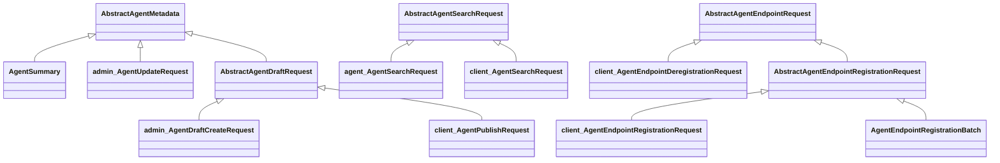

# Agent 请求模型分包与复用核查

核查日期：2026-09-15。基于 `codex/agent-model-consolidation` 当前工作区，包含此前未提交的模型整合。
§7 已按本轮确认方向完成代码迁移，模型目录 Java 文件 39 → 31；本轮自动化矩阵已执行，已知失败与排除项单独记录。
本轮独立证据见 [请求整合验证记录](MODEL_REQUEST_VALIDATION.md)，不复用前轮通过数字。
后续对工具、Search 合并和注销参数化的评审修订见 §7；目标结构以 §7 为准，§1–6 保留前案和调用关系证据。
规范中的对应提案见 [中文](../../../specs/zh-cn/ai/client-ai-api-evolution-spec.md#66-请求分包补充提案2026-09-15)
和 [English](../../../specs/en/ai/client-ai-api-evolution-spec.md#66-request-package-refinement-proposal-2026-09-15)。

## 1. 分包结论

保留同一个 `nacos-api` 模块，用 Java package 表达调用场景：

| 包 | 内容 | 边界 |
| --- | --- | --- |
| `model.agent` | RAD 请求、共享值对象、管理及发现结果 | 不因只有 Client HTTP 入口就把 RAD 协议对象移入 client 包 |
| `model.agent.admin` | 5 个管理操作的具体请求 | 服务于 Admin/Console/Maintainer；服务端内部管理流程可以复用 |
| `model.agent.client` | 4 个 namespace-bound SDK 具体请求 | 不提供 namespace 字段；SDK 负责绑定 namespace |
| `model.agent.base` | 现有 5 个共享抽象类 | public abstract、protected 构造器；不依赖 admin/client 的具体请求 |

Admin/Client 标记从这 9 个类名移到包名，保留 Agent 前缀和业务操作名。
`admin` 和 `client` 请求不互相继承。公共 SDK 方法继续接收具体请求，不暴露抽象基类入参。
这里划分的是契约用途，不是强制服务端业务实现禁止引用某一类请求。

## 2. 全部 9 个请求的实际调用关系

扫描 `api.ai.model` 后，所有以 AdminRequest/ClientRequest 结尾的模型均在本表中。
Console Agent Controller 直接复用 ai 模块的 Admin Form，没有另一套同名 Console Form。

| 当前类名 | 目标包与类名（相对 model.agent） | 实际用途与 Form 对应 |
| --- | --- | --- |
| AgentDraftCreateAdminRequest | admin.AgentDraftCreateRequest | Admin/Console 的 AgentDraftCreateForm；Maintainer createDraft；AgentOperationService；A2A canonical converter 和历史定义迁移也复用 |
| AgentDraftUpdateAdminRequest | admin.AgentDraftUpdateRequest | Admin/Console 的 AgentDraftUpdateForm；Maintainer updateDraft；Controller/Handler 把内容交给版本更新流程 |
| AgentUpdateAdminRequest | admin.AgentUpdateRequest | Admin/Console 的 AgentUpdateForm；Maintainer updateAgent；转换成可写 Agent 元数据 |
| AgentLabelsUpdateAdminRequest | admin.AgentLabelsUpdateRequest | Admin/Console 的 AgentLabelsUpdateForm；Maintainer updateLabels |
| AgentVersionAdminRequest | admin.AgentVersionRequest | Maintainer 的 submit/publish/forcePublish/redraft/online/offline；Console RemoteHandler 构建该请求；服务端 AgentVersionForm 直接传 agentName/version，不调用 toRequest |
| AgentPublishClientRequest | client.AgentPublishRequest | AgentService.publishAgent；Client HTTP/gRPC；AgentPublishForm；AgentPublishApplicationService；AgentOperationService 的发布入口 |
| AgentSearchClientRequest | client.AgentSearchRequest | AgentDiscoveryService.searchAgents；SDK 复制成根包 AgentSearchRequest 并注入 namespace；服务端 AgentSearchForm 直接生成根包请求 |
| AgentEndpointRegistrationClientRequest | client.AgentEndpointRegistrationRequest | SDK registerAgentEndpoints；转换成根包 AgentEndpointRegistrationBatch；服务端 AgentEndpointRegistrationForm 生成该 Batch |
| AgentEndpointDeregistrationClientRequest | client.AgentEndpointDeregistrationRequest | SDK 按自然键局部注销意图；服务端 AgentEndpointDeregistrationForm 只表达整份 Publication 注销，与 SDK 列表请求不是直接映射 |

核查结果：普通 client 模块没有引用上述 AdminRequest；maintainer-client 和 console 模块没有引用上述 ClientRequest。
5 个 AdminRequest 都有 Maintainer 公共接口调用方，没有发现仅由 Form 构建且只在服务端内部消费的 AdminRequest。
4 个 ClientRequest 都有公共 Java SDK 方法调用方，不能只保留对应 HTTP Form。

### 需要明确的例外

1. A2A converter 输出草稿创建请求，迁移 reconciler 用其内容组装 VersionDetail 和 AgentSummary。
   这属于服务端内部复用管理定义输入，不是旧 A2A SDK 暴露了 AdminRequest；迁包时更新引用并回归即可。
   不为此再新增一层转换 DTO，也不要求 A2A 迁移调用 Admin HTTP API。
2. Client 发布和 Admin 建草稿进入同一个私有 `createValidatedDraft(AbstractAgentDraftRequest)`。
   公开入口仍分开，Client 的 autoSubmit 和幂等重试语义仍由发布应用服务处理。
3. Client 注销 3 个中的 2 个，SDK 先计算剩余集合并重新注册；清空时才发送整份注销。
   因此不能为了统一 Request/Form，把列表直接变成 HTTP DELETE 的参数。

关键代码入口：

- [Maintainer 公共契约](../../../maintainer-client/src/main/java/com/alibaba/nacos/maintainer/client/ai/AgentMaintainerService.java)
- [SDK 请求复制及 namespace 绑定](../../../client/src/main/java/com/alibaba/nacos/client/ai/utils/AgentModelUtils.java)
- [SDK 局部注销及剩余集合注册](../../../client/src/main/java/com/alibaba/nacos/client/ai/AgentEndpointPublicationManager.java)
- [服务端 Client HTTP Binding](../../../ai/src/main/java/com/alibaba/nacos/ai/controller/AgentClientController.java)
- [公共草稿工作流](../../../ai/src/main/java/com/alibaba/nacos/ai/service/agent/AgentOperationService.java)
- [A2A 历史定义转换](../../../ai/src/main/java/com/alibaba/nacos/ai/service/a2a/migration/A2aHistoricalDefinitionReconciler.java)

## 3. base 的复用建议

保持当前 5 个抽象基类，先做两项已有类内的收敛，不新增继承层。

| 基类 | 当前复用 | 建议 |
| --- | --- | --- |
| AbstractAgentMetadata | AgentSummary、AgentUpdateAdminRequest、AbstractAgentDraftRequest | 将这三个直接子类重复声明的 extensions 移到此处；现有所有具体后代已经有该属性 |
| AbstractAgentDraftRequest | Admin 草稿创建、Client 发布 | 将两个具体类完全相同的草稿身份/内容来源 validate 收到此处；autoSubmit 留在 Client 发布请求 |
| AbstractAgentSearchRequest | Client Search、完整 RAD Search | 保持；namespace 只属于根包 RAD 具体请求 |
| AbstractAgentEndpointRequest | 注册基类、Client 注销、SDK 带 namespace 注销意图 | 保持字段共享；注册/注销的健康字段等校验仍按操作区分 |
| AbstractAgentEndpointRegistrationRequest | Client 注册、RAD RegistrationBatch | 保持 runtimeVersion/versionRange 共享；namespace 只在完整 Batch |

建议后的主要继承关系（省略 getter/setter 和不变的序列化接口）：



图中的 admin_/client_/agent_ 是显示包归属的标签，不是建议的 Java 类名。
不把 AgentDraftUpdateRequest 继承自草稿创建请求：更新不接收首建 metadata、author 或 basedOnVersion。
也不为 agentName/version 两个字段再建立通用身份继承链；这会与 Metadata 继承路径交叉，增加理解成本。
AgentVersionRequest、AgentLabelsUpdateRequest 继续作为独立的具体操作请求。

### 现有包内校验工具必须一起处理

`AgentAdminRequestUtils` 是 package-private，却同时被 Admin 和 Client 发布请求使用。
仅移动 9 个类会导致跨包访问失败。

建议：草稿共用校验移入 AbstractAgentDraftRequest；身份和版本直接复用已有 AgentValidationUtils；
可写 status 校验留在 AgentUpdateRequest；移除不再需要的包内转发工具。
保留错误文本、异常类型和空白判断语义，针对公共 validate 行为回归，不继续直接测试已移除的 helper。
不把工具类改成 public 放进 model.base，避免把工具误当成共享模型。

## 4. 根包中额外发现的非协议模型

`AgentEndpointDeregistrationBatch` 的实际生产调用方只有 SDK 内部，以及 api 中的专用校验重载。
其类注释也明确它是 SDK desired batch 的 namespaced removal intent。
服务端 HTTP/gRPC 的整份注销均不接收该类；它不是与 RegistrationBatch 对称的 RAD Wire 模型。

建议将该内部状态对象归入 client 模块的内部 model 包；不要放进对用户公开的 model.agent.client，
否则仍向 SDK 使用者暴露带 namespace 的第二种注销输入。
移动时必须同步调整 RadModelValidator 对该类型的校验入口，避免 api 反向依赖 client。
原有端点数量、重复自然键、健康字段禁止规则及 NacosException 映射都需保留。
这项与 9 个公共请求分包分开实施、验证，避免纯迁包中夹带注销流程改写。

另一个实现层现状是 AgentPublishForm 继承 admin 包的 AbstractAgentDraftForm，其祖先也在 admin 包。
这不构成公共请求的错误继承。本次模型分包不强行重建 Form 继承树；后续如要求 Form 包也严格分层，
需一起梳理共享身份、版本、JSON 解析，而不是只移动一个 AbstractAgentDraftForm。

## 5. 改名的实际影响与约束

- 同名：目标 `agent.client.AgentSearchRequest` 与根包 `agent.AgentSearchRequest` 简单类名相同。
  不影响 Java 类型区分；在同时转换两者的 AgentModelUtils 和契约测试里，对其中一个使用完整限定名，禁止星号 import。
  不为了这一处转换再给全部 Client 类恢复 Client 后缀。
- Java 兼容：包名/类名变化会改变公共方法描述符，调用新 Agent API 的使用者需要更新 import 并重新编译。
  按已确认约束不保留 3.3.0-BETA 兼容壳；已发布历史 A2A API 仍保持。
- Wire：不改 HTTP 字段、namespace 绑定、默认值、RPC 信封的简单类名与 payload 字段。
  AgentPublishRpcRequest 仅更换成员的 Java 类型引用，信封名称不能跟着业务模型一起改。
- JSON：extensions 上移不得变成新的嵌套对象，不改变列表/搜索省略 extensions 的投影规则。
  属性声明位置可能改变普通 JSON 属性遍历顺序，测试应比较字段契约；涉及存储/摘要的确定性向量则必须逐字节保持。
  当前 Agent 内容存储和索引摘要采用显式投影，仍需回归证明没有间接改变。
- 构件：只改变 Java package，不新增 Maven module，不改变 ai 与 maintainer-client 的依赖方向。

按 9 个现有类名逐词扫描当前已跟踪文件，直接关联 41 个生产 Java 文件、33 个测试 Java 文件。
生产分布为 api 12、ai 12、client 9、console 6、maintainer-client 2；测试含 7 个外部 IT 文件。
这只是直接引用统计，不是最终修改文件上限：base、校验工具、内部 Batch 和场景文档需要另行计入。

## 6. 实施及验证拆分

| 阶段 | 改动 | 验证要求 |
| --- | --- | --- |
| P1 | 9 个请求迁包改名；共用草稿 validate 移入 base，剩余校验按 §3 处理；更新所有接口/实现/测试 import；同步当前规范与 SDK 文档 | 相关 reactor 编译；9 类 JSON 往返、Client 无 namespace、类型为并列子类；Form 非空嵌套解析；非法 basedOnVersion/双来源/无来源；历史 A2A 接口回归 |
| P2 | extensions 上移到现有 Metadata 基类 | 字段集合/空值/空集合/autoSubmit 默认 false；首次 metadata 与后续 draft 限制；存储 bytes/digest、索引投影、Artifact 与迁移映射向量 |
| P3 | 单独内收 SDK 注销 Batch 和相应校验 | 3 注册删 2 后只剩 1；全部注销；不存在项；重复自然键/超量/非法 healthy；原输入不变；HTTP/gRPC 所属 Publisher 与 redo 意图不变 |

P1 不得通过公开 helper 来绕过包边界；基础字段调整和内部注销类型归属单独复核。
上述是 review 阶段拆分，不代表本轮要求或已经创建 commit。

所有执行结果在实际完成前均为 Pending；不沿用上一轮 287 UT 或此前端到端验收数字。
复用并更新既有 IT 场景：

- OpenAPI：Admin/Console draft create/update/labels/生命周期，Client publish/search/register/deregister；HTTP JSON 不应变化。
- Java SDK：新包输入、namespace 隔离、HTTP/gRPC 资源矩阵、发布幂等与异常映射、批量局部注销。
- Maintainer SDK：五种管理请求、显式/默认 namespace、六种版本生命周期方法，default/Jackson 3 两套 adapter。
- 已发布旧 A2A 调用及 A2A canonical/migration 回归；仅迁包不引入 A2A/RAD 模式切换或故障恢复新范围。

实施时同步 Java SDK/Maintainer/OpenAPI 场景文档和覆盖登记，公开签名及客户端 Java 8 目标继续检查。
每阶段执行相关模块 Spotless apply/check、编译和必要测试；不为简单 import 改名单独增加镜像实现的测试。

## 7. 后续评审：减少 Request，而不只是迁包（已实现，验证中）

本节根据后续三条评审意见修订目标，不代表 Java 或 Wire 已经修改。对应规范提案见
client-ai-api-evolution-spec 的 §6.7；实施前需要按本节明确同步 Java 与传输绑定。

### 7.1 工具归入 utils

共享校验属于现有 `api.ai.utils`。优先将真正共用的草稿内容来源校验、可写状态校验
并入 `AgentValidationUtils`，身份/版本直接使用它已有的方法，不再保留 Admin 命名的转发工具。
Request.validate() 继续作为调用入口；两个相同的草稿 validate 可由现有草稿基类统一委托。
这样不增加第二个 AgentRequestUtils，也不把 public 工具放入 model.base。
空白判断、错误文本、异常类型和各操作校验范围保持。

### 7.2 Search 合并为一个无 namespace 的模型

保留根包 `agent.AgentSearchRequest`，仅包含 agentNameContains、tagsAll、protocolsAny、pageNo、pageSize。
删除 AgentSearchClientRequest 和只有这一组子类使用的 AbstractAgentSearchRequest，将五个字段直接放入具体类。
SDK 仍防御性复制条件，不能借合并模型而修改用户集合。

namespace 继续存在，但由调用上下文携带：

- Client 公共方法为 `searchAgents(AgentSearchRequest request)`，使用实例 namespace。
- HTTP Form/query 保留 namespaceId，内部调用 `search(namespaceId, request)`。
- SDK transport、服务端 SCAN/INDEX、校验使用显式 namespace，不能退化成隐含默认值或 ThreadLocal。
- AgentSearchRpcRequest 在信封上携带 namespaceId，searchRequest 成员仅包含搜索条件。
  参数提取、鉴权、namespace 校验、Handler 规范化和查询必须使用同一个生效值。

这不是纯 Java 迁包：当前 gRPC JSON 的 `searchRequest.namespaceId` 会移到信封的 `namespaceId`。
RPC 信封类名不变，但内容布局变化，必须同步 Client/Server、双语 Agent API/gRPC 绑定及测试。
若要求旧 gRPC JSON 完全不变，则需显式传输映射，不能声称直接合并即可兼容；本提案优先采用
现有 Client publish 一样的“信封 namespace + 业务请求”方式，避免再造一个同构 Java Request。

RAD 完整逻辑请求仍包含一次 namespace。现有 RAD Schema 可以继续描述完整逻辑消息，
由 HTTP 字段或 RPC 信封与业务条件共同映射；无 namespace 的 SDK 对象不能单独拿去满足
要求 namespace 的完整请求 Schema。实施时写明映射并用完整请求 fixture 验证，不静默删除 namespace 约束。

### 7.3 注销直接使用三个公共参数

```java
void deregisterAgentEndpoints(String agentName, String protocol, List<Endpoint> endpoints)
    throws NacosException;
```

同时删除 AgentEndpointDeregistrationClientRequest 和 AgentEndpointDeregistrationBatch，
内部 manager 接收 SDK 注入的 namespace 及这三个参数，不再另建持有相同内容的内部 DTO。
在修改发布状态之前完成空值/空列表/数量/自然键重复/Endpoint 字段校验，并复制用户输入。
原本的注销规则（例如不接受 healthy）和受控异常映射不因换参数而放宽。

行为仍是注册 3 个、注销 2 个后提交剩余 1 个的完整注册；全部删完才发送整份注销；
不存在的自然键不影响其他端点。Publisher、transport 归属、容量处理、回滚和 redo 意图保持。

修正 §4 的表述范围：没有该 Java 类型的服务端直接 Wire 入口，并不代表 RAD 没有定义它。
RAD §3.12 和 Schema 当前仍把 AgentEndpointDeregistrationBatch 定义为 Publisher 的局部注销逻辑命令。
删除 Java 对象后，这个逻辑操作由方法参数和 SDK namespace 实现；规范须取消“必须是应用对象”的
Java 绑定要求，但保留局部注销语义及逻辑消息 Schema，不把它变成服务端局部 read-merge-write。

### 7.4 注册保留完整 Batch，合并 namespace-only 包装

RegistrationBatch 与注销内部 DTO 不同：真实进入 HTTP/gRPC 注册、服务端运行时注册服务，
也是 SDK 完整期望发布状态和 gRPC redo 的内容。字段为 agentName、protocol、runtimeVersion、
versionRange、endpoints，并带当前实现的 namespaceId。
三个参数不能表达部署版本和兼容范围；即使增加为五个参数，内部仍需完整发布对象。

建议保留根包 AgentEndpointRegistrationBatch，合并 AgentEndpointRegistrationClientRequest，
将 namespace 外置，与 Search 使用同一原则。公开注册输入为不含 namespace 的完整 Batch：

```java
void registerAgentEndpoints(AgentEndpointRegistrationBatch batch) throws NacosException;
```

HTTP 字段保持不变，AgentEndpointRegisterRpcRequest 的 namespace 从 registrationBatch 成员
移到信封。服务端接收 namespace 与 Batch；SDK PublicationKey/RedoKey 继续包含 namespace，
redo 构造、缓存、重发和清理显式携带或使用所属 SDK 的 namespace，不能因删字段而丢失隔离。
当前 AgentEndpointPublicationRedoData 的构造器直接读取 batch.getNamespaceId()，必须实际适配。
这项影响注册、redo 和 RPC 鉴权，单独实施，不能作为机械改名处理。

注册/注销合并后，AbstractAgentEndpointRequest 和 AbstractAgentEndpointRegistrationRequest
已经没有多个具体模型可共享，应删除并将注册字段放入保留的 Batch，不保留单子类继承链。

### 7.5 最终目标及验证差异

本节完整方案保留 5 个 admin 请求、client.AgentPublishRequest；共享 Search 与 RegistrationBatch
留在 agent 根包；base 只保留 AbstractAgentMetadata 和 AbstractAgentDraftRequest。
加上工具归并，共可移除 8 个现有 model 目录 Java 文件，当前 39 个预计降为 31 个。
已完成上述 31 个 Java 文件的结构；extensions 上移不增加或减少类。

实施拆分调整为：工具与 Admin/Publish 分包、注销三参数；Search 合并及对应 namespace 链路；
Registration 合并及发布状态/redo 链路。字段上移与现有确定性向量一起验证。
除 §6 的既有回归外，新增或调整：

- 两个 SDK 使用相同 Agent/protocol 但不同 namespace，搜索、注册、局部注销、清理相互隔离。
- Search 在 SCAN/INDEX、HTTP/gRPC 下使用同一生效 namespace；默认 namespace 和鉴权/参数提取一致。
- RPC Search/Register 信封序列化及服务端解析成对验证；逻辑 RAD Schema fixture 补齐上下文一次且仅一次。
- 默认值、空值、非法条件与异常码保持；传入对象/列表不被修改。
- 注册完整替换、runtimeVersion/versionRange、健康和管理字段、3 删 2/全删/无关自然键保持。
- 通过现有受控 UT 验证 redo 的 namespace 和 Publisher key，不扩展真实故障恢复测试范围。
- Java SDK/HTTP/Maintainer 既有场景与覆盖登记同步；3.3 新签名调用方重新编译，历史 A2A 不变。

本节目标已经落地；本轮自动化复验及仍保留的错误码/鉴权缺口见 MODEL_REQUEST_VALIDATION.md。
