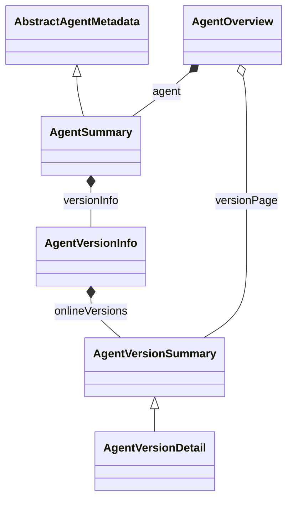

<!--
  Copyright 1999-2026 Alibaba Group Holding Ltd.

  Licensed under the Apache License, Version 2.0 (the "License");
  you may not use this file except in compliance with the License.
  You may obtain a copy of the License at

       http://www.apache.org/licenses/LICENSE-2.0

  Unless required by applicable law or agreed to in writing, software
  distributed under the License is distributed on an "AS IS" BASIS,
  WITHOUT WARRANTIES OR CONDITIONS OF ANY KIND, either express or implied.
  See the License for the specific language governing permissions and
  limitations under the License.
-->

# Agent 与版本摘要合并：本次落地范围

2026-09-14；本地试改，未提交。此文描述本次代码，MODEL_RELATIONSHIPS.md 前面的图保留为上一次试改快照。

## 合并结果



| 原类型 | 本次保留类型 |
| --- | --- |
| Agent、AgentSummary、AgentCatalogEntry | AgentSummary |
| AgentVersionInfo、AgentVersionCatalog | AgentVersionInfo |
| AgentVersionSummary、AgentCatalogVersion（更早的 AgentVersionCatalogEntry 已合并） | AgentVersionSummary |
| AgentVersionDetail | 继续继承 AgentVersionSummary，保留具体版本内容 |

```text
AgentSummary
└── versionInfo: AgentVersionInfo
    ├── editingVersion
    ├── reviewingVersion
    ├── labels: Map<label, version>
    └── onlineVersions: List<AgentVersionSummary>
        ├── version
        ├── labels[]       当前在线版本的自定义标签，不含 latest
        └── protocols[]
```

latest 从 `versionInfo.labels["latest"]` 读取，在线数量由 onlineVersions.size() 派生。
Java 保留只读的 getLatestVersion()/getOnlineCnt() 便利方法，用 @JsonIgnore 排除重复 JSON 字段；没有对应 setter。

## 同类型在不同查询中的字段边界

| 查询 | 返回 | 字段边界 |
| --- | --- | --- |
| 管理资源列表 | Page<AgentSummary> | 公共元数据、治理和版本信息；不加载 extensions |
| 管理资源详情/更新 | AgentOverview.agent 或 AgentSummary | 包含 extensions；versionInfo.labels 保留完整标签，包括非 online 目标 |
| RAD Search | Page<AgentSummary> | 只含公共元数据和 versionInfo；仅投影 online 标签和版本，排除 namespace、治理、工作版本、extensions |
| 版本管理列表/生命周期操作 | AgentVersionSummary | version、状态、作者、摘要、摘要哈希和时间等；不加载定义内容 |
| 精确版本详情 | AgentVersionDetail | 继承版本摘要，并含 namespace、Agent 名称、callInterfaces |

采用同一具体类按查询填充字段，不新增 wrapper 或抽象继承层。Search 的字段边界由显式投影和校验器保证。

## 存储与协议

本次调整了管理响应和 Search 的 JSON：原并列 versionCatalog、Search 的顶层 latestVersion/versions、
公开 onlineCnt 均收敛到 versionInfo。新客户端、服务端及 Console 必须一起使用这一模型版本；不提供试验版旧模型别名。

内部 `version_info` 的 lifecycle/onlineCnt/labels 与 `ext.versionCatalog` 的 latestVersion/onlineVersions
继续使用原存储结构，显式组装公共模型。搜索索引结构及其 sourceDigest 输入也保持原投影，
管理状态和非在线标签不会因 DTO 合并进入索引摘要。

对应规范、管理/RAD JSON Schema、Java SDK/Maintainer SDK/OpenAPI IT 同步修改。
Console 的源码和对应构建产物同时更新，latest 与在线数量均读取新字段。

## 本次不处理

CallInterface、Endpoint 及发现结果层次保持上一次代码；默认 Discover 的 MODEL-D01 问题继续记录在
MODEL_RELATIONSHIPS.md。A2A/RAD 模式协商、故障恢复和跨集群兼容不在本次范围。

## 验证

本次验证结果单独追加到 MODEL_VALIDATION.md，不复用上一次试改的通过数。
