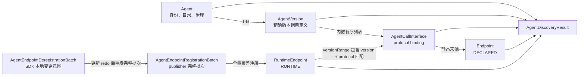
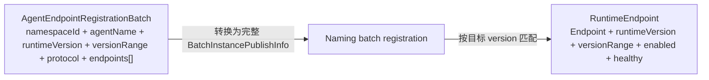
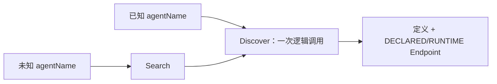
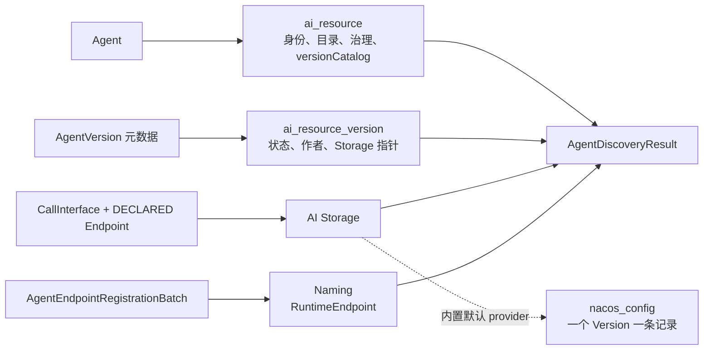
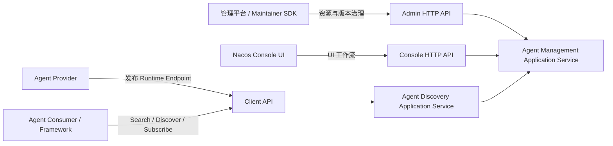
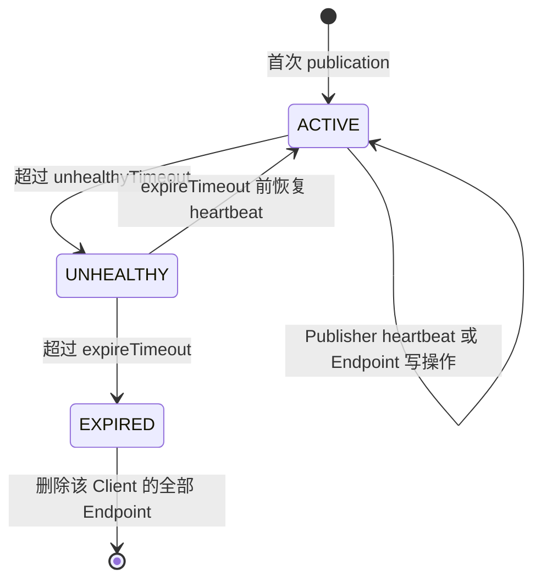
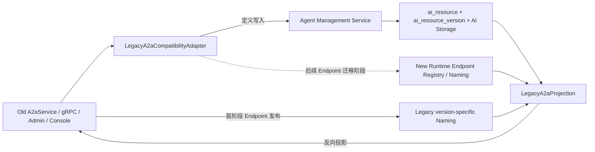
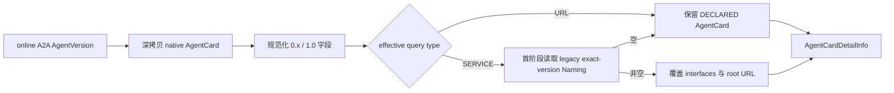

<!--
  Copyright 1999-2026 Alibaba Group Holding Ltd.

  Licensed under the Apache License, Version 2.0 (the "License");
  you may not use this file except in compliance with the License.
  You may obtain a copy of the License at

       http://www.apache.org/licenses/LICENSE-2.0

  Unless required by applicable law or agreed to in writing, software
  distributed under the License is distributed on an "AS IS" BASIS,
  WITHOUT WARRANTIES OR CONDITIONS OF ANY KIND, either express or implied.
  See the License for the specific language governing permissions and
  limitations under the License.
-->

# Agent 管理与 Remote Agent Discovery（RAD）设计草案

> 状态：讨论草案，非正式规范。
>
> 本文先确认 Agent/A2A 的现状、目标和基本原则，再从使用视角给出 Agent/RAD 模型及其存储映射。
> 第 4 章聚焦模型与存储映射；范围外事项、待决问题和后续工作统一记录在第 4.4 节。第 5 章在该模型上
> 给出 Client、Admin 和 Console API 设计；第 6 章定义存量 A2A API 的双向兼容；第 7 章列出编码落地
> TODO；第 8 章保留滚动升级 TODO。

## 1. 背景

Nacos 已经将 Prompt、Skill 和 AgentSpec 迁移到统一的 AI 资源模型：

```text
ai_resource + ai_resource_version
```

统一模型提供资源身份、版本、生命周期、标签、可见性、发布流水线和存储指针等公共治理能力。
当前 A2A Agent 仍使用独立的 Config 数据和 Naming Endpoint，没有进入统一模型。

与此同时，现有 A2A 模型直接以 AgentCard 为核心。它适合表达 A2A 协议下的 Agent 描述，
但不足以表达一个可绑定多种协议、具有统一生命周期和运行时实例的通用 Agent。

### 1.1 相关 Issue

| Issue | 主要诉求 | 对本次分析的影响 |
|---|---|---|
| [#14804](https://github.com/alibaba/nacos/issues/14804) | 将 A2A Registry 向上抽象为通用 Agent Registry，兼容 A2A，并为其他 Agent 协议预留扩展能力 | 需要把 Agent 从 A2A 协议模型中抽离出来 |
| [#15450](https://github.com/alibaba/nacos/issues/15450) | 当前 `agentName::version` Naming serviceName 与 Gateway/URI 使用存在兼容问题 | 需要解耦业务身份、版本和物理服务标识，不能只替换分隔符 |
| [#15230](https://github.com/alibaba/nacos/issues/15230) | Agent 名称需要支持中文等业务友好名称 | 需要区分机器 `agentName`、Unicode `displayName` 与物理存储/路由 key |

补充关联 Issue 中，[#14621](https://github.com/alibaba/nacos/issues/14621) 和
[#14439](https://github.com/alibaba/nacos/issues/14439) 反映了 A2A 协议版本与安全描述的持续演进，
[#14801](https://github.com/alibaba/nacos/issues/14801) 和
[#14789](https://github.com/alibaba/nacos/issues/14789) 则提出了大量 Agent 的生命周期治理和检索诉求。
这些关联诉求进一步说明需要先稳定通用 Agent 抽象。

当前 [A2A Agent 规范](../specs/zh-cn/ai/a2a-agent-spec.md) 也已经留下演进方向：未来应建立协议无关的
Remote Agent/Agent Service 抽象，A2A 只是其中一种协议绑定。

同时参考[《阿里云一方 Agent 标准草案 v0.3》](https://alidocs.dingtalk.com/i/nodes/7NkDwLng8Za7QYkeHNdbeqKAJKMEvZBY)
作为 Agent Discovery 方向的输入。该草案定义了机器名、双语展示、关键词、场景、统一版本、调用形态、
消费渠道和治理状态。它主要回答“Agent 是什么、在哪里被发现”，而 A2A/RAD 回答“Agent 支持什么调用协议、
当前可从哪里调用”。本方案将两者纳入同一 Agent Version，但不把 Discovery Manifest 误当作调用协议。

### 1.2 抽象高度

本次不再把问题理解为“A2A 换表”或“修复 serviceName”，而是分析 Nacos 应如何管理一个远程 Agent：

- Agent 如何成为统一、可版本化和可治理的 AI 资源；
- A2A 如何从核心领域模型降为一种协议表达；
- Agent 定义与运行时 Endpoint 如何分离；
- 如何形成面向远程 Agent 调用元信息的 Remote Agent Discovery（RAD）注册、发现和订阅抽象。

本次抽象聚焦 Agent/A2A 的迁移、Agent Registry 管控模型和 RAD 数据面协议，不定义实际远程调用协议。

## 2. 现状分析

### 2.1 当前领域对象仍是 A2A AgentCard

当前公开身份在规范中定义为：

```text
namespaceId -> a2a -> agentName
```

核心对象是 `AgentCard`，主要包含：

- name、description、provider；
- capabilities、skills；
- protocolVersion、preferredTransport；
- supportedInterfaces/additionalInterfaces；
- security schemes 和其他 A2A 字段；
- version 等 AgentCard 基本信息。

Nacos 在 `AgentCardDetailInfo` 和 `AgentCardVersionInfo` 中另外维护 `registrationType`、
`latestPublishedVersion`、版本明细和 latest 标记；这些是 Nacos 的注册治理信息，不属于 `AgentCard` 本体。

当前模型已经兼容 A2A 1.0，同时保留部分旧 A2A 字段。但仓库中没有独立于 AgentCard 的通用 Agent、
AgentVersion 或 ProtocolBinding 领域对象。

现有服务提供的能力主要是：

- AgentCard 发布、更新、删除；
- metadata、版本列表和具体版本查询；
- Endpoint 注册、注销与查询时注入；
- AgentCard 订阅。

仓库中没有统一的 Agent invoke、message、task、session、stream 或 cancel 调用模型。
因此当前能力本质上是“A2A AgentCard 注册与发现”，不是实际的远程 Agent 调用协议。

主要接口和模型：

- [`AgentCard`](../api/src/main/java/com/alibaba/nacos/api/ai/model/a2a/AgentCard.java)
- [`A2aService`](../api/src/main/java/com/alibaba/nacos/api/ai/A2aService.java)
- [`A2aServerOperationService`](../ai/src/main/java/com/alibaba/nacos/ai/service/a2a/A2aServerOperationService.java)

### 2.2 Agent 元数据和版本仍存储在 Config

当前 A2A 没有使用 `ai_resource` 和 `ai_resource_version`，而是使用两类 Config 数据：

| 内容 | Config group | dataId |
|---|---|---|
| AgentCard metadata | `agent` | `encode(agentName)` |
| AgentCard version | `agent-version` | `encode(agentName)-<agentVersion>` |

metadata 中维护版本摘要和 `latestPublishedVersion`；每个版本的 AgentCard 详情单独存储。
latest 和版本可见性没有复用统一资源模型的 `online/offline + labels.latest` 语义。

不同入口的版本写入行为也不完全一致：

- Admin/Maintainer update 可以覆盖已有同版本 AgentCard；
- Java SDK `releaseAgentCard` 对相同 name/version 是幂等 no-op；
- 首次创建 Agent 时会建立 latest，`setAsLatest` 主要影响已有 Agent 的新版本。

当前 A2A 资源没有完整复用统一模型中的：

- draft、reviewing、reviewed、online、offline 生命周期；
- scope、owner 和统一 visibility；
- bizTags、label、发布流水线；
- 统一的版本内容存储和资源审计。

### 2.3 AgentCard 同时承载定义和运行时视图

AgentCard 中既有相对稳定的协议描述，也包含 Endpoint URL/interface 等运行时信息。

当 `registrationType=URL` 时，消费者主要使用 AgentCard 中保存的静态地址。

当 `registrationType=SERVICE` 时，查询流程会：

1. 读取 Config 中的 AgentCard；
2. 查询 Naming 中对应的 Endpoint service；
3. 将 Naming hosts 转换为 Agent interfaces；
4. 用动态 interfaces 替换返回视图中的 `supportedInterfaces` 和 `additionalInterfaces`；
5. 按 preferred transport 过滤后随机选择一个 URL 作为 primary URL。

如果没有动态 hosts，则保留原 AgentCard 中的静态接口和 URL。

这意味着同一个 AgentCard 查询结果同时受版本内容和实时 Naming 数据影响，定义变更与 Endpoint 变更没有独立边界。

### 2.4 Endpoint 依赖 Naming，但身份与 Agent 名称、版本耦合

当前动态 Endpoint 注册链路为：

```text
Java SDK
  -> AgentEndpointRequest / BatchAgentEndpointRequest
  -> AgentEndpointRequestHandler
  -> Naming EphemeralClientOperationService
  -> group = agent-endpoints
  -> serviceName = encode(agentName) + "::" + version
```

Endpoint instance metadata 保存 transport、path、TLS、protocol、protocolVersion、query 和 tenant 等信息。
实例与 gRPC connectionId 绑定，连接断开后依赖 Naming ephemeral client 语义清理。

当前实现还具有以下行为：

- 注册前不校验 Agent、version 或协议绑定是否存在；
- 一个 connection 在同一个 service 下再次 single register 会覆盖此前的 publish record；
- batch register 会替换该 connection 对整个 service 的 publish record；
- deregister 按 `connectionId + service` 删除整个 record，并不是精确删除请求中的单个 Endpoint；
- Endpoint request 尚未把运行版本、兼容版本绑定、Agent protocol binding 与 host + port + transport
  自然键统一为一个注册模型。

因此当前 Endpoint 能工作，但还不是一个独立、可精确寻址和可支持多协议的 Agent Endpoint 模型。

主要实现：

- [`AgentEndpointRequestHandler`](../ai/src/main/java/com/alibaba/nacos/ai/remote/handler/a2a/AgentEndpointRequestHandler.java)
- [`AgentEndpointUtil`](../ai/src/main/java/com/alibaba/nacos/ai/utils/AgentEndpointUtil.java)

### 2.5 Agent 名称同时承担业务身份和物理标识

当前 `AgentCard.name` 同时承担 Nacos 查询身份、页面展示名称和底层 key 输入，而 A2A 协议本身把它定义为
human-readable name。展示语义与机器身份在入口处已经混在一起。

当前参数规则将 Agent 名称限制为可打印 ASCII：

```text
^[\x20-\x7E]+$
```

长度上限为 64。这直接导致中文 Agent 名称无法通过参数校验，同时仍允许空格、冒号、斜杠等不适合机器身份的字符。

现有 `AsciiAgentIdCodec` 也没有形成可靠的 Unicode 物理 key：它使用 `Character.isLetter`，中文字符可能被当作
letter 原样保留；其他字符又按 UTF-16 `char` 编码。即使只放开正则，中文名称仍会继续进入 Config dataId、
权限资源和 Naming serviceName。

该 codec 已经参与旧 A2A Config/Naming 物理标识，后续不能通过修改原实现来改变编码结果。新模型需要新增
独立 codec；现有 `AsciiAgentIdCodec` 保持行为不变，作为旧数据解析、兼容读取和服务端迁移的 legacy codec。

同时，Naming serviceName 又由 `encode(agentName) + "::" + version` 拼接。将分隔符改为 `-` 仍然无法解决：

- name/version 分段歧义和碰撞；
- 中文、跨存储的大小写比较语义、超长和 URI 解析约束；
- Agent 改名或版本格式变化导致物理服务身份变化；
- 业务名称泄露到底层路由和存储实现。

因此 #15230 和 #15450 实际是同一个根问题的两个表现：人类展示名、机器 Agent 身份和物理 key 没有分层。

主要实现：

- [`ParamCheckRule`](../common/src/main/java/com/alibaba/nacos/common/paramcheck/ParamCheckRule.java)
- [`AsciiAgentIdCodec`](../ai/src/main/java/com/alibaba/nacos/ai/service/a2a/identity/AsciiAgentIdCodec.java)

### 2.6 API、SDK、缓存和兼容表面已经较多

当前需要兼容的主要表面包括：

- Admin/Console `/v3/.../ai/a2a` HTTP API；
- Java SDK `A2aService`；
- `AiService extends A2aService`；
- Maintainer SDK `A2aMaintainerService`；
- AgentCard query/release 和 Endpoint register/deregister gRPC request；
- `SERVER_AGENT_REGISTRY`、`SERVER_AGENT_CARD_V1` 等能力位；
- 已有 OpenAPI IT、Java SDK IT 和 Maintainer SDK IT 场景。

当前没有 `/v3/client/ai/a2a` HTTP API，Java SDK 的运行时请求直接走 gRPC。
Admin/Console 创建 Agent 时默认 `registrationType=URL`，Java SDK 发布时默认 `SERVICE`。

客户端 AgentCard 订阅基于周期轮询。变更判断主要比较 version、URL 和 interfaces；同版本的 description、skills、
capabilities 或 security 变化可能不触发 listener。Endpoint redo 也没有完整表达同名 Agent 的多版本、多协议实例。

这些表面不能在迁移中一次性替换，需要先明确哪些是长期契约、哪些是兼容 facade、哪些现有行为属于待修缺陷。

### 2.7 与统一 AI 资源模型的差距

Prompt、Skill、AgentSpec 已经使用：

- [`AiResource`](../ai/src/main/java/com/alibaba/nacos/ai/model/AiResource.java)
- [`AiResourceVersion`](../ai/src/main/java/com/alibaba/nacos/ai/model/AiResourceVersion.java)
- [`AiResourceManager`](../ai/src/main/java/com/alibaba/nacos/ai/service/resource/AiResourceManager.java)
- [`AiResourceStorage`](../plugin/ai/src/main/java/com/alibaba/nacos/plugin/ai/storage/spi/AiResourceStorage.java)

统一底座已经具备 Agent 可以复用的元数据、版本、生命周期、label、visibility、pipeline 和 storage 能力。
但它目前仍是公共骨架，不是新增一个 `agent` type 就自动完成迁移：

- payload、runtime query、SDK cache 仍由各资源类型实现；
- 默认 storage 和 publish pipeline 的资源类型目前是闭集；
- 当前没有一等资源依赖和 ProtocolBinding 模型；
- 部分生命周期 guard、已发布版本不可变和 label 校验仍需在接入前确认、补齐；
- Agent Endpoint 属于运行时状态，不能直接塞入 `ai_resource_version` 代替 Naming。

因此迁移方向可以复用统一底座，但不能简单复制 Prompt、Skill 或 AgentSpec 的实现。

### 2.8 当前完整链路

```text
管理者发布 AgentCard
        |
        v
Config: agent / agent-version
        |
        +----------------------+
                               |
Agent Provider                 Agent Consumer
通过 gRPC 注册 Endpoint         查询 AgentCard
        |                      |
        v                      v
Naming: agent-endpoints        Config + Naming 组装动态 AgentCard
                               |
                               v
                         返回 URL/interfaces
                               |
                               v
                    业务框架自行调用远程 Agent
```

Nacos 当前负责 AgentCard 和 Endpoint 的注册发现，真正的远程调用不经过 Nacos，也没有统一客户端调用抽象。

### 2.9 现状问题

| 问题 | 当前表现 | 直接影响 |
|---|---|---|
| Agent 与 A2A 协议没有分层 | 核心资源身份和 DTO 都以 A2A AgentCard 为中心 | 新协议只能继续向 AgentCard 塞字段或复制一套实现 |
| 没有统一 Agent 资源 | A2A 未进入 `ai_resource + ai_resource_version` | 生命周期、版本、visibility、label 和 pipeline 语义不一致 |
| 逻辑身份与物理 key 耦合 | agentName 同时用于查询、Config、权限和 Naming serviceName | 中文名称、Gateway、版本格式和改名问题互相牵连 |
| 定义和 Endpoint 混合 | 查询时将 Naming hosts 注入 AgentCard | 定义变更、实例变化、缓存和订阅无法独立处理 |
| Endpoint 维度不足 | 按 connection + service 保存 publish record，地址与 transport 主要落在 Naming Instance/metadata | 多版本、多协议的分组、自然键和批量场景下的精确更新语义不清晰 |
| 尚无 RAD 抽象 | SDK 返回 AgentCard/URL 后结束 | 发现、协议选择和 Endpoint 解析之间没有稳定边界 |
| 兼容行为分散 | HTTP、SDK、gRPC、Maintainer、能力位和旧 Config/Naming 都有独立语义 | 迁移不能通过一次换表或改 serviceName 完成 |

这些问题的共同根因是：当前实现以“A2A AgentCard 注册”为中心，而目标需要以“通用 Agent 资源及其运行时调用入口”
为中心重新划分领域边界。

### 2.10 分析目标

当前阶段的目标不是直接给出完整实现，而是先回答以下问题。

#### 2.10.1 需要确认的核心概念

1. 什么是 Nacos 中的 Agent，Agent 与 AgentSpec、A2A AgentCard 的边界是什么；
2. Agent、AgentVersion、调用接口和运行时 Endpoint 分别属于哪个生命周期；
3. A2A 如何成为 AgentVersion 中的第一个调用协议，而不是继续成为 Agent 本身；
4. 管控面怎样以较少对象完成创建、列表、详情和版本治理；
5. 数据面怎样以一次 Agent Discovery 为默认体验，以可选 Filter 完成协议和 Endpoint 筛选，同时支持 SDK 内部缓存与订阅；
6. 对外对象如何拆解到 `ai_resource + ai_resource_version + ai_storage`；
7. `agentName`、可选 `displayName` 和物理存储/路由 key 如何分层。

#### 2.10.2 本阶段应形成的结论

- 一套从管控面和数据面都容易使用的 Agent Registry 对象与 RAD 读取视图；
- Agent 元数据、版本调用定义与运行 Endpoint 的明确边界；
- 对外对象到统一 AI 资源存储的确定映射；
- 面向列表、详情和 Agent Discovery 的信息密度与读取次数原则；
- A2A 原生对象在通用模型中的位置；
- 进入 API 与兼容设计前需要维护者确认的模型决策。

## 3. 设计概览

### 3.1 总体分层

从使用者视角，新模型只保留三个事实对象：

```text
Agent                    它是谁、能做什么、如何治理
└── AgentVersion         这一版如何调用
    └── CallInterface[]  这一版支持的 A2A 等调用接口（内嵌值对象）

RuntimeEndpoint[]        这个运行实例支持哪些版本和协议、当前从哪里调用
```

`AgentSummary`、`AgentOverview`、`AgentDiscoveryResult` 等都只是针对不同场景裁剪或组合出的读取视图，
不是新的事实对象。Agent 和 AgentVersion 落到统一 AI 资源的低频持久化模型；RuntimeEndpoint
落到高频运行时注册模型。术语上，Agent Management / Agent Registry 表示管控面，RAD 表示数据面发现协议。
RAD 统一 `AgentReference -> version -> CallInterface -> versionRange -> Endpoint` 主链路，
Nacos server 负责注册、发现和可选过滤，客户端协议实现直连 Endpoint。

### 3.2 设计基本原则

1. **Agent-first，协议下沉。** Agent 是核心领域资源，A2A 是 `CallInterface` 的首个协议；不能继续让协议 DTO
   决定通用 Agent 模型。

2. **复用统一 AI 资源治理。** Agent metadata、version、lifecycle、visibility、label 和 pipeline 应尽量复用统一模型，
   避免再建一套专用治理逻辑。

3. **沿用 A2A 名称基线，不制造第二套身份。** `agentName` 沿用当前 A2A 可打印 ASCII 与长度规则，
   作为大小写敏感、不做 trim/slug 的不透明身份；`displayName` 可选且支持 Unicode，缺失时展示 `agentName`。
   新模型通过 `rad-ascii-v1` AgentName codec 派生 Config key 和 Naming serviceName 共用的
   `encodedAgentId`；codec 对安全名称保持原值，对其他字符使用 `enc-` 前缀和三位十进制转义，
   结果只包含 `[A-Za-z0-9-]`，并保留原始身份的大小写区别。Version 符合 Config dataId 字符集，保持原值。
   鉴权和缓存也不得直接拼接原始名称构造物理身份。

4. **定义与运行时分离。** Agent version 和协议描述是可发布的定义；Endpoint、健康和 Registry Client 生命周期
   是动态运行时状态，两者独立变化和订阅。

5. **控制面与数据面分离。** Nacos server 负责管理、注册、发现和解析，不默认成为 Agent 请求代理；调用由客户端
   协议实现完成。

6. **公共字段少而稳定，协议内容保持原生。** 展示、检索和治理字段放在 Agent；调用定义放在 AgentVersion；
   A2A AgentCard 等原生描述完整保存在 CallInterface 中，不抽象一个字段并集式“超级 AgentCard”。

7. **按使用场景控制信息密度。** 列表不加载版本 payload，版本详情不混入 Runtime Endpoint；普通调用方通过一次
   Agent Discovery 获取定义和 Endpoint，可选 Filter 只缩小同一结果，缓存与订阅由长生命周期 SDK 内部处理。

8. **单一事实源，派生摘要可重建。** Agent、AgentVersion 内容和 Runtime Endpoint 各自只有一个事实源；
   为读性能保存的摘要必须由事实生成、可校验且可重建，不能成为第二套可独立编辑的数据。

9. **先定模型，再定接口与迁移。** 旧 A2A API 保持兼容、历史数据由 server 迁移是已确认约束；
   模型定稿后再设计 API、兼容流程并改写/新增中英文 specs 与测试矩阵。

## 4. 具体设计

> 本章先定义管控面和数据面使用的对象，再定义服务端存储，最后给出跨层映射。对象与 HTTP、gRPC、SDK 等传输形式无关。
> 已确认的模型规则全部放在 4.1～4.3；非目标、兼容迁移、待决实现细节和后续工作集中放在 4.4。

### 4.1 对外 Agent Registry 与 RAD 模型

#### 4.1.1 模型关系与边界

模型包含 `Agent`、`AgentVersion`、`RuntimeEndpoint` 三类事实。`AgentCallInterface` 是
`AgentVersion` 内嵌的值对象；Registration Batch 是完整批次写命令，Deregistration Batch 是 SDK
本地变更意图；其他对象均为读取视图。



| 对象 | 回答的问题 | 变化频率 | 生命周期与事实源 |
|---|---|---:|---|
| `Agent` | 它是谁、能做什么、如何展示和治理 | 低 | 独立资源；统一 AI Resource |
| `AgentVersion` | 这一精确版本如何调用 | 低 | AI Resource 版本生命周期 |
| `AgentCallInterface` | 该版本支持哪种协议及静态地址 | 低 | 随 AgentVersion 内容保存 |
| `RuntimeEndpoint` | 某协议的运行实例当前可服务哪些版本、从哪里调用 | 高 | Naming 注册、健康和 Client identity 生命周期 |
| `AgentEndpointRegistrationBatch` | 覆盖当前 publisher 对同一 Agent + protocol 的完整运行地址批次 | 写命令 | 不独立持久化 |
| `AgentEndpointDeregistrationBatch` | 描述 SDK 本地需要移除的自然地址；SDK 更新 redo 后重发剩余完整批次 | Client 本地命令 | 不作为服务端增量写事实保存 |
| Summary、Detail、Catalog、Discovery 等 | 面向具体使用场景的裁剪或组合结果 | 读取时 | 不作为新事实保存 |

#### 4.1.2 Agent 身份与资源字段

Agent 使用一个机器身份和一个可选展示名称：

| 字段 | 规则 | 参与身份 |
|---|---|:---:|
| `agentName` | 必填；1～64 个可打印 ASCII，正则 `^[\x20-\x7E]+$`；不能为纯空白 | 是 |
| `displayName` | 可选；支持 Unicode；缺失或空白时展示 `agentName` | 否 |

`agentName` 大小写敏感，服务端原样保存，不做 trim、lowercase、slug 或字符替换。精确查询使用完整值；
列表过滤使用 literal contains，查询层转义 `%`、`_` 等 LIKE 特殊字符。原值存入 `ai_resource.name`，
Config dataId 与 Naming serviceName 共用 `rad-ascii-v1` 生成的 `encodedAgentId`；Version 在 Config dataId 中
保持原值。权限和缓存使用结构化身份字段，不得直接拼接原始名称构造 key。
旧 A2A API 的新写入也执行上述校验；历史异常身份的处理延后到第 8 章。

Agent 字段如下：

| 字段 | 必选 | 含义 |
|---|:---:|---|
| `namespaceId` | 是 | 复用 Nacos Namespace 规则；1～128 个 `[A-Za-z0-9_-]` 字符 |
| `agentName` | 是 | 稳定公开身份，创建后不可直接修改 |
| `displayName` | 否 | Unicode 展示名，缺失时回退 `agentName` |
| `description` / `iconUrl` | 否 | 目录简介和图标 |
| `provider` | 否 | 提供方 `name/url`，不等同于管理 owner |
| `tags[]` | 否 | 面向展示、目录和检索的公开分类标签 |
| `extensions` | 否 | `Map<String, JsonValue>`；命名空间化的公开扩展 |
| `status` | 是 | `enable` 或 `disable` |
| `owner` / `scope` | 是 | 管理责任主体和共享可见性；首版 scope 为 `PUBLIC` 或 `PRIVATE` |
| `versionInfo` | 只读 | editing、reviewing、online count 和 labels（含 latest） |
| `versionCatalog` | 只读 | latest 及全部 online 版本的轻量调用目录 |
| `metaVersion` | 只读 | Agent 元数据 CAS 版本 |
| `createTime/updateTime` | 只读 | 审计和排序 |

字段边界固定如下：

- Agent 不内嵌完整协议描述、Endpoint、健康状态或完整版本历史；`versionCatalog` 只保存紧凑的 online 版本摘要。
- `description/provider/tags` 服务通用目录；协议同名信息保留在版本的 native descriptor。
- 首版不再单独定义其他目录分类字段；未来确有结构化需求时再通过 AgentResourceExt Schema 演进。
- 首次创建时，Adapter 仅用 native descriptor 填充调用方未显式提供的目录字段；创建后不自动双向同步。
- `extensions` 不参与身份、鉴权、版本、默认检索或 Endpoint 选择，也不得保存凭据和服务端内部状态。
- 完整 Agent 和 AgentOverview 返回 `extensions`；Summary、Catalog 与 Discovery 不返回。
- 修改 Agent 目录或扩展字段只推进 `metaVersion`，不创建 AgentVersion。

#### 4.1.3 AgentVersion、CallInterface 与 Endpoint

**AgentVersion**

| 字段 | 必选 | 含义 |
|---|:---:|---|
| `namespaceId/agentName/version` | 是 | 精确版本身份 |
| `status` | 是 | `draft/reviewing/reviewed/online/offline` |
| `callInterfaces[]` | 是 | 至少一个的有序调用接口列表 |
| `author` / `changeDescription` | 否 | 作者和变更说明 |
| `contentDigest` | 只读 | 完整版本内容摘要，用于不可变校验和缓存 |
| `createTime/updateTime` | 只读 | 审计信息 |

版本采用 `MAJOR.MINOR.PATCH[-PRERELEASE]`，总长不超过 64：

- MAJOR、MINOR、PATCH 为 `0` 或不以 `0` 开头的正整数。
- PRERELEASE 由一个或多个 `.` 分隔的 `[0-9A-Za-z-]+` 标识组成；纯数字标识禁止前导零。
- 允许 `1.2.0-RC1`、`1.2.0-RC.2`、`1.2.0-M2`，不允许 `+build-metadata`。
- Version 原样保存且大小写敏感；`1.2.0-RC1` 与 `1.2.0-rc1` 是两个不同的 Version。
- 版本顺序先按 MAJOR、MINOR、PATCH 数值比较；正式版高于同核心版本的 prerelease；prerelease 标识从左到右比较，
  纯数字按数值比较且低于非数字标识，非数字标识按大小写敏感的 ASCII 字典序比较，相同前缀下标识更多者更高。
- `ai_resource_version` 唯一性、DAO 比较、缓存键、label 目标与精确查询均使用大小写严格语义。
- label 存在 Agent `versionInfo.labels` 中，发现时先解析为精确版本。

这些语法是首版所有 Agent 写入入口的统一创建约束，旧 A2A API 也不例外；不符合约束的输入返回
旧 API 对应的参数错误，不进行改名或隐式转换。

| Version status | 内容可修改 | 发现语义 |
|---|:---:|---|
| `draft` | 是 | 不进入普通数据面发现 |
| `reviewing` | 否 | 审核中冻结 |
| `reviewed` | 否 | 审核结果已形成 |
| `online` | 否 | 可进入普通数据面发现 |
| `offline` | 否 | 保留内容但不进入普通数据面发现 |

`ai_resource_version.status` 是生命周期事实源；`publishPipelineInfo` 只保存审核过程和结果。

**AgentCallInterface**

| 字段 | 必选 | 含义 |
|---|:---:|---|
| `protocol` | 是 | 规范化协议标识；同一 Version 内唯一 |
| `protocolVersion` | 否 | 快速协商值，不参与接口身份 |
| `descriptorMediaType` | 是 | native descriptor 的媒体类型 |
| `nativeDescriptor` | 是 | 完整协议原生描述；A2A 场景为 AgentCard |
| `endpointSourceOrder[]` | 是 | 来源允许集合和默认顺序：`RUNTIME`、`DECLARED` |
| `declaredEndpoints[]` | 否 | 从版本定义派生的静态 Endpoint |

`endpointSourceOrder` 必须非空，元素只能是 `RUNTIME`、`DECLARED`，并且同一来源不能重复。
每个协议 Adapter 生成稳定的 canonical protocol token；CallInterface 唯一性、Endpoint 注册批次、Discover
Filter 和 Naming serviceName composer 全部使用该 token，并按大小写精确比较。
`callInterfaces[]` 的业务顺序就是协议默认偏好顺序；SDK 从第一个仍有可用 Endpoint 的接口开始选择。
数组重排会改变 `contentDigest`，已发布版本不得原地重排。
`endpointSourceOrder` 属于单个 CallInterface：`[RUNTIME, DECLARED]` 表示运行时优先、声明地址后备；
`[DECLARED]` 只表示该 CallInterface 的数据面 Discover 不使用 Runtime Endpoint，不限制 Endpoint 注册，
也不限制管控面查询原始 RuntimeEndpointSnapshot。

**Endpoint**

DECLARED 与 RUNTIME 来源复用同一个 Endpoint 值对象：

| 字段 | 必选 | 身份字段 | 含义 |
|---|:---:|:---:|---|
| `uri` | 是 | host、effective port | 完整调用 URI |
| `transport` | 是 | 是 | 规范化传输类型 |
| `priority` | 否 | 否 | 数值越小优先级越高 |
| `weight` | 否 | 否 | 同 priority 内的负载权重 |
| `metadata` | 否 | 否 | zone、环境、机房和自定义 labels 等扁平键值 |

Endpoint 的身份由以下自然键确定：

```text
(namespaceId, agentName, protocol)
+ normalizedHost(uri) + effectivePort(uri) + normalizedTransport
```

- URI 必须包含非空 scheme 和 host；port 必须显式给出，或能由 scheme 解析出 1～65535 的默认端口。
- DNS host 使用大小写无关的规范形式；IP 使用稳定 IPv4/IPv6 表达；缺省端口按 URI scheme 补齐。
- path、query、metadata、priority、weight 不参与身份；发布者修改它们时提交新的完整批次覆盖旧批次。
- 同一逻辑分组内不能只靠不同 path 并存两个 Endpoint。
- Adapter 从 native descriptor 生成并校验 declaredEndpoints；二者不允许独立编辑。

#### 4.1.4 Runtime Endpoint 注册与生命周期



`AgentEndpointRegistrationBatch` 是当前 publisher 对一个
`(namespaceId, agentName, protocol)` Naming Service 的完整期望批次，不独立持久化。单 Endpoint 注册就是
`endpoints[]` 只有一个元素，首版不再定义单条服务端增量注册命令：

| 字段 | 必选 | 含义 |
|---|:---:|---|
| `namespaceId` | 是 | 请求的隔离边界；Client SDK 使用初始化时绑定并缓存的值自动填充 |
| `agentName` | 是 | 目标 Agent 身份 |
| `runtimeVersion` | 是 | 当前实际运行的 Agent 实现版本 |
| `versionRange` | 否 | 该实例可服务的 AgentVersion 范围；缺失时规范化为精确范围 `[runtimeVersion]` |
| `protocol` | 是 | canonical protocol token |
| `endpoints[]` | 是 | 1～1000 个公共 Endpoint；同一完整批次共享唯一的 runtimeVersion/versionRange |

`namespaceId` 是协议请求的顶层字段，但不是普通 Client SDK 的调用级参数。Java Client 在初始化时解析并缓存唯一
namespace，HTTP/gRPC Proxy 在组装请求时把该缓存值写入批次；SDK 用户不能借由批次跨 namespace 调用。
直接调用 HTTP OpenAPI 时由调用方显式提交 namespaceId，省略时按 Binding 规则归一化为默认 namespace。

`AgentEndpointDeregistrationBatch` 只包含 `namespaceId/agentName/protocol` 和
`endpoints[] {uri, transport}`；它是 SDK 的本地变更意图，不直接发送给服务端执行增量删除。SDK 从 redo
中的完整批次移除这些自然键，再发送剩余 `AgentEndpointRegistrationBatch`；剩余集合为空时注销整个
publisher publication。直接 HTTP 调用不提供服务端局部注销；调用方同样提交剩余完整批次或注销整份
publication。服务端不得读取旧 publisher record 做 read-modify-write。

这意味着同一 publisher 不能同时为同一 Agent + protocol 保存两组 runtimeVersion/versionRange。若未来需要
并行发布多组 binding，必须调整公开 Registration Batch 模型或引入独立 publisher identity，不能在服务端把
多个请求隐式 merge 成一条 Naming record。

`versionRange` 使用 Maven 风格的单连续区间语法，但版本格式和比较使用本文的 RAD SemVer 规则，
不使用 Maven `ComparableVersion`：

| 表达式 | 语义 |
|---|---|
| `[1.0.6]` | 仅匹配 `1.0.6` |
| `[1.0.0,2.0.0)` | 大于等于 `1.0.0` 且小于 `2.0.0` |
| `[1.0.0,)` | 大于等于 `1.0.0` |
| `(,2.0.0]` | 小于等于 `2.0.0` |

范围边界必须是合法 Version，比较和精确匹配均大小写敏感；canonical 形式不含空白。至少必须提供一个边界，
下界不得高于上界，相同上下界只允许写为精确形式 `[version]`。
首版只支持精确版本或一个连续区间，不支持离散集合和区间并集。`runtimeVersion` 用于管控和诊断，
必须命中规范化后的 `versionRange`；数据面以目标 `version` 是否命中该范围判断实例能否服务。

Runtime Endpoint 注册与 Agent、AgentVersion 和 CallInterface 的创建顺序解耦。服务端允许在上述定义
尚不存在时预注册 Endpoint；注册成功只表示运行时发布已被 Registry 接受，不表示当前可发现。

| 来源 | 创建方式 | 存储 | 变化条件 |
|---|---|---|---|
| `DECLARED` | Adapter 从版本 native descriptor 派生 | AgentVersionContent | 仅 draft 内容更新 |
| `RUNTIME` | AgentEndpointRegistrationBatch 注册 | Agent Registry/Naming | 注册、注销、健康和 publisher identity 变化 |

AgentEndpointRegistrationBatch 规则如下：

1. 注册阶段只校验 agentName/runtimeVersion/versionRange/protocol/Endpoint 格式、鉴权和单批次容量；
   不校验 Agent、Version 或 CallInterface 是否存在，也不校验 Version status。
2. 同一 publisher identity 对同一 `(namespaceId, agentName, protocol)` 只维护一份完整
   `BatchInstancePublishInfo`；gRPC 使用 connectionId，HTTP 使用 clientId。
3. 一个完整批次只声明一组 runtimeVersion/versionRange。versionRange 缺失时在转换层规范化为
   `[runtimeVersion]`，并为批次中的每条 Naming Instance 写入 singular version/versionRange metadata；
   Naming metadata 不保存序列化后的 bindings 数组。
4. 再次注册是 publisher 级完整覆盖：未出现在新批次中的 Endpoint 被删除，出现的 Endpoint 以新内容替换；
   服务端不把它解释为自然键增量 upsert。
5. SDK 的局部注销、Endpoint 修改或 runtimeVersion/versionRange 更换都在本地 redo 上计算新的完整批次后
   重发；剩余批次为空时调用 Naming 注销整个 publication。
6. 服务端 Agent 层只负责 Endpoint 与 Naming Instance/BatchInstancePublishInfo 的数据结构转换、参数校验和
   Naming operation 调用。它不读取旧 publisher state，不做增量 merge，不直接依赖
   `ClientServiceIndexesManager`，不为 Agent 注册额外加锁，不维护额外 projection cache，也不在写入时扫描
   其他 publisher 做冲突或 Service 总量校验。
7. gRPC 连接断开或 HTTP Client 过期由 Naming Client 生命周期清理该 identity 的 publication；其他 identity
   的发布不受影响。
8. RuntimeEndpoint 不暴露 ownerConnection、publisherId 等 Naming 内部身份。
9. 查询从 `ServiceStorage` 的 `ServiceInfo` 读取当前 Naming 视图，根据每条 Instance 的 singular pair 构建
   `RuntimeVersionBinding`，再按 Endpoint 聚合查询结果中的 `bindings[]`。
10. 普通发现阶段才要求 Agent enabled、目标 Version online、CallInterface 存在且允许 `RUNTIME`、
    目标 `version` 命中 `versionRange` 且 RuntimeEndpoint enabled；返回 Naming 健康保护前的原始 healthy 状态，
    `healthy=false` 仍返回，由 SDK 或业务方决定是否使用。

每个 publisher identity 独立维护活性：gRPC publisher 由 connection lifecycle 决定，HTTP publisher 由 Client 级
heartbeat 决定。Agent 查询层以 `ServiceStorage` 已形成的 Naming 可见状态为事实源，再聚合等价 Endpoint 的
binding 和健康结果，不在 Agent 写路径维护第二份 publisher 状态。
`enabled` 是独立运维状态，不被 publisher 心跳覆盖。Endpoint metadata 禁止设置
`preserved.heart.beat.interval`、`preserved.heart.beat.timeout` 和 `preserved.ip.delete.timeout`，避免 Naming
逐 Instance 超时与 Agent HTTP Client 级超时产生两套事实源。

Agent 或 Version 不存在、disable、offline 或被删除时，只停止相关发现投影，不级联删除仍活跃 publisher 的
Naming Instance。Runtime Endpoint 只由显式注销、publisher identity 失活或 Registry 自身的运行时清理终止。
Client redo 保存并重发完整发布批次，只重做结构、鉴权和单批次容量校验，不以
Agent/Version/CallInterface 存在为前提。

每个 `(namespaceId, agentName, targetVersion, protocol, source=RUNTIME)` 数据面投影维护一个
opaque `sourceRevision`。服务端按以下顺序生成投影和 revision：

1. 从 Naming `ServiceStorage` 缓存读取指定 protocol 的完整内部 Service 投影。
2. 从每条 Instance 的 singular version/versionRange metadata 构建 binding，并保留
   `targetVersion` 命中 `versionRange` 的实例。
3. 排除 `enabled=false`，保留 `healthy=true/false`。
4. 按 canonical Endpoint 聚合 Naming 当前视图中的等价实例，并在查询结果中规范化、去重和排序
   `bindings[]`；服务端写路径不为此执行跨 publisher 扫描。
5. 将 Endpoint 规范化并按自然键稳定排序，metadata 按 key 排序。
6. 对固定字段二进制编码计算 `MurmurHash3 x64 128`，输出
   `murmur3-x64-128-v1:<32 lowercase hex>`。

revision 输入只包含 URI、transport、effective priority/weight、公开 Endpoint metadata 和 `healthy`。
runtimeVersion、versionRange、ownerConnection、publisher 数量、心跳时间、lastUpdatedTime 以及
Naming 内部 revision 均不进入哈希。versionRange 或 enabled 的变化通过目标投影的成员增删体现；healthy
变化通过返回字段体现并推进 revision。调用方 Filter 在基础 sourceRevision 之后应用，因而可能产生安全的额外刷新，
但不会漏刷新。空集合也具有稳定 revision；冗余 publisher 变化未改变聚合投影时 revision 不变。

Murmur3-128 只用于变化检测和缓存相等性，不用于身份、鉴权、CAS 防篡改或持久内容完整性。
`sourceRevision` 是 Endpoint 集合的不透明内容指纹，用于 SDK 缓存命中和 Watch 去重，不是 Agent 或 Naming 的自增版本。
实现每次直接基于 `ServiceStorage` 返回的当前 `ServiceInfo` 构建投影；`ServiceStorage` 已是 Naming 缓存，
Agent 层不再维护额外 projection cache。
Runtime revision 不使用 32 位 Java hashCode；AgentVersion 等持久内容摘要继续使用 SHA-256。服务端使用
`MurmurHash3 x64 128`、固定 seed `0` 以及内部 Schema 定义的 framing、long 顺序和字节序；实现测试覆盖
空集合、排序、字段变化和边界。这些细节用于保证不同 Server 对相同投影生成相同 token，不构成对外模型选项。

#### 4.1.5 管控面读取模型

管控面使用有界视图，不返回包含全部历史、descriptor 和运行时状态的巨大对象：
`RuntimeEndpointSnapshot` 是管控面只读视图，不属于 RAD 数据面；数据面只消费 `AgentDiscoveryResult`。

| 视图 | 用途 | 包含 | 不包含 |
|---|---|---|---|
| `AgentSummary` | 列表和筛选 | 展示、治理、versionCatalog 摘要 | descriptor、Endpoint、版本历史、extensions |
| `AgentOverview` | 管理详情首页 | 完整 Agent + 有界 AgentVersionSummary page | 版本 payload、Runtime Endpoint |
| `AgentVersionDetail` | 查看或编辑精确版本 | Version 元数据 + 完整 CallInterface（含 protocol 和 endpointSourceOrder） | Runtime Endpoint |
| `RuntimeEndpointSnapshot` | 查看运行地址 | 指定 Agent + protocol 的完整内部 Service 运行时投影及状态，可选 version 过滤 | Version descriptor、连接归属、数据面可发现性结论 |

`AgentVersionSummary` 固定包含 `version/status/author/changeDescription/contentDigest/createTime/updateTime`。
`RuntimeEndpointSnapshot` 不分页，固定包含：

```text
namespaceId / agentName / protocol
version?                              // 可选；只返回 versionRange 命中该版本的项
items[] {
  endpoint, bindings[] { runtimeVersion, versionRange },
  state, enabled, healthy, lastUpdatedTime
}
state = AVAILABLE | DISABLED | UNHEALTHY
```

状态判定顺序固定为：`enabled=false -> DISABLED`，否则 `healthy=false -> UNHEALTHY`，其余为 `AVAILABLE`。
`lastUpdatedTime` 直接取本次读取的 `ServiceInfo.lastRefTime`。它表示 Naming ServiceInfo 快照的节点本地
更新时间，不承诺是某个 Endpoint 的独立语义变更时间；同一快照中的 item 可以共享该值。跨节点相等性和
Watch 去重使用 `sourceRevision`，不依赖该时间。
`protocol` 必填；省略 `version` 时返回该 protocol 的全部唯一运行实例，提供 `version` 时只返回
`versionRange` 命中该值的 binding；没有剩余 binding 的项被移除，没有实例时成功返回空 `items[]`。
Snapshot 对每个 Endpoint 自然键只返回一项，不跨 protocol 聚合，也不应用
`endpointSourceOrder`：已声明 CallInterface 无论是否包含 `RUNTIME` 都可以查询原始运行时注册事实。
`state` 只反映 enabled/healthy，不增加 `discoverable` 字段；最终发现还依赖 Agent enabled、Version online、
versionRange、endpointSourceOrder 和数据面 Filter。Console 在本地分页展示，并组合 VersionDetail 与 Snapshot，
但二者仍保持独立事实来源。

管控交互模型如下：

| 用户动作 | 逻辑交互 | 数据范围 |
|---|:---:|---|
| Agent 列表或筛选 | 1 | AgentSummary page |
| 打开 Agent 管理详情 | 1 | Agent + 有界 VersionSummary page |
| 打开精确版本 | 1 | 该 Version 的完整定义及 callInterfaces[] |
| 查看某 protocol 的 Runtime Endpoint | 每个 protocol 1 次，按需懒加载 | 指定 Agent + protocol 的 RuntimeEndpointSnapshot，可选 version 过滤 |
| 创建 Agent 和首个 draft | 1 | Agent 元数据 + 首个 Version |
| 修改展示、标签、scope、extensions | 1 | 只更新 Agent |
| 创建或更新调用定义 | 1 | 只创建或更新 draft Version |

高效筛选字段和语义如下：

| 字段 | 筛选语义 |
|---|---|
| `agentName` | literal contains；转义 LIKE 特殊字符 |
| `tags` | 对用户设置的 tag 做精确包含筛选 |
| `protocolsAny` | 至少一个 online Version 的 `protocols[]` 命中任一目标 protocol |
| `scope/owner` | 管控治理筛选 |
| `displayName/provider` | 只返回和展示，不对 ext longtext 做无索引筛选 |

#### 4.1.6 数据面 Search 与统一 Discover

数据面区分目标未知时的目录 Search 和目标已知后的 Agent Discover：

| 动作 | 回答的问题 | 返回 | 调用前置 |
|---|---|---|:---:|
| Search | 哪些 Agent 可能适合 | `AgentCatalogPage` | 仅目标未知时需要 |
| Discover | 指定 Agent 支持什么、当前从哪里调用 | `AgentDiscoveryResult` | 是 |

Search 使用 `AgentSearchRequest`，返回协议分页对象 `AgentCatalogPage`。Java 绑定直接使用字段完全等价的
`Page<AgentCatalogEntry>` 实现，不再增加独立的 Java `AgentCatalogPage` 类，也不形成第二套线上结构。

`AgentSearchRequest` 支持 `agentNameContains`、`tagsAll[]` 和 `protocolsAny[]`。其中
`tagsAll[]` 要求包含全部用户 tag，`protocolsAny[]` 要求至少一个 online Version 暴露任一目标
protocol；筛选必须在稳定分页之前完成。



`AgentCatalogEntry` 包含 agentName、displayName、description、iconUrl、provider、tags、
`latestVersion` 和 `versions[]`；不重复返回 Search Request 已确定的 namespaceId，也不包含 owner、草稿状态、
descriptor 或 Endpoint：

```text
AgentCatalogEntry
├── agentName / displayName / description / iconUrl / provider
├── tags[]
├── latestVersion
└── versions[]
    ├── version
    ├── labels[]
    └── protocols[]
```

`versions` 只列当前 online 且调用方可见的版本，并按 SemVer 降序排列；protocols 只包含
canonical protocol token，不展开 CallInterface。
它不承诺当前存在健康 Endpoint，运行可用性由 Discover 返回。列表必须完整且不得
截断；首版不定义单 Agent 同时 online Version 的产品级硬上限。服务端只返回 Agent enabled、至少存在一个 online Version
且具有有效 latestVersion 的目录项。

只要存在 online Version，就必须存在且仅存在一个 `latestVersion`，并且它属于 `versions`；发布首个 online
Version 时自动建立 latest。下线当前 latest 必须在同一操作中切换到另一个 online Version；下线最后一个 online
Version 时同时清空 latestVersion 和 versions。服务端从内部 `versionCatalog` 派生这两个对外字段，
不将内部包装对象泄漏到 RAD Search。

Discover 输入由目标引用和可选 Filter 组成：

| 对象 | 字段 | 规则 |
|---|---|---|
| `AgentReference` | `agentName/version?/label?` | 在当前请求 namespace 内引用 Agent；version 与 label 互斥，均缺失时使用 latest |
| `AgentDiscoveryFilter` | `protocols[]` | protocol allowlist；protocolVersion 非空时精确匹配 |
|  | `transports[]` | transport allowlist |
|  | `endpointSources[]` | `RUNTIME`、`DECLARED` allowlist |
|  | `metadataSelector` | Endpoint metadata 精确匹配 |

省略 Filter 表示不裁剪；Filter 只减少同一结果中的接口、来源或 Endpoint，不执行负载均衡。结果裁剪规则固定为：

- protocol/protocolVersion 无匹配时返回 `callInterfaces=[]`；
- protocol 匹配但 endpointSources 无匹配时保留该 CallInterface，并返回 `endpointSets=[]`；
- transport 或 metadata 无匹配时保留对应 endpointSet，并返回 `endpoints=[]`。

```text
AgentDiscoveryResult
├── namespaceId / agentName / version / contentDigest
└── callInterfaces[]
    ├── protocol / protocolVersion / descriptorMediaType / nativeDescriptor
    └── endpointSets[]
        ├── source = RUNTIME | DECLARED
        ├── sourceRevision
        └── endpoints[] { uri, transport, priority, weight, metadata, healthy? }
```

`healthy` 在 RUNTIME Endpoint 中必填并表示 Naming 健康保护前的原始状态，在 DECLARED Endpoint 中不存在。AgentDiscoveryResult 不返回
displayName、iconUrl、provider、目录字段或 extensions；这些信息属于 Search/Catalog 和管控视图。

Discover 固定执行以下逻辑：

1. 将 `version`、`label` 或缺省的 latest 解析为精确 `version`。
2. 校验可见性、Agent enabled 和 Version online。
3. 按 Version 原始顺序读取全部 CallInterface，并按各自 endpointSourceOrder 获取来源。
4. 对 RUNTIME 来源执行 `versionRange` 区间匹配并排除 `enabled=false`；保留 `healthy=true/false`，再应用可选 Filter。
5. 每个允许且未被 Filter 排除的来源都返回 endpointSet；来源当前为空时返回空 endpoints 和 revision。
6. `endpointSets` 按 AgentVersionContent 内部 endpointSourceOrder 的相对顺序输出，每个集合再按 priority 和稳定地址顺序输出；
   服务端不隐式选择唯一地址，也不因 healthy 排序改变
   原始集合。SDK 默认的 selectOneHealthy 先过滤 healthy，再应用 priority/weight；getAll 和订阅保留不健康项。

DECLARED endpointSet 的 `sourceRevision` 使用 Version `contentDigest`；RUNTIME endpointSet 使用该分组的
enabled 发现投影的 Murmur3-128 `sourceRevision`。两者都只按 opaque token 相等性比较。
`endpointSets` 是本次调用的权威地址；native descriptor 中自带的静态 URL 不能覆盖它。

| 调用方 | 首次交互 | 后续状态管理 |
|---|---|---|
| 短生命周期函数或进程 | ① Discover `order-agent` 并过滤 A2A/JSONRPC；② 一次获得 version、定义和全部 enabled Endpoint；③ SDK 选择 healthy Endpoint 并调用 | 调用完成后进程退出，不维护缓存和订阅 |
| 常驻 Gateway 或业务平台 | ① 首次执行同一个 Discover；② 缓存完整结果并开始调用 | version/label/latest 解析结果变化时刷新完整快照；contentDigest 变化刷新定义；sourceRevision 变化刷新 Endpoint 及健康状态并重新选址 |

#### 4.1.7 核心不变量与容量

核心不变量如下：

- Agent 元数据与 AgentVersion 内容不互相拥有生命周期。
- 一个 Version 至少包含一个 CallInterface；protocol 唯一，数组顺序具有默认选择语义。
- reviewing、reviewed、online、offline 内容不可原地修改；旧 A2A API 首版也不提供同版本强制覆盖。
- AgentEndpointRegistrationBatch 只声明 runtimeVersion、versionRange 和 protocol，不复制 Agent 或 descriptor，也不要求定义先于 Endpoint 存在。
- 一个物理 Runtime Endpoint 在其全部兼容版本上共享同一 Endpoint payload；版本差异始终取目标 AgentVersion 的 CallInterface。
- native descriptor 是协议原貌；标准 Endpoint 是 Adapter 生成并校验的调用投影。
- Summary、versionCatalog、digest 和 revision 均由服务端生成，并能从事实源重建。

本模型采用以下校验上限：

| 字段 | 上限 |
|---|---:|
| `displayName` / `provider.name` | 128 Unicode code points |
| `description` | 2048 字符 |
| icon、provider、Endpoint URI | 2048 字符 |
| `tags` | 32 项，每项 64 字符；序列化后的 `biz_tags` JSON 不超过 1024 字符 |
| Agent `extensions` | 32 项；key 128 字符；序列化后的 UTF-8 JSON 合计 16 KiB |
| `AgentVersion.version` | 64 字符 |
| Agent Version 物理 Config dataId | 255 字符；超长逻辑 dataId 由通用 `NacosAiConfigKeyCodec` 使用 SHA-256 物理回退 |
| `runtimeVersion` | 64 字符 |
| `versionRange` | 256 字符；首版仅一个连续区间 |
| `protocol/protocolVersion` | 32 / 64 字符 |
| `callInterfaces` | 每 Version 16 项 |
| `declaredEndpoints` | 每 CallInterface 64 项 |
| Endpoint `metadata` | 32 项；key 64、value 256 字符 |
| Runtime 最终 Naming metadata | key/value 的 Java `String.length()` 合计 1024 |
| `AgentVersionContent` | 1 MiB |
| Runtime Endpoint | 每 Agent + protocol 合计 1000 项，可由集群配额调低 |

所有扩展、metadata 和 descriptor 均不得保存明文凭据。Runtime 写入先构造完整 Naming metadata，再整体校验；
超限请求直接拒绝，不截断或丢字段。

### 4.2 内部存储与映射

#### 4.2.1 总体存储拆分



低频元数据和版本内容进入统一 AI Resource/Storage；高频 RuntimeEndpoint 进入 Naming。读取视图由这些事实源
组合，不额外保存合并后的 AgentDiscoveryResult。

#### 4.2.2 `ai_resource` 与 `ai_resource_version`

Agent 的资源身份为 `namespaceId + type=agent + name=agentName`。

| `ai_resource` 字段 | Agent 映射 |
|---|---|
| `namespace_id/type/name` | `namespaceId` / 常量 `agent` / 原始 `agentName` |
| `c_desc` | `description` |
| `status` | `enable/disable` |
| `owner/scope` | 同名治理字段 |
| `biz_tags` | 用户设置的公开 tags |
| `ext` | typed `AgentResourceExt` |
| `c_from` | 来源 |
| `version_info` | editing、reviewing、online count、labels |
| `meta_version` | `metaVersion` |
| `gmt_create/gmt_modified` | 审计时间 |

`AgentResourceExt` 字段如下：

| 字段 | 来源 | 维护方式 |
|---|---|---|
| `schemaVersion` | 常量 `1` | 服务端 |
| `displayName/iconUrl/provider` | Agent 目录字段 | 用户写入，服务端校验 |
| `extensions` | Agent 公开扩展 | 用户写入，服务端校验 |
| `versionCatalog` | 全部 online AgentVersion 的轻量目录 | 服务端派生 |

`versionCatalog` 固定包含 `latestVersion` 和 `onlineVersions[]`；每个条目只保存
`version/labels[]/protocols[]`。`versionInfo.labels` 与 `ai_resource_version.status` 是事实源；发布、下线、
label 或 latest 变化时，服务端在同一逻辑事务中重建 versionCatalog。
存在 online Version 时 `versionInfo.labels.latest` 必须唯一指向其中一个版本；不存在 online Version 时清空
latest 和目录。versionCatalog 不允许用户写入，可从 Version row 与内容重建，
使 Search 只读取 `ai_resource` page，不产生按 Agent 查询 Version 的 N+1。

`biz_tags` 只保存用户设置的公开 tags，并保持值和顺序。序列化后的 JSON 不得超过 1024 字符；
修改 tags 时重新校验，超限则原子拒绝该操作。RAD 按 Protocol 筛选以
`versionCatalog.onlineVersions[].protocols` 为逻辑事实源；首版可以直接据此过滤，后续可以维护独立的
派生 Protocol 索引优化查询，但不得把 Protocol 编码进 `biz_tags`。

AgentName 和 Version 身份在 DAO、DDL、缓存、label、精确查询和权限比较中统一使用严格比较，
保证跨数据库大小写语义一致。`ai_resource_version.version` 保持 64 字符容量，与 Agent Version
公开契约一致，不为本模型额外扩大身份空间。

每个 AgentVersion 对应一行 `ai_resource_version`：

| `ai_resource_version` 字段 | AgentVersion 映射 |
|---|---|
| `namespace_id/type/name/version` | 精确版本身份 |
| `status` | draft/reviewing/reviewed/online/offline |
| `author/c_desc` | 作者和 changeDescription |
| `storage` | Storage provider、key、digest、媒体类型、schema 和大小 |
| `publish_pipeline_info` | 审核过程与结果 |
| `gmt_create/gmt_modified` | 审计时间 |

内置 AI Storage provider 为 `nacos_config`；替换 provider 时仍保持“一个 Version 对应一个完整内容对象”，
provider key 对上层保持 opaque。`nacos_config` provider 的 `storage` 结构固定为：

| 字段 | 值或含义 |
|---|---|
| `provider` | `nacos_config` |
| `key` | provider opaque key |
| `keyFormat` | `agent-version-config-v1` |
| `agentNameCodec` | `rad-ascii-v1` |
| `contentDigest` | `sha256:<digest>` |
| `mediaType` | `application/vnd.nacos.agent-version+json` |
| `schemaVersion` | `1` |
| `size` | 内容字节数 |

版本列表只读取 Version row；精确 AgentVersionDetail 再读取一次 Storage。

#### 4.2.3 AgentVersionContent、Config key 与 RAD ASCII AgentName codec

一个 Version 对应一个完整内容对象：

```text
AgentVersionContent
├── kind = AgentVersionContent
├── schemaVersion = 1
└── callInterfaces[]
    ├── protocol / protocolVersion
    ├── descriptorMediaType / nativeDescriptor
    ├── endpointSourceOrder[]
    └── declaredEndpoints[]
```

整个对象一次序列化和存取；同一份 UTF-8 JSON bytes 用于持久化、size 和 SHA-256 digest。

`nacos_config` provider 使用固定逻辑映射：

| 逻辑字段 | 逻辑 `config_info` 坐标 |
|---|---|
| `namespaceId` | `tenant_id=namespaceId` |
| 存储类别 | `group_id=agent-version` |
| `agentName + version` | `data_id=agent__<encodedAgentId>__<version>.json` |
| `AgentVersionContent` | `content=<UTF-8 JSON>`，`type=json` |
| 定位与校验 | Version `storage.key/contentDigest`；`storage.key` 对上层保持 opaque |

`encodedAgentId = RadAsciiAgentIdCodec.encode(agentName)`。Config 与 Naming 共用 encodedAgentId。Version 满足
`MAJOR.MINOR.PATCH[-PRERELEASE]`，在逻辑 dataId 中保持原值，不经过 AgentName codec。内置 Storage provider
再对完整逻辑 group/dataId 使用通用 `NacosAiConfigKeyCodec`：安全且未超限时物理值与逻辑值相同；逻辑 dataId
超长时使用 `sha256.<digest>` 物理回退。公开身份始终来自 AI Resource，任何上层不得依赖物理 key 可逆。
旧 A2A API 与新 Agent API 使用同一 key layout，不增加兼容专用 opaque keyFormat。

| Codec 契约 | 固定规则 |
|---|---|
| codecId | `rad-ascii-v1` |
| 输入 | 原始 agentName；1～64 个可打印 ASCII 字符 |
| 原值形式 | 全部字符匹配 `[A-Za-z0-9-]` 时直接返回原值，不增加前缀 |
| 编码形式 | 其他名称输出 `enc-<body>`；body 中 ASCII 字母和数字保持原值，其他字符使用 `-` 加三位十进制 ASCII 编码 |
| 连字符 | 进入编码形式后，原始 `-` 也编码为 `-045`，保证保留数字时 `-DDD` 仍可无歧义解码 |
| 输出字符 | 只包含 `[A-Za-z0-9-]`，保留字母大小写，不 trim、不 lowercase |
| 解码 | 只解码已知为 `rad-ascii-v1` 的物理段；无 `enc-` 前缀时原样返回，有前缀时只接受字母、数字或 canonical `-DDD` |
| 示例 | `Nacos-Agent -> Nacos-Agent`；`Nacos Agent -> enc-Nacos-032Agent`；`name-ok.1:2 -> enc-name-045ok-0461-0582` |
| 分隔安全 | encodedAgentId 不包含 `_` 或 `.`；Version 不包含 `_`，均不会与 `__` 分隔符混淆 |

`DDD` 必须是三位十进制数，并且对应一个需要转义的可打印 ASCII 字符；截断、非数字、越界或非 canonical
转义均视为非法物理标识，不做容错替换。

首版沿用前缀识别方式，不额外处理原始 AgentName 与 `enc-<body>` 编码结果同形的低概率冲突；该边界集中记录在
4.4.1 节。Codec 只处理 AgentName，不承担 serviceName 中 protocol tuple 的组合与拆分。

Config 物理 `data_id` 最大 255 个字符，由通用 codec 保证；不能仅因逻辑 dataId 超长而拒绝合法 Agent。
物理回退只改变 provider 内部坐标，不截断或改写 AgentName、Version。一个 draft 始终覆盖同一逻辑 StorageKey；
进入 reviewing 后内容冻结。`contentDigest` 不参与 dataId，只用于缓存、内容校验和不可变性检查。
读取、审核和发布都校验 Version storage 指针、digest 与实际内容一致。

#### 4.2.4 RuntimeEndpoint 与 Naming 映射

RuntimeEndpoint 复用 Naming，物理逻辑分组为 `namespaceId + agentName + protocol`；transport 经
`RadAsciiAgentIdCodec` 编码后进入 cluster，
runtimeVersion 和 versionRange 进入 Instance metadata。

| RAD 字段 | Naming Service / Instance 映射 |
|---|---|
| `namespaceId` | Service namespace |
| 固定 group | `agent-endpoints` |
| `agentName + protocol` | `serviceName=radServiceNameComposer(encodedAgentId, protocol)` |
| normalizedTransport | `Instance.clusterName=RadAsciiAgentIdCodec.encode(normalizedTransport)` |
| normalized URI host / effective port | `Instance.ip/port` |
| URI path | `__nacos.agent.endpoint.path__` |
| normalized transport | `__nacos.agent.endpoint.transport__` |
| URI scheme | `__nacos.agent.endpoint.protocol__` |
| 旧 A2A protocol version | 可选 `__nacos.agent.endpoint.protocolVersion__`；仅兼容 Adapter 写入，不进入 RAD metadata 或 revision |
| HTTPS 标记 | `__nacos.agent.endpoint.supportTls__` |
| URI rawQuery | `__nacos.agent.endpoint.query__` |
| native tenant | 非空时写入 `__nacos.agent.endpoint.tenant__` |
| runtime Version | `__nacos.agent.endpoint.version__`；每条 Instance 必填 |
| canonical Version range | `__nacos.agent.endpoint.versionRange__`；每条 Instance 必填且必须包含 runtime Version |
| priority | `__nacos.agent.endpoint.priority__` |
| weight | `Instance.weight` |
| Endpoint metadata | 合并到 `Instance.metadata` |
| runtime state | `Instance.enabled/healthy`，注册使用 `ephemeral=true` |

物理标识规则如下：

| 标识 | 固定规则 |
|---|---|
| serviceName | `rad-<encodedAgentId>-<protocol>`；不含 version，只含 `[A-Za-z0-9-]`，实际最大长度 297，保留大小写 |
| clusterName | 使用 `rad-ascii-v1` 编码 normalizedTransport；只包含 `[A-Za-z0-9-]`，最大 260 字符 |
| Instance 自然键 | 同一 Service/cluster 下的 host + effective port；transport 已进入 cluster |

RAD 对 Gateway 的保证仅是 `lb://<serviceName>` 能被 URI 正常解析，不把 serviceName 定义成 DNS 名称，也不
执行 lowercase。会主动 lowercase serviceId 的中间件配置不在兼容保证内；Adapter 必须原样传递 serviceName。
version 不进入 serviceName 或 clusterName；精确版本发现由 RAD 对 Instance versionRange metadata 做区间匹配。

首版优先保持 serviceName 简洁可读，不增加长度 framing；接受 `(A, B-C)` 与 `(A-B, C)` 都映射为
`rad-A-B-C` 的低概率冲突。首版不增加冲突索引或消歧逻辑，也不从 serviceName 反解组成部分；读取侧
使用已知 AgentName 和 protocol 重组比较。未来需要时使用新的 composer id 迁移。

原始 transport 同时保存在保留 metadata，读取时重新编码并与 clusterName 交叉校验。
用户 metadata 不得覆盖 `__nacos.agent.endpoint.xxx__` 保留 key。完整 Instance metadata 复用 Naming 容量校验。
AgentEndpointRegistrationBatch 未提交 versionRange 时，转换层必须在写 Naming 前规范化为
`[runtimeVersion]`。同一批次的每条 Instance 都写 singular version/versionRange；Naming metadata 不写
serialized bindings。读取端只从 singular pair 构造查询期 `RuntimeVersionBinding`，再按 canonical Endpoint
聚合 Snapshot 的 `bindings[]`。

同一 publisher 对同一 `(namespaceId, agentName, protocol)` 只维护一个完整
`BatchInstancePublishInfo`。新 registration 全量覆盖旧 publication；Endpoint 局部注销、内容修改或 binding
更换由 SDK 在本地 redo 中形成新的完整批次后重新注册，空批次注销整个 publication。服务端不得读取旧
publisher record 做 read-merge-write。

注册批次转换、Declared 去重和发现投影共用同一个 Endpoint canonicalizer：normalizedHost 写入
`Instance.ip`，effectivePort 写入 `Instance.port`，normalizedTransport 使用 `RadAsciiAgentIdCodec`
编码后写入 clusterName，原值写入保留 metadata。
最终 Instance 统一复用 Naming 对 ip、port、clusterName、weight 和完整 metadata 的参数校验。

Discover 先按 Agent + protocol 从 Naming `ServiceStorage` 缓存读取完整内部 Service 投影，可按 transport
选择 cluster，再解析 versionRange 并判断目标 version；目标 CallInterface 提供 protocolVersion、descriptor
和内部 endpointSourceOrder。数据面排除 disabled Instance，保留 unhealthy Instance 及其 `healthy=false`。
`ServiceStorage` 对完全相同 Instance 的去重不影响最终按 canonical Endpoint 聚合的公开结果。RAD 不直接复用通过外部
Naming SDK/API、service selector 或 protectThreshold 健康保护链路得到的查询/推送 `ServiceInfo`；
健康保护是否回退到不健康地址由 RAD SDK 或业务方显式决定。

Naming Client 状态维护发布归属、心跳或连接活性、失活清理和完整 batch 写入事实；Runtime Snapshot 和
Discover 读取 `ServiceStorage` 的完整 Service 投影，再完成 versionRange 匹配和查询期 bindings 聚合。
Agent 服务端不直接依赖 IndexManager，不增加服务级锁，不维护第二份 projection cache，也不做写时跨
publisher 扫描。

#### 4.2.5 读写路径、缓存与一致性

读取路径如下：

| 场景 | 后端读取 | Storage 读取 |
|---|---|:---:|
| 管控列表 / 数据面 Search | `ai_resource` page | 否 |
| AgentOverview | `ai_resource` + 有界 `ai_resource_version` page | 否 |
| AgentVersionDetail | 一行 Version + 一次 Storage get | 是 |
| RuntimeEndpointSnapshot | 指定 protocol 的 `ServiceStorage` 完整内部 Service 投影，可选 versionRange 过滤；不应用 endpointSourceOrder | 否 |
| Discover | Agent + online Version + Storage 缓存 + versionRange 区间匹配后的允许来源 Endpoint | digest 未命中时一次 |

写入路径如下：

| 变化 | 写入位置 | 一致性规则 |
|---|---|---|
| Agent 目录、治理、extensions | `ai_resource` | metaVersion CAS |
| 创建或更新 draft | AI Storage 固定 key + Version row（默认 provider 为 Config） | 同步更新 Storage pointer 中的 contentDigest |
| 发布、下线、label/latest 变化 | Version row + Resource versionInfo/ext | 同步重建 versionCatalog |
| Runtime 注册、心跳、注销 | Naming | 不写 AI Resource/Storage |

一致性责任边界固定如下：

- AI Storage provider 保证单个 StorageKey 的原子保存、字节不变和 provider 所声明的读写一致性；
  provider 不感知 Agent Resource、Version row、label 或生命周期。
- Agent Registry 负责 Resource、Version、Storage 指针、contentDigest 和 versionCatalog 的跨事实源编排、
  校验、幂等重试与可恢复状态管理；发布前必须重读 Storage 并校验 digest。
- 跨存储写入失败时，Registry 保留可观测、可幂等重试的不完整状态；只有具备操作代次或等价所有权证明时
  才能执行补偿或孤儿内容清理，避免并发重试复用同一 Version 和固定 Storage key 时误删有效数据；
  digest 不一致时不得返回未校验内容。
- `versionCatalog` 和 Resource 级版本摘要是可从 Version row 与内容重建的派生数据，
  不将其一致性责任下放给 Storage provider。

缓存边界与事实生命周期一致：Agent 按 `metaVersion`，Version 内容按 `contentDigest`，Runtime 数据面投影按
`sourceRevision`。Naming `ServiceStorage` 已缓存完整的 per-Service `ServiceInfo`；Agent 层每次直接从该
对象构建 Runtime Snapshot 或 Discover 投影，不维护额外 Agent projection cache。服务端不长期缓存合并后的
AgentDiscoveryResult。`versionCatalog` 是唯一资源级反范式化调用目录，只由服务端维护并可从 online Version
重建。Runtime watch 从 `ServiceStorage` 内部完整投影变化重建 RAD 投影，不能直接转发外部 Naming SDK/API
或已经应用 selector、健康保护的 `ServiceInfo`。

### 4.3 对外对象、内部存储与协议适配

#### 4.3.1 对象映射

| 对外对象或视图 | 内部事实来源 | 保存形态 |
|---|---|---|
| `Agent` | `ai_resource` 标准列 + AgentResourceExt | Resource row |
| `AgentVersion` 元数据 | `ai_resource_version` | Version row |
| `AgentCallInterface` / DECLARED Endpoint | AgentVersionContent / AI Storage | 随 Version 内容；默认 provider 为 Config |
| `AgentEndpointRegistrationBatch` | 覆盖 Naming publisher 对一个 Agent protocol service 的完整批次 | 命令本身不保存 |
| `AgentEndpointDeregistrationBatch` | SDK 本地移除意图；转换为剩余完整 Registration Batch 或整 publication 注销 | 不进入服务端增量存储 |
| `RuntimeEndpoint` | Naming Service + Instance 投影 | Naming 运行时状态 |
| `AgentSummary` / `AgentCatalogEntry` | Agent row + versionCatalog；Catalog 将其压平为 latestVersion + versions[] | 不保存，读取投影 |
| `AgentOverview` | Agent row + VersionSummary page | 不保存，读取组合 |
| `AgentVersionDetail` | Version row + Storage content | 不保存，读取组合 |
| `RuntimeEndpointSnapshot` | Naming 完整运行时快照 | 不保存，读取投影 |
| `AgentDiscoveryResult` | version content + DECLARED Endpoint + versionRange 区间匹配后的 RUNTIME Endpoint | 不保存，读取时组合 |

#### 4.3.2 A2A Adapter 映射

A2A 是 RAD 的首个协议 Adapter：

| A2A 内容 | RAD 模型位置 | 映射规则 |
|---|---|---|
| AgentCard `name` | `Agent.agentName` | 两者必须相等 |
| AgentCard `version` | `AgentVersion.version` | 两者必须相等 |
| 完整 AgentCard | `CallInterface.nativeDescriptor` | 原样保存，Adapter 校验 |
| A2A protocol version | `protocolVersion` + native descriptor | 规范化值用于协商，原始值无损保留 |
| supported/additional interfaces、root URL | `declaredEndpoints[]` | Adapter 派生，不允许双写编辑 |
| preferred transport | native descriptor + Adapter | 不提升为 Agent 资源字段 |
| 运行时 A2A Endpoint | `AgentEndpointRegistrationBatch -> RuntimeEndpoint` | `runtimeVersion=AgentCard.version`、`versionRange=[AgentCard.version]`、`protocol=a2a` |
| skills/capabilities/security | native descriptor | 不拆成跨协议公共字段并集 |
| description/provider | Agent 目录字段 + native descriptor | 分别服务目录和精确协议版本 |

发现 A2A 接口时同时返回 native AgentCard 和允许来源中的 endpointSets。客户端以 endpointSets 为权威地址，
按 endpointSets 数组顺序、healthy、priority、weight 和调用方策略构造本次调用视图；getAll 和订阅保留
`healthy=false` 项，默认 selectOneHealthy 不选择它们。存储的 native AgentCard 保持不变。

### 4.4 章末集中记录：范围、兼容、待决项与后续工作

#### 4.4.1 当前模型不引入的内容

| 事项 | 当前边界 |
|---|---|
| MCP | 不进入本次 Agent/RAD 模型 |
| 实际调用层 | RAD 只返回调用元信息；Nacos 不承载 message/task/session/stream/cancel、代理转发、重试和调用凭据 |
| 渠道 Publication | 渠道上架、计费和 publication revision 由独立模型引用 Agent 精确版本 |
| 全文与向量检索 | 首版只提供 tags 精确检索；全文和语义搜索使用独立索引能力 |
| 独立事实对象 | 不增加 DiscoveryProfile、ProtocolBinding 表或 PublicationState |
| AgentSpec 专用关系 | Agent 与 AgentSpec 生命周期独立；来源追踪使用通用资源关系，不增加 Agent 专用 sourceRef |
| 额外接口字段 | 不增加 defaultInterfaceId、interfaceId、descriptorDigest |
| Endpoint 随机 id | Endpoint 使用自然键，客户端不维护 endpointId |
| Discovery 版本表达式 | AgentReference 只接受互斥的 `version` 或 `label`，均缺失表示 latest；不接受 SET/RANGE selector |
| Runtime 版本范围 | 首版 `versionRange` 支持精确版本或一个连续区间，不支持离散集合和区间并集 |
| 通用已发布同版本强制更新 | 首版所有 Agent API 均不提供；reviewed、online 和 offline Version 不可原地修改 |
| contentToken | 每 Version 使用固定 Config key 和 contentDigest，不创建候选 blob 或指针切换 |
| Codec `enc-` 同形原名 | 不增加保留前缀、二次逃逸、冲突索引或原子映射；首版接受原名与编码结果理论同形的低概率限制，公开身份始终取 `ai_resource.name`，未来无冲突方案必须使用新 codec id 和显式迁移契约 |

未来可为 owner 或管理员提供显式的已发布同版本强制更新能力，用于应急修复。该操作必须记录完整审计，
重新生成 contentDigest，并使相关缓存和 Watch 快照失效；具体权限、API 与兼容语义不进入首版。

#### 4.4.2 旧 A2A API 与历史数据兼容

旧 API 只作为新 Agent 模型的限时 facade；持久定义的唯一事实源是
`ai_resource + ai_resource_version + AI Storage`。旧 AgentCard 写入、Endpoint 发布、查询反向投影和
兼容时限见第 6 章；历史数据迁移、混合版本集群的双读双写与切换时序见第 8 章 TODO。

#### 4.4.3 实现阶段统一分配的细节

模型和协议语义已经固定；下列实现常量在对应代码变更中统一分配，并不得改变本文模型：

| 事项 | 已固定契约 | 实现时补齐 |
|---|---|---|
| API/SDK 落地 | 第 5 章及正式 Agent API Spec 固定 HTTP/gRPC 路径、SDK、HTTP Client lifecycle、watch 和返回语义 | 新错误码数值、默认超时、Java package 和测试矩阵 |
| Client 代码式发布 | 首批保留 `A2aService` release；后续通用发布显式可选并支持 `autoSubmit` | 通用方法名、Request/Response、HTTP/gRPC 传输和启用版本 |

Draft 更新的并发控制属于 AI Resource 通用底座问题，不由 Agent 模块单独扩展持久化或 Storage
契约。本阶段与 Prompt、Skill 和 AgentSpec 保持一致：校验目标仍为 draft，覆盖已有固定
Storage key，再调用现有 `updateStorageAndDesc` 更新 Version row。后续由 AI Resource 统一设计
`ai_resource_version` 条件更新、AI Storage conditional create/replace/delete、迟到写防护和
结果不确定恢复语义，并推动各资源类型共同迁移。Skill 和 AgentSpec 的多文件一致性还需要
generation/manifest 方案，不能由单 key CAS 直接替代。

#### 4.4.4 正式 Specs 与 Schema

当前方案已落为互相独立演进的正式规范与 Schema：

| 契约 | 正式文档 | Schema |
|---|---|---|
| Agent 管理模型 | [Agent 管理规范](../specs/zh-cn/ai/agent-management-spec.md) | [Agent Management 0.1.0](../specs/schemas/ai/agent/0.1.0/agent-management.schema.json) |
| RAD 数据面协议 | [RAD 协议规范](../specs/zh-cn/ai/rad-protocol-spec.md) | [RAD Protocol 0.1.0](../specs/schemas/ai/rad/0.1.0/rad-protocol.schema.json) |
| API Binding | [Agent API 规范](../specs/zh-cn/ai/agent-api-spec.md) | 复用 Agent/RAD Schema，不复制领域对象 |
| 内部存储与 Naming 映射 | [Agent 存储规范](../specs/zh-cn/ai/agent-storage-spec.md) | [Agent Storage v1](../specs/schemas/ai/agent/internal/v1/agent-storage.schema.json) |

外部 `0.1.0` 与内部 `schemaVersion=1` 分文件演进；进入实现后以正式 Specs 为规则源，Schema 用于对象生成和
序列化校验。旧 `doc/rad-protocol` 讨论稿不再作为规则源。

## 5. API 设计

> 本章在第 4 章模型上定义 API 分层、传输、操作、请求响应和运行时生命周期。数据面协议统一称为
> Nacos Remote Agent Discovery（RAD）：它负责发现远程 Agent 及其调用元信息，不定义、代理或执行实际调用。
> 本章是方案解释；正式 API 契约以
> [Agent API 规范](../specs/zh-cn/ai/agent-api-spec.md)为准，领域对象以 Agent/RAD Schema 为准。

### 5.1 API 分层与公共约束

新 API 以通用 Agent 为资源，不再以 A2A AgentCard 为资源。三类接口共用领域模型，但传输、调用方和兼容边界不同：



| 接口面 | HTTP | gRPC | SDK / 调用方 | 能力边界 |
|---|:---:|:---:|---|---|
| Client | 是 | 是 | `AgentDiscoveryService`、非 Java Client | Search、Discover、当前 Client identity 的 Endpoint 发布；SDK 后续轮询 Discover 提供本地订阅 |
| Admin | 是 | 否 | `AgentMaintainerService`、管理平台 | Agent CRUD、版本内容、生命周期和 Runtime 查看 |
| Console | 是 | 否 | Nacos Console UI | 复用 Admin 语义组织页面工作流 |

HTTP 遵循 Nacos v3 API，路径位于 `/v3/{client|admin|console}/ai/agents`，响应为 `Result<T>`，并使用
`@NacosApi`、`@Since`、对应 `ApiType`、`SignType.AI` 和 READ/WRITE 鉴权。GET 使用 query；Client、
Admin 和 Console 写入均使用独立 Form，复杂字段以 JSON 字符串承载，不通过 `@RequestBody` 直接绑定公共
Request。`agentName` 按原值比较且不作为 PathVariable。gRPC 继续使用统一 `Payload` 和 `metadata.type`，
不增加 proto method。

RAD 对外 Schema 只定义六个根对象，API Binding 不再复制领域 DTO：

| 根对象 | 用途 |
|---|---|
| `AgentSearchRequest` / `AgentCatalogPage` | 目录搜索及分页结果 |
| `AgentDiscoveryRequest` / `AgentDiscoveryResult` | 一次 Discover；SDK 本地轮询复用相同请求和完整结果 |
| `AgentEndpointRegistrationBatch` | 覆盖当前 publisher 的完整 Endpoint 批次 |
| `AgentEndpointDeregistrationBatch` | SDK 本地按自然键移除 Endpoint 的便利命令 |

`AgentEndpointDeregistrationBatch` 是否继续作为 RAD wire Schema 根对象，还是只保留为 Java SDK
本地 convenience model，仍需正式 API 评审决定；无论结果如何，服务端只接受完整 Batch replacement 和整
publication 注销。

Java 使用字段等价的 `Page<AgentCatalogEntry>` 表示 `AgentCatalogPage`。HTTP `Result<T>`、gRPC Request/Response、
`ClientLivenessInfo` 和 `ConsoleRuntimeEndpointView` 都是传输或界面包装，不进入 RAD Schema。单条 Endpoint 操作使用
只含一个元素的 Batch，首版不增加单条对象或单双数重载。

namespace 规则固定如下：

| 调用方式 | 规则 |
|---|---|
| 普通 Client SDK | 初始化时绑定一个 namespace；公开方法不接收调用级 namespace，由 Proxy 注入缓存值并禁止跨 namespace |
| Client HTTP OpenAPI | 可显式传 `namespaceId`，省略时使用 Nacos 默认 namespace |
| Maintainer SDK | SDK 不绑定 namespace；显式方法参数是自定义 namespace 的唯一来源，便利重载固定使用默认 namespace；Request/Command 不携带 `namespaceId` |
| Admin / Console API | HTTP Form 保留 `namespaceId`，省略或空白时规范化为默认 namespace；Form 生成的 Request/Command 不携带该字段 |

`Agent` metadata 更新复用共享 AI Resource 更新流程；draft 内容只允许在目标 Version 仍为 draft 时更新。
Search、Agent 管理列表和版本列表分页，`RuntimeEndpointSnapshot` 返回完整快照且不分页。公共错误语义为：

| 场景 | 结果 |
|---|---|
| 缺少参数、version 与 label 同时出现、非法 URI 或重复自然键 | `PARAMETER_MISSING`、`PARAMETER_MISMATCH` 或 `PARAMETER_VALIDATE_ERROR` |
| Discover 或 Agent/Version 管控精确查询中资源不存在或不可见 | `RESOURCE_NOT_FOUND`；Endpoint 预注册和 RuntimeEndpointSnapshot 不执行定义存在性校验 |
| metaVersion 不匹配 | `RESOURCE_CONFLICT` |
| 非法生命周期转换 | `ILLEGAL_STATE` |
| HTTP 注册未能建立或保留 Client state，或 heartbeat 找不到 Client/Publication | HTTP 404 + 专用 `HTTP_CLIENT_NOT_FOUND (50404)`，Client 必须执行 Endpoint redo |
| SDK 所选 transport 不支持该能力 | 本地 `FEATURE_NOT_SUPPORTED`，不发送远程请求 |
| 注销不存在的 Endpoint | 成功 no-op |
| 合法 RuntimeEndpointSnapshot 查询没有注册实例 | 成功返回空 `items[]`；endpointSourceOrder 不含 RUNTIME 也不是错误 |
| Agent 存在但 Filter 无匹配 | 按 4.1.6 返回空 `callInterfaces`、`endpointSets` 或 `endpoints`，不返回 404 |

HTTP 状态和 `Result.code` 按 Nacos v3 异常映射同时表达结果；gRPC Response 保留等价 `errorCode`。
`HTTP_CLIENT_NOT_FOUND` 固定为 `50404`，不能复用普通 Agent `RESOURCE_NOT_FOUND`，否则 Client
无法可靠判断是否需要全量 redo。

### 5.2 Client API

#### 5.2.1 Java SDK 语义接口

新 Java Client interface 使用 `AgentDiscoveryService`，不把 RAD 缩写扩散到用户代码。兼容期内：

```text
AiService extends AgentDiscoveryService, A2aService
```

`AgentDiscoveryService` 定义新的强类型方法；兼容 default method 避免已有第三方 `AiService` 实现立即失效，
Nacos 官方实现覆盖全部方法。

| 能力 | 方法 | 输入 | 返回 |
|---|---|---|---|
| 目录搜索 | `searchAgents` | `AgentSearchRequest` | `Page<AgentCatalogEntry>` |
| 统一发现 | `discoverAgent` | `AgentReference` | `AgentDiscoveryResult` |
| 过滤发现 | `discoverAgent` | `AgentReference, AgentDiscoveryFilter` | `AgentDiscoveryResult` |
| 轮询订阅 | `subscribeAgent` | Reference、可选 Filter、Listener | 当前 `AgentDiscoveryResult`，目标尚不存在时为 `null` |
| 取消轮询订阅 | `unsubscribeAgent` | 与订阅相同的 Reference、Filter、Listener | `void` |
| 注册 Endpoint | `registerAgentEndpoints` | `AgentEndpointRegistrationBatch` | `void` |
| 注销 Endpoint | `deregisterAgentEndpoints` | `AgentEndpointDeregistrationBatch` | `void` |

Request 和 Batch 的 `namespaceId` 由 SDK 复制对象后注入绑定值；不同的非空值在本地拒绝。`AgentReference` 和
`AgentDiscoveryFilter` 是相对该 namespace 的值对象，不再重复携带 namespaceId。

SDK 语义固定如下：

1. 面向用户只有 `discoverAgent` 一个发现动作；无 Filter 和有 Filter 是同名重载。
2. `subscribeAgent` 是 SDK 本地便利能力：周期执行相同的 Discover，目标首次不存在时返回 `null` 但保留
   轮询，后续 `NOT_FOUND` 不终止订阅或投递空快照；目标出现，或 version/label/latest 解析结果、
   `contentDigest`、任一 `sourceRevision` 变化时，Listener 收到新的完整 `AgentDiscoveryResult`。
3. Discover 和订阅排除 `enabled=false`，保留 `healthy=false`。`getAll`、`selectOneHealthy`、priority/weight
   选址和协议调用均为 SDK 本地 helper，不增加远程 API。
4. SDK 按 `(namespaceId, agentName, protocol)` 保存一份完整 Registration Batch redo。注册、局部注销、
   Endpoint 修改或 binding 更换都先更新本地期望批次，再全量覆盖注册；空批次注销整个 publication。
5. 首版可以不增加通用 Agent 发布方法，但现有
   `A2aService.releaseAgentCard(...)` 必须继续可用，并由兼容 Adapter 转换为新模型的创建和发布流程。

SDK 轮询层按解析 Version、`contentDigest` 和 `sourceRevision` 去重完整结果。Runtime Registry 本身不保存
projection cache；未改变 healthy 或 Endpoint 投影的普通 heartbeat 不推进 `sourceRevision`，因此不会触发
重复 Listener 通知。

#### 5.2.2 Client 传输与 gRPC Payload

| 能力 | HTTP | gRPC |
|---|:---:|:---:|
| Search | 是 | 是 |
| Discover | 是 | 是 |
| 服务端 Subscribe / Push | 否 | 否 |
| SDK 本地轮询订阅 | 复用 Discover | 复用 Discover |
| Endpoint register/deregister | 是 | 是 |
| Client heartbeat | 是 | 不需要，复用 gRPC connection lifecycle |

`subscribeAgent` 不增加远程操作，使用 SDK 已选择的 Discover transport 周期轮询。轮询请求只刷新 HTTP Client
本身，不刷新其中的 Publisher，也不增加独立 HTTP path、gRPC Payload 或能力位。

首版 gRPC Payload 如下：

| Request | Response | 语义 |
|---|---|---|
| `AgentSearchRpcRequest` | `AgentSearchResponse` | 携带 `AgentSearchRequest`，搜索并返回 Java 映射 `Page<AgentCatalogEntry>` |
| `AgentDiscoveryRpcRequest` | `AgentDiscoveryResponse` | 携带 `AgentDiscoveryRequest`，完成 Reference + 可选 Filter 的一次发现 |
| `AgentEndpointRegisterRpcRequest` | `AgentEndpointOperationResponse` | 携带一个 `AgentEndpointRegistrationBatch` |
| `AgentEndpointDeregisterRpcRequest` | `AgentEndpointOperationResponse` | 直接携带 namespaceId + agentName + protocol，注销当前 connection 的整份 publication |

全部 Request 的 `getModule()` 返回 `ai`。gRPC Endpoint publisher identity 使用当前
`RequestMeta.connectionId`，不在 body 中重复传 clientId，也不增加业务 heartbeat Payload；连接断开后释放该
connection 的发布，重连取得新 connectionId 后由 SDK redo。

gRPC Payload Wrapper 统一使用 `RpcRequest` 后缀，以区别于 RAD 协议根消息。
`AgentEndpointDeregisterRpcRequest` 直接携带 `namespaceId + agentName + protocol`，
不增加容易与安全身份混淆的 Identity 对象，也不复用语义不同的 Registration/Deregistration Batch；
它不得携带局部 Endpoint 删除命令。

首版不定义 `AgentSubscribeRequest`、`AgentDiscoveryNotifyRequest`、watchKey、Push ACK 或 Connection
维度 Watch Redo State。轮询调度、完整结果缓存和变化去重全部属于 Java SDK 本地实现。

新能力位暂定为 `SERVER_AGENT_DISCOVERY_V1` 和 `SERVER_AGENT_ENDPOINT_V1`，前者只覆盖 Search 和 Discover，
并与旧
`SERVER_AGENT_REGISTRY` 分离。Java SDK 默认使用 gRPC，也允许显式选择 HTTP transport。只有在确认请求尚未被
服务端处理时才能切换传输；gRPC write timeout 的结果未知，不得自动改用 HTTP 重复写入。

#### 5.2.3 Client HTTP Search 与 Discover

| Method | Path | 主要输入 | 返回 |
|---|---|---|---|
| GET | `/v3/client/ai/agents/search` | namespaceId、agentNameContains、tagsAll、protocolsAny、pageNo/pageSize | `Result<Page<AgentCatalogEntry>>` |
| GET | `/v3/client/ai/agents` | namespaceId + AgentReference + 可选 AgentDiscoveryFilter | `Result<AgentDiscoveryResult>` |

Search 的 HTTP query 与 `AgentSearchRequest` 同名：`agentNameContains` 使用 literal contains；重复
`tagsAll` 要求 Agent 包含全部指定标签，重复 `protocolsAny` 取 OR。只返回 enabled、具有 online
Version 和有效 latest 的可见 Agent。按 Protocol 筛选是协议能力；首版从 `versionCatalog` 判断，
后续可以用独立索引优化，但不改变 HTTP/RAD 契约。

Discover 的 HTTP query 映射如下：

| 模型字段 | HTTP query |
|---|---|
| 请求 namespace / AgentReference.agentName | `namespaceId` 可省略并使用默认 namespace；`agentName` 必填 |
| AgentReference.version | `version` |
| label | `label`；与 version 互斥；两者缺失表示 latest |
| protocols[] | 重复 `protocol` |
| protocolVersion | `protocolVersion` |
| transports[] | 重复 `transport` |
| endpointSources[] | 重复 `endpointSource` |
| metadataSelector | URL encoded JSON object：`metadataSelector={...}` |

`metadataSelector` 不使用动态 `metadata.<key>` 参数名，便于 Spring form、OpenAPI 生成和网关参数白名单处理。

#### 5.2.4 HTTP Endpoint 注册、心跳与 Distro

HTTP Runtime Endpoint 只提供三个 API，不创建 Session/Lease CRUD：

| Method | Path | 请求 | 返回 |
|---|---|---|---|
| POST | `/v3/client/ai/agents/endpoints` | Form：Batch 普通字段 + JSON 字符串 `endpoints` | `Result<ClientLivenessInfo>` |
| DELETE | `/v3/client/ai/agents/endpoints` | Form：namespaceId + agentName + protocol；注销整份 publication | `Result<Void>` |
| PUT | `/v3/client/ai/agents/endpoints/heartbeat` | 无 body | `Result<ClientLivenessInfo>` |

三个 API 固定携带：

```text
X-Nacos-Client-Id: http-<ipToken>-<processToken>-<clientSequence>-<createTimestamp>
Request-Module: AI
```

`X-Nacos-Client-Id` 在 Client 生命周期内保持不变，服务端作为 opaque string 使用。Header 限制为 1～256 个
`[A-Za-z0-9._:-]` 字符；官方生成值只使用 `[A-Za-z0-9-]`，`processToken` 至少包含 96-bit 随机量并可附带 PID 诊断段，
`clientSequence` 区分同进程 Client。进程重启生成新值；重试、切换 Server 和 redo 保持原值。
`Request-Module` 复用现有 Header 并固定为大小写不敏感的 `AI`。Search 和 Discover 不强制
Client Header；携带已存在的 `X-Nacos-Client-Id` 时只续约 Client，不创建空 Client，也不续约
其中的 Publisher。

Registration Batch 是同一 publisher 对 `(namespaceId, agentName, protocol)` 的完整期望状态，并且整个
Batch 只携带一组 runtimeVersion/versionRange；`versionRange` 缺失时规范化为 `[runtimeVersion]`，且
runtimeVersion 必须命中该范围。服务端只对完整 Batch 做格式、版本范围、protocol、Endpoint、鉴权和
单批次容量校验，不查询 Agent/Version/CallInterface，也不读取旧 publisher state 或扫描其他 publisher；
校验通过后直接转换并调用 Naming batch registration 覆盖旧 publication。HTTP 与 gRPC 共用相同完整 Batch
和转换规则；Endpoint metadata 遵循 4.1.4 的 Naming 保留 key 规则。

Endpoint POST 使用 `application/x-www-form-urlencoded`；Form 将 `endpoints` JSON 数组字符串解析为
公共 Batch，并将空 namespace 规范化为 `public`。DELETE 使用普通 Form 参数。鉴权参数提取直接读取这些
请求参数，不需要预读 InputStream、回填 parameter map 或增加 Body Filter。

`ClientLivenessInfo` 仅包含 `heartbeatIntervalMillis`、`unhealthyTimeoutMillis`、`expireTimeoutMillis`，不包含
sessionId、leaseId、endpointId 或 owner。三个值满足严格递增关系，最近一次注册或 heartbeat 响应决定后续调度；
Java SDK 内部消费该对象，对外注册方法仍返回 `void`。首版 Naming HTTP Client 的有效值固定为
5000、15000 和 30000 毫秒，请求方不能覆盖；返回对象避免 SDK 硬编码，并允许未来配置化时返回服务端有效值。

`POST` 与 `DELETE` 使用同一个 `/endpoints` 路径，由 HTTP Method 区分完整覆盖注册和整 publication 注销。
SDK 的 `AgentEndpointDeregistrationBatch` 不直接映射为 DELETE Form，而是在本地更新 redo 后执行 POST；
更新后为空才执行 DELETE。直接 HTTP 调用方若要局部移除 Endpoint，必须提交剩余完整 Registration Batch。
DELETE 使用普通 Form 参数；首版不增加语义重复的 `/deregister` 别名。

首版不定义 `PUT /endpoints`：POST 已表示 publisher 完整批次替换，再增加更新动作会产生两种替换语义。
也不定义 `GET /endpoints`：调用方通过统一 Discover 获取定义与可调用 Endpoint，管理员通过
RuntimeEndpointSnapshot 查看运行时状态。Client 级 heartbeat 继续使用语义明确的 `/endpoints/heartbeat`。

Publisher 活性按服务端返回的三个时间参数管理；HTTP Client 另行维护可由查询和轮询订阅刷新
的 Client 活性：



UNHEALTHY 阶段 Endpoint 仍进入发现结果并携带 `healthy=false`；EXPIRED 后才被删除。同一自然 Endpoint 有多个
publisher 时，至少一个 publisher 健康即可聚合为健康；全部 publisher 不健康时才为 `healthy=false`。
注销最后一个 Endpoint 会立即删除空 Client state，Client 停止心跳。

服务端按 clientId 完成 Distro 路由，固定语义如下：

| 方面 | 语义 |
|---|---|
| 身份与路由 | 内部 id 为 `HTTP_CLIENT@@<externalClientId>`；`responsibleId/resourceKey` 使用该内部 id |
| Client manager | `HttpConnectionBasedClientManager` 与 `ConnectionBasedClientManager` 同级，由 `ClientManagerDelegate` 优先按前缀路由 |
| Distro | 复用 `Nacos:Naming:v2:ClientData`、`ClientSyncData` 和现有 `DistroClientDataProcessor`，不增加 AI 专用 type/processor |
| 责任节点 | 仅责任节点维护 native Client、Client/Publisher 活性和超时；普通时间戳续约不全节点广播 |
| 同步 | Publication、聚合健康或过期删除变化时同步标准完整 Client state，peer 重建 Naming 视图 |
| HTTP 路由 | AI 模块注册自己的 Distro Filter，按内部 Client id 转发有状态请求；不扩展 Naming 模块现有 Filter |
| 身份约束 | 首次注册绑定鉴权主体和 namespace；后续不匹配则拒绝；clientId 不是鉴权凭据 |
| 模块复用 | AI、Naming、MCP 等模块使用相同 external clientId 时共享同一个 Client、publisher/subscriber 容器和生命周期 |
| Client 类型 | 使用支持超时的 HTTP Client；不冒充 gRPC Connection Client，也不复用 Naming IP-port tag |

#### 5.2.5 幂等、重试与 Redo

| 操作或事件 | 固定语义 |
|---|---|
| 重复 POST 相同完整 Batch | 成功 no-op |
| POST 不同完整 Batch | 以新 Batch 全量覆盖当前 publisher 的旧 publication |
| 同一批出现重复自然键 | 参数错误，不采用 last-write-wins |
| SDK 重复局部注销 | 本地期望状态 no-op；非空时重发完整 Batch，空时注销整 publication |
| 重复注销不存在的 publication/Client | 成功 no-op |
| 重复 Publisher heartbeat | 刷新 Client 和 Publisher 活性，不修改 Publisher payload 或 revision |
| 携带已存在 Client id 的 Search/Discover | 只刷新 Client 活性；不创建 Client，不刷新 Publisher 健康、payload 或 revision |
| HTTP 请求超时 | 保持同一 clientId 和相同 payload 退避重试 |
| heartbeat 返回 `HTTP_CLIENT_NOT_FOUND` | 将本地全部期望 Endpoint 标记为未注册，按分组完整 redo |
| gRPC reconnect | 使用新 connectionId 完整 redo Endpoint；本地轮询订阅不需要服务端 redo |
| 跨传输注销 | 禁止；HTTP identity 不能删除 gRPC contribution，反之亦然 |

HTTP Client 在首次请求前记录每个 Agent protocol service 的完整期望 Batch；shutdown 时 best-effort 注销全部
publication，失败由 expireTimeout 清理兜底。参数错误和鉴权失败不进入无限 redo。普通 Search/Discover
可以续约已存在 Client，但不刷新 publisher 活性。

### 5.3 Admin API 与 Maintainer SDK

Admin 基础路径为 `/v3/admin/ai/agents`。管理读取不隐式执行数据面 Discover，也不把 Runtime Endpoint 注入
Version descriptor。

#### 5.3.1 Agent 与管控读取

| Method | Path | 作用 | 返回 |
|---|---|---|---|
| GET | `/v3/admin/ai/agents` | Agent 详情和有界版本摘要首页 | `Result<AgentOverview>` |
| PUT | `/v3/admin/ai/agents` | 通过共享 AI Resource 更新流程修改 Agent 可写字段 | `Result<Agent>` |
| DELETE | `/v3/admin/ai/agents` | 删除 Agent 及全部版本内容；Runtime publication 立即不可发现但不级联删除 | `Result<Void>` |
| GET | `/v3/admin/ai/agents/list` | 按 Agent 字段筛选和分页 | `Result<Page<AgentSummary>>` |
| GET | `/v3/admin/ai/agents/versions` | 分页读取版本摘要 | `Result<Page<AgentVersionSummary>>` |
| GET | `/v3/admin/ai/agents/version` | 读取精确版本完整定义 | `Result<AgentVersionDetail>` |
| GET | `/v3/admin/ai/agents/runtime-endpoints` | 查看指定 protocol 的运行时快照，可选 version 过滤 | `Result<RuntimeEndpointSnapshot>` |

Runtime Endpoint 查询参数固定为 `namespaceId + agentName + protocol + version?`，其中 protocol 必填，version
可选。Admin 返回 Naming 原始 Snapshot，不应用 CallInterface 的 endpointSourceOrder；合法查询没有运行实例时
返回空 `items[]`。省略 version 用于查看该 Agent + protocol 的全部 Runtime publication，提交 version 时只保留
versionRange 命中该版本的项。

不提供独立的 `POST /agents` 创建入口。`POST /agents/draft` 在 Agent 不存在时以直接提交的
`callInterfaces` 创建 Agent metadata、首个 Version 和 Storage 内容；Agent 已存在时创建后续直接内容或
复制 draft。首建 Resource、Version 和 Storage 必须按 4.2.5 实现逻辑原子语义，任一步失败时不向调用方
暴露可用的半成品 Agent，并执行补偿。
`PUT /agents` 只更新 displayName、description、iconUrl、provider、tags、extensions 和 status，
保留已有 owner 和 scope，不修改身份、版本内容、labels 或服务端派生 versionCatalog。
owner 首版不提供转移操作；scope 由独立的公开/私有可见性能力修改，不进入通用 metadata CAS。

列表支持 agentName、bizTag、scope、owner、pageNo/pageSize 和 orderBy；不对 ext longtext
中的 displayName 或 provider 执行无索引模糊搜索。

Runtime Endpoint 首版只提供只读快照，不提供 Agent 专属 enable/disable、管理员注销或健康状态修改 API。

#### 5.3.2 Version 内容与生命周期

| Method | Path | 作用 | 返回 |
|---|---|---|---|
| POST | `/v3/admin/ai/agents/draft` | Agent 不存在时创建 Agent 和首个直接内容 draft；存在时创建后续直接内容或复制 draft | `Result<AgentVersionDetail>` |
| PUT | `/v3/admin/ai/agents/draft` | 更新指定 draft | `Result<AgentVersionDetail>` |
| DELETE | `/v3/admin/ai/agents/draft` | 删除指定 draft | `Result<Void>` |
| POST | `/v3/admin/ai/agents/submit` | draft -> reviewing；无 Pipeline 时可按统一 AI 生命周期直接 online | `Result<AgentVersionSummary>` |
| POST | `/v3/admin/ai/agents/publish` | reviewed -> online | `Result<AgentVersionSummary>` |
| POST | `/v3/admin/ai/agents/force-publish` | 绕过 Pipeline 进入 online | `Result<AgentVersionSummary>` |
| POST | `/v3/admin/ai/agents/redraft` | reviewed -> draft | `Result<AgentVersionSummary>` |
| POST | `/v3/admin/ai/agents/online` | offline -> online | `Result<AgentVersionSummary>` |
| POST | `/v3/admin/ai/agents/offline` | online -> offline | `Result<AgentVersionSummary>` |
| PUT | `/v3/admin/ai/agents/labels` | 更新自定义 label；latest 由服务端维护 | `Result<Agent>` |

所有 Version 动作显式提交 `namespaceId + agentName + version`，不得用缺省 version 修改 latest。Version status
只能通过上述动作和 Pipeline 结果改变。`force-publish` 与其他 Admin 生命周期写操作一样使用 Agent WRITE 鉴权，
不增加独立权限点；无论成功或失败都必须写审计日志，至少记录调用主体、namespaceId、agentName、version、原状态、
目标状态、结果、requestId 和操作时间，不记录 descriptor 或敏感 metadata。

#### 5.3.3 Maintainer SDK

`AiMaintainerService.agent()` 返回 `AgentMaintainerService`，现有 `a2a()` 在兼容期保留。新接口一一映射上述
Admin HTTP API，不增加 Maintainer gRPC；复杂写操作使用 Request/Command。该 SDK 不绑定 namespace；每个操作
同时提供显式 namespace 形式，以及固定使用默认 namespace 的便利重载。Request/Command 不包含 namespaceId；
返回对象不包含 AgentCard、registrationType 或 setAsLatest。

### 5.4 Console API

Console 基础路径为 `/v3/console/ai/agents`，复用 Admin 的相对 path、请求、响应和领域语义，不再重复定义一套
API。唯一附加对象是 `ConsoleRuntimeEndpointView`：包含 `RuntimeEndpointSnapshot`，以及由 Console Backend 根据
4.2.4 生成的 `namingServiceRef {namespaceId, groupName, serviceName}`；UI 不实现 RAD ASCII AgentName codec。

精确 Version 页面先读取 AgentVersionDetail，并以 `callInterfaces[].protocol` 构造页签；切换页签时懒加载对应的
RuntimeEndpointSnapshot，默认携带当前 Version 过滤。Console 对全部已声明 CallInterface 执行相同查询，
不因 endpointSourceOrder 缺少 `RUNTIME` 而跳过；此时仍展示已注册 Endpoint，并提示“当前 Version 未启用
RUNTIME 来源，这些地址不会进入该 Version 的 Discover 结果”。该提示由 VersionDetail 推导，不写入 Snapshot。
多数情况下这类 Snapshot 是空 `items[]`；未在当前 Version 声明的预注册 protocol 首版不进入该页面，可通过
Naming 页面查看。

Runtime Endpoint 页签首版只读，enable/disable 跳转 Naming Instance 页面完成。Console 不提供 Search、Discover、
Endpoint 注册/注销或远程调用；Console wrapper 不进入 RAD Schema、Client API 或 Maintainer SDK。

### 5.5 落地计划

存量 Java SDK、gRPC Payload、Admin、Maintainer 和 Console API 的具体兼容窗口、双向转换与特殊语义统一由
第 6 章定义；本节只记录新 API 的阶段边界。

新 API 不再暴露 `registrationType`、`setAsLatest`、随机单 Endpoint 选择或 AgentCard Runtime 覆盖行为。
HTTP Client identity 是新增的长期 Open API 契约；其生成、Distro、心跳、错误和 redo 已分别进入 Agent API、
AP 一致性和 Client Runtime 正式 Specs，不能把它描述成现有 Naming IP-port heartbeat 的简单别名。

Client SDK 发布能力分阶段落地：首批必须保留现有 `A2aService.releaseAgentCard(...)` 的行为兼容，但可以不提供新的
通用发布方法；后续新增 namespace-bound 的通用 Agent 发布请求及 `autoSubmit` 语义。该方法是部署流程的显式可选
步骤，单独注册 Endpoint 不得隐式创建 Agent。`autoSubmit=false` 默认只创建 draft；`true` 执行正常 submit 并遵守
Pipeline，不等同于 force-publish。上下线、审核、强制发布和治理能力仍只属于 Maintainer SDK。

API 落地顺序并入第 7 章完整编码 TODO；本章只保留上述接口契约和分层依据。

## 6. 存量 A2A API 兼容设计

### 6.1 目标与边界

本章描述标准 Agent 写路径切换后的目标兼容契约，不表示当前实现已经完成迁移。首阶段只建立新 RAD
Runtime Registry；旧 A2A Endpoint Handler 继续使用当前带 exact Version 的 Naming serviceName 和旧
`BatchInstancePublishInfo` replacement 语义，不写入新 `rad-<encodedAgentId>-<protocol>` Service，也不与
新 RAD publication 混合。旧 Config/Naming 数据切换必须在后续兼容 Adapter 和滚动升级方案明确后单独进行。

切换后，存量 A2A API 保留原路径、Java 方法、gRPC Payload 和旧 DTO，但不再维护一套独立的
AgentCard 持久模型。服务端在旧协议边界完成双向适配：



兼容层固定以下边界：

1. Agent 和 Version 定义在切换后只写新模型；旧 Config 不再是在线请求的第二事实源。
2. 旧请求不需要理解 AgentVersion status、CallInterface、EndpointSet、revision 或 RAD 能力位。
3. 新 Agent/RAD API 不返回 AgentCard、`registrationType`、`setAsLatest` 等兼容字段。
4. 兼容的是旧公开契约，不固化 Console remote 模式丢失 version、列表 root version 偏差等已知缺陷。
5. 首版 Agent 调用协议只有 A2A，旧 A2A latest 与 Agent 通用 latest 使用同一个精确版本指针，不定义协议级 latest。
6. 首阶段旧 Endpoint 请求保持旧 version-specific Naming 布局；切换到新 Runtime Service 前的历史数据、
   混合集群双读双写、源切换和回滚时序统一放入第 8 章 TODO。
7. 旧 API 新写入执行第 4 章统一的 AgentName、Version 和内容校验；不为异常输入增加改名、别名或兼容存储。
8. 跨 `ai_resource`、AI Storage 和 Naming 的一致性属于新模型通用实现问题，不作为旧 A2A API 的专属兼容机制。

### 6.2 兼容表面与时限

| 表面 | 保留内容 | 兼容时限 |
|---|---|---|
| Java `A2aService` | 全部方法签名、namespace-bound 语义、返回 DTO 和 listener | 当前不设删除版本；后续删除必须单独走废弃流程 |
| 旧 A2A gRPC | `QueryAgentCardRequest`、`ReleaseAgentCardRequest`、`AgentEndpointRequest`、`BatchAgentEndpointRequest` 及 Response、Payload SPI 和旧能力位 | 与 `A2aService` 一致 |
| Admin `/v3/admin/ai/a2a` | register/get/update/delete/list/version-list 及参数、Result 包装 | 4.0.x 仍兼容；后续大版本可按废弃规范移除 |
| `A2aMaintainerService` | 现有 Admin HTTP facade 和默认参数 | 与 Admin API 一致 |
| Console `/v3/console/ai/a2a` | 旧 UI 所需 register/get/update/delete/list/version-list | 3.4.x 仍兼容；新 UI 切换后的后续版本可移除 |

旧 gRPC Handler 保留原 `metadata.type`、旧 `SERVER_AGENT_REGISTRY` / `SERVER_AGENT_CARD_V1`
能力协商和 namespace + 原始 agentName 的 AI READ/WRITE 鉴权。旧 Client 不得被要求携带新
Agent Discovery 能力位。`A2aService` / 旧 gRPC 暂不设删除时间是独立决定，不随
Admin/Maintainer 在 4.0.x 的兼容窗口自动结束。

### 6.3 旧 AgentCard 写入新模型

#### 6.3.1 字段转换

Legacy Adapter 先按现有 A2A 规则规范化 AgentCard 的 0.x 和 1.0 字段，再执行以下映射：

| 旧输入 | 新模型 | 规则 |
|---|---|---|
| namespace + `AgentCard.name` | `Agent.namespaceId/agentName` | 保留原值和大小写，不生成 slug |
| `description/iconUrl/provider` | Agent 目录字段 | 只在创建 Agent 时初始化；后续旧 Version 写入不覆盖已治理的 Agent 字段 |
| 旧 API 首次创建上下文 | `status/owner/scope/c_from` | `enable` / 鉴权主体 / `PUBLIC` / `legacy-a2a`；附加到已有 Agent 时不覆盖治理字段 |
| `AgentCard.version` | `AgentVersion.version` | 通过第 4.1.3 节校验后原值、大小写敏感保存 |
| 完整规范化 AgentCard | A2A CallInterface `nativeDescriptor` | 使用 AgentCard media type 无损保存 |
| A2A 协议版本 | `protocolVersion` | 从 AgentCard 首选界面规范化；原始值仍保留在 descriptor |
| root URL、supported/additional interfaces | `declaredEndpoints[]` | 按 AgentCard 顺序派生；自然键重复时取第一项，descriptor 仍无损 |
| `registrationType=URL` | `endpointSourceOrder=[DECLARED,RUNTIME]` | 默认声明地址优先 |
| `registrationType=SERVICE` | `endpointSourceOrder=[RUNTIME,DECLARED]` | 默认运行时地址优先 |

`registrationType` 的兼容契约只包含公开枚举 URL/SERVICE：Admin/Console 写入保持现有大写
严格校验，PUT 另允许空值；Java/gRPC 与查询 Adapter 使用大小写不敏感比较并规范化为大写。
其他非空值直接返回参数错误；这是对旧实现“非 SERVICE 均当作 URL”非公开容错行为的明确收紧。
旧 Admin POST 缺省为 URL，`A2aService.releaseAgentCard` 缺省为 SERVICE。旧 Admin PUT 未填写时，
已有 A2A Version 沿用该 Version 的来源顺序；新 Version 沿用当前通用 latest，没有可沿用值时使用 URL。
Client release 的 `setAsLatest` 缺省为 false，Admin/Console HTTP PUT 缺省为 false，
Maintainer `updateAgentCard(agentCard, namespaceId)` 重载保持缺省 true。

首版只有 A2A CallInterface，因此旧 `latestPublishedVersion`、`versionDetails[].latest` 和
`setAsLatest` 直接映射到 Agent 的通用 `latestVersion`。发布新版本且 `setAsLatest=false` 时保留原指针；
发布首个 online Version 时自动建立指针；删除或下线当前 latest 时按第 4.1.5 节重选。
首版不在 `AgentResourceExt` 中增加 `legacyA2a.latestVersion`。未来引入其他 Agent 调用协议后，
如果通用 latest 可能不含 A2A CallInterface，再单独设计协议级默认版本。

#### 6.3.2 操作语义

旧发布不引入 draft 或 Pipeline；它是只对 legacy facade 开放的直接 online 通道。

| 旧操作 | 新模型处理 | latest 规则 |
|---|---|---|
| Client `releaseAgentCard`，Agent 不存在 | 创建 enabled Agent、online Version 和 A2A CallInterface | 首个 online Version 自动成为 latest，忽略 `setAsLatest=false` |
| Client `releaseAgentCard`，精确 Version 不存在 | 创建 online Version 和 A2A CallInterface | `setAsLatest=true` 时切换 latest；否则保留原值 |
| Client `releaseAgentCard`，精确 Version 已 online | 保持旧契约并成功 no-op，不覆盖已发布内容 | latest 不变，即使 `setAsLatest=true` |
| Client `releaseAgentCard`，精确 Version 尚未 online | canonical 内容相同才允许直接 online；内容不同返回冲突 | 成为首个 online Version 时建立 latest，否则仅在 `setAsLatest=true` 时切换 |
| Admin POST register | 同名 Agent 已存在时返回旧冲突错误；否则创建首个 online Version | 建立 latest |
| Admin PUT update，精确 Version 不存在 | 创建新的 online Version | `setAsLatest=true` 时切换 latest；否则保留原值 |
| Admin PUT update，精确 Version 已存在 | canonical 内容不同返回冲突；内容相同时不覆盖，尚未 online 则直接 online | 操作成功且 `setAsLatest=true` 时允许切换 latest，否则保留原值 |
| DELETE 精确 Version | 删除目标 Version；目标不存在时成功 no-op | 删除当前 latest 时按第 4.1.5 节重选 |
| DELETE 不带 Version | 删除 Agent 及其全部 Version；目标不存在时成功 no-op | 同时清空 latest |

旧发布继续提供“代码部署时直接发布 online Version”的现有能力，但不获得已发布同版本强制覆盖能力。
未来如需 owner 或管理员用于应急修复的强制更新，应作为独立高风险操作设计权限、审计和缓存失效，
不属于首版旧 API 兼容行为。删除持久定义不级联删除仍由活跃连接发布的 Runtime Endpoint。

#### 6.3.3 统一身份校验

旧 A2A API 的新写入与新 Agent API 使用相同的 AgentName、Version 和长度约束。合法身份原值保存并使用
第 4.2.3 节的统一 codec；不合法输入直接返回旧 API 形状的参数错误，不进行自动改名，因为改名会改变
后续精确查询、Endpoint 绑定和鉴权身份，并引入别名碰撞。历史异常身份是否迁移或拒绝由第 8 章统一设计。

### 6.4 旧 Endpoint API 的首阶段边界

首阶段不把旧 Endpoint API 转换到新 RAD Runtime Registry。当前 single、batch 和 deregister
继续以一个精确版本 Naming Service 为单位：

```text
legacyNamingService =
    (publisher identity, namespaceId, group=agent-endpoints,
     serviceName=<legacyEncodedAgentName>::<exactVersion>)
```

| 旧操作 | 必须保留的语义 |
|---|---|
| single register | 沿用旧 Handler，将当前 version-specific publication 替换为仅含该 Endpoint |
| batch register | 所有 Endpoint version 必须相同；沿用旧 Handler 替换整个 version-specific batch |
| deregister | 沿用旧 Handler 注销当前 connection 对该 version-specific Service 的整份 publication |

旧 Naming Instance 继续使用当前字段转换：

| 旧 `AgentEndpoint` | 首阶段旧 Naming 语义 |
|---|---|
| `endpoint.version` | 继续进入 legacy version-specific serviceName，不写新 Runtime version metadata |
| 固定调用协议 | 旧 serviceName 隐含 A2A；`endpoint.protocol` 仍是 URI scheme |
| `protocol/supportTls/address/port/path/query` | 组装完整 Endpoint URI；HTTP + TLS 规范化为 HTTPS |
| `transport` | Endpoint normalized transport |
| `protocolVersion` | 按旧 metadata key 保存 |
| `tenant` | 按旧 metadata key 保存 |

因此首阶段调用链保持为：


该阶段继续允许 AgentDefinition 创建前预注册，保留旧参数校验、连接断开清理和 Client redo 行为。
后续若将旧 A2A Endpoint 切换到新 Runtime Service，必须先解决同一旧 publisher 同时发布多个 exactVersion
与“新 Service 每个 publisher 只有一份单 binding 完整批次”的映射问题，并定义双读、切流和回滚；不得通过
服务端 group-delete、读取旧 publisher 后增量 merge，或向 singular Instance metadata 塞 bindings 数组规避。
这些内容放入第 8 章单独评审。

### 6.5 新模型反向投影为旧单条查询

#### 6.5.1 目标 Version 选择

“A2A Version 可投影”表示 AgentVersion 为 online，且包含能被当前 Adapter 解析的
`protocol=a2a` CallInterface。旧查询按以下顺序定位：

1. Agent 不存在时返回旧 `AGENT_NOT_FOUND`。
2. 显式 version 只做大小写敏感的精确查询；目标不存在、非 online 或不能投影为 A2A 时返回
   旧 `AGENT_VERSION_NOT_FOUND`。
3. version 缺省时直接使用 Agent 通用 `latestVersion`；latest 缺失或不可投影时返回
   `AGENT_VERSION_NOT_FOUND`，不推测其他版本。

Client gRPC get/subscribe 是数据面发现，额外要求 Agent `status=enable`。Admin/Console get 是管控读取，
可查看 disable Agent 的 online A2A 定义；两者都不将 draft、reviewing、reviewed 或 offline 伪装成旧已发布版本。

#### 6.5.2 AgentCardDetailInfo 投影

LegacyA2aProjection 对定位到的 Version 执行固定流程：



| 步骤 | 固定规则 |
|---|---|
| 基础 Card | 深拷贝 A2A `nativeDescriptor`；不从 Agent 通用字段重新拼装“超级 AgentCard” |
| 保存的 registrationType | A2A CallInterface 以 `RUNTIME` 开头时为 SERVICE，否则为 URL |
| 查询类型 | 请求显式 URL/SERVICE 只覆盖本次地址投影；缺省时使用保存类型 |
| 响应 registrationType | 始终返回保存类型，不因本次显式查询类型改写 |
| URL 投影 | 返回 native AgentCard 的 DECLARED 界面 |
| SERVICE 投影 | 首阶段查询 legacy exact-version Naming；后续切流完成后才查询新 Runtime Registry。非空时覆盖 supportedInterfaces、additionalInterfaces 和 root URL，为空时保留 DECLARED AgentCard |
| Runtime 可用性 | 不返回 `enabled=false`；保留 `healthy=false`，因旧 DTO 无健康字段，是否使用仍由旧 SDK/业务方决定 |
| AgentInterface | URI 还原 url，transport 同时回填 transport/protocolBinding；protocolVersion 优先用兼容 Endpoint metadata，缺失时用 CallInterface 值；tenant 从兼容 metadata 回填 |
| root URL | 先按 priority 和 Endpoint 自然键稳定排序；优先取与原 preferredTransport 匹配的第一项，否则取全局第一项 |
| latestVersion | 目标等于 Agent 通用 `latestVersion` 时设为 `true`，否则保持 `null` |

最终对象只含旧 AgentCardDetailInfo 字段；EndpointSet、sourceRevision、healthy、priority、weight
和通用 metadata 不泄漏给旧客户端。对一个未变的新模型快照，投影顺序和结果必须稳定。

### 6.6 列表、版本列表与订阅

#### 6.6.1 Admin/Console/Maintainer 列表

旧 list 首版读取 `ai_resource` 中的 `versionCatalog` 判断是否存在可投影的 A2A online Version，并在过滤后
完成分页。该兼容路径不向 `biz_tags` 写入内部索引；后续可以由独立 protocol 目录索引优化。
`search` 对 `accurate` / `blur` 的比较忽略大小写；agentName 非空时，`accurate` 是原值精确匹配，
`blur` 是转义 `%` / `_` 后的 literal contains。agentName 为空时两种模式都列出全部符合其他条件的 Agent。
列表作为管控视图不排除 disable Agent，但排除没有 online 可投影 A2A Version 的 Agent。

| 旧返回字段 | 新模型来源 |
|---|---|
| AgentCardVersionInfo 基础字段 | 通用 latest 的 native AgentCard；root `version` 也固定为该 latest |
| `latestPublishedVersion` | Agent 通用 `latestVersion` |
| `versionDetails[]` | 所有 online 可投影 A2A Version row 的 version/createTime/updateTime |
| `versionDetails[].isLatest` | 是否等于 Agent 通用 `latestVersion` |
| `registrationType` | 通用 latest 的 endpointSourceOrder 首项反推 |

`/version/list` 使用同一套 `versionDetails[]` 投影，不另行保存列表副本。
为避免把兼容数据反范式化进 AgentResourceExt，服务端对当前页批量读取 Version row，并按
`contentDigest` 命中 native descriptor 缓存；未命中时在 provider 能力内批量预取，否则有界并发读取。
读放大严格受 pageSize 约束，不允许逐项串行 N+1。

#### 6.6.2 旧 subscribe/unsubscribe

旧订阅返回和 listener 事件继续使用完整 AgentCardDetailInfo：

1. version 为空时订阅 Agent 通用 latest；精确 version 不跟随 latest 切换。
2. 当前不存在时 `subscribeAgentCard` 返回 `null`，但保留订阅；后续出现时触发 listener。
3. 当前存在时返回完整当前值，并保证 listener 至少收到一次初始值。
4. 多个旧 listener 共享同一 agentName + version/latest 底层订阅；最后一个移除后才取消。
5. 底层可继续轮询，也可内部复用新 Watch；对旧 listener 发送前必须经过与 GET 相同的
   LegacyA2aProjection。
6. 兼容期按旧客户端判定维度对投影结果去重：Version 或 interfaces 未变时不额外回调。

### 6.7 错误、鉴权、幂等与审计

| 场景 | 旧 API 结果 |
|---|---|
| Agent 不存在或不包含任何 A2A 内容 | `AGENT_NOT_FOUND` |
| 显式 Version 不存在、非 online、无 A2A CallInterface 或 descriptor 无法转为旧 AgentCard | `AGENT_VERSION_NOT_FOUND`；不返回残缺 Card |
| Admin POST 中旧 A2A 视图已存在 | 原冲突错误 |
| Client release 的 A2A 精确版本已 online | 成功 no-op；非 online 按第 6.3.2 节直接 online |
| DELETE 或 Endpoint deregister 的目标不存在 | 成功 no-op |
| 旧参数缺失、AgentCard 不合法或身份不符合第 4 章约束 | 保持旧 INVALID_PARAM / PARAMETER_MISSING 错误形状 |

旧 Adapter 不绕过 namespace、scope、owner 或原 agentName 鉴权，也不降级可见性判定。
所有直接 online、删除和同版本冲突拒绝均写审计日志，至少包含：

- `operation=legacy-a2a-release|delete|reject-update`；
- 调用主体、namespaceId、agentName、version 和 requestId；
- 原/新 status、原/新 contentDigest 和 latest 变化；
- 成功/失败结果、错误码和操作时间。

审计不记录完整 descriptor、安全方案或 Endpoint 敏感 metadata。

### 6.8 兼容验收矩阵

| 方向 | 首批必须覆盖的场景 |
|---|---|
| 旧写新读 | release 首版/新版/同版 no-op、URL/SERVICE、setAsLatest、Admin 同版相同内容 no-op 与不同内容冲突 |
| 新写旧读 | 通用 latest/exact、disable Agent 管控读取、各种非 online status 隐藏 |
| Endpoint | 定义前预注册、single 替换、batch 替换、整 version-specific publication 注销、多 exactVersion 旧布局隔离 |
| 查询投影 | URL、SERVICE Runtime 非空覆盖、空集回退、explicit type 不改响应 type、unhealthy 保留、disabled 排除 |
| 列表与订阅 | accurate/blur、旧分页 DTO、version-list、latest/exact subscribe、不存在后出现、稳定去重 |
| 校验、删除与审计 | 非法身份拒绝、latest 重选、删除 no-op、直接 online/删除/冲突拒绝审计 |

具体 OpenAPI IT、Java SDK IT 和 Maintainer SDK IT 在正式 spec 确认时按该矩阵展开。

## 7. 编码落地 TODO

以下任务按依赖顺序拆分；每一阶段都先更新对应 Spec/Schema 和集成测试场景矩阵，再进入行为实现：

### 7.1 分阶段实现边界与编码门禁

后续每个阶段在开始编码前必须先完成范围确认，并遵守以下约束。该门禁用于防止 Agent/RAD 功能实现
扩散为通用底座改造；未完成范围确认或触发待决阻塞时，不得继续生成生产代码。

1. **以正式规范和本文设计为唯一行为依据。** 实现前必须完整阅读本阶段涉及的中英文正式 Specs、
   Schema 和本文对应章节，并逐项建立“规范条目 -> API/模型/实现 -> 测试场景”的映射。代码不得自行
   增删、放宽或收紧规范语义；发现正式规范之间、规范与本文之间存在冲突或空白时，先暂停编码并提交
   具体差异供维护者决策。
2. **先声明允许改动范围。** 每个阶段必须先列出目标、允许修改的 production package/file、
   配套测试和文档，以及明确禁止修改的共享层；编码完成后按实际 diff 复核一次。未列入允许清单的
   production 文件默认不得修改，确需扩大范围时必须重新执行本门禁。
3. **共享底座默认只读。** 非本阶段规范明确要求且不阻塞主流程时，不修改通用
   `ai_resource` / `ai_resource_version` 表结构、DAO、Repository、Manager、生命周期和 Storage 契约，
   不修改 HTTP common、通用参数绑定与异常映射、公共 Client runtime、连接与 redo 等共享逻辑。
   Agent/RAD 应优先使用已有公开能力和扩展点，不为已知通用问题增加 Agent 专用修复、旁路或重复实现。
4. **API 必须逐项服从正式 Agent API Spec。** HTTP method/path、参数位置、默认值、错误、返回模型、
   鉴权和 namespace 语义均不得自行调整。Controller 的 HTTP 入参类型必须与规范及 Nacos v3 约定一致；
   规范使用 Form 时必须保留独立 Form，不得无理由改用公共 Request、`@RequestBody` 或手工参数解析。
   Form 负责 HTTP namespace/default namespace 绑定，公共 Request/Command 不重复携带 namespace，
   namespace 由 Controller 或 Maintainer 方法的独立参数传入。
5. **只实现当前阶段的最小闭环。** 不顺手重构、优化或修复与本阶段验收无关的通用问题，不提前实现
   后续阶段能力，也不因为“以后可能需要”增加模型、字段、接口、缓存、锁或持久化投影。非阻塞问题只
   记录问题现象、影响范围、复现条件和建议归属，留给独立设计或后续任务处理。
6. **阻塞变更必须升级决策。** 只有当现有共享能力缺失已经使规范要求的主要功能无法实现、关键流程
   无法推进或无法正确验收时，才可申请修改共享底座。申请时必须暂停相关编码，并说明规范依据、阻塞
   链路、最小必要改动、受影响模块/API、兼容与回滚风险、替代方案及测试范围，由维护者明确决策后再
   扩大允许清单。
7. **测试与覆盖率随阶段收口。** 每个 production 变更必须同时补充对应单元测试；阶段 PR 的新增
   production Java 可执行行以 line coverage 100% 为目标，并按相应 API/SDK 规范同步更新 OpenAPI IT、
   Java SDK IT 或 Maintainer SDK IT 场景矩阵和覆盖登记。不得通过修改生产逻辑、排除文件或加入无业务
   断言的测试来规避覆盖率门禁。

每个阶段开始前使用以下最小清单留痕：

| 项目 | 必填内容 |
|---|---|
| 规范依据 | 对应正式 Spec/Schema 与本文章节 |
| 当前目标 | 本阶段唯一可验收的功能闭环 |
| 允许范围 | production package/file、测试、IT 和文档清单 |
| 禁止范围 | 本阶段保持只读的共享层和后续能力 |
| 已知问题 | 非阻塞问题及其独立后续归属 |
| 阻塞检查 | 是否需要共享底座改动；如需要则停止编码并等待决策 |
| 验收门禁 | 格式、编译、单测、line coverage 与相应 IT/兼容场景 |

#### 已完成阶段范围留痕：Console 后端 Facade

| 项目 | 本阶段结论 |
|---|---|
| 阶段状态 | 已完成并合入 `develop`（PR #15602） |
| 规范依据 | Agent API Spec 第 3～4 章、Agent Management Spec 第 6 章、Agent Storage Spec 第 5.1 节、Console Spec 第 6 章、HTTP API/鉴权/错误规范、API Integration Test Spec，以及本文第 5.4、7.1 节 |
| 当前目标 | 实现 `/v3/console/ai/agents` 对全部 Agent Admin 相对路径、Form、结果、生命周期和鉴权意图的同语义 Facade；Runtime 查询额外返回后端生成的 `ConsoleRuntimeEndpointView` 和 Naming Service 引用 |
| 允许范围 | `ai.constant.Constants.Agent` 仅增加 Console path；`console` 模块新增 Agent Controller、Proxy、Handler interface、inner/remote/noop Handler 和 Console 专用 Runtime view；增加这些文件的单元测试；在 `test/openapi-test` 增加 Console Agent 场景、测试辅助常量和 coverage/scenario 登记；更新本设计阶段状态 |
| 禁止范围 | 除上述 path 常量外的 `ai` production 代码；`ai_resource` / `ai_resource_version`、DAO、Repository、Manager、Storage、Runtime Registry 与生命周期；`api`、`maintainer-client`、HTTP common、Client runtime；RAD Client API、HTTP Client 活性/Distro、Java SDK、旧 A2A Adapter 和 Console UI |
| 已知问题 | Console UI 的 Version/Protocol 页签、懒加载交互、无 `RUNTIME` 来源提示和 Naming 页面跳转属于后续 UI 交付；本阶段只提供规范要求的后端数据与引用，不提前修改前端 |
| 阻塞检查 | 现有 Agent Admin Application Service、Maintainer SDK、Runtime Snapshot 和 `RadServiceNameComposer` 已满足 inner/remote 两种部署路径；不需要修改共享底座。若实现中发现这些既有契约无法完成任一 Admin 镜像路径，则停止扩大范围并提交维护者决策 |
| 验收门禁 | `console` Spotless、编译和相关单测；本阶段新增 production Java 可执行行 line coverage 100%；OpenAPI test-compile 和 Console Agent 独立 IT；复核实际 production diff 仅包含白名单文件 |

#### 已完成阶段范围留痕：HTTP Client 活性与 Distro

| 项目 | 本阶段结论 |
|---|---|
| 阶段状态 | 已完成并合入 `develop`（PR #15609） |
| 规范依据 | Agent API Spec 第 2.3～2.4、2.6 节，Agent Storage Spec 第 4.3、4.5、5.3 节，RAD Protocol Spec 第 7 节，以及本文第 4.1.4、4.2.4、5.2.4～5.2.5、7.1 节 |
| 当前目标 | 实现通用 `HttpConnectionBasedClient`、Client/Publisher 分层活性、ACTIVE/UNHEALTHY/EXPIRED Publisher 生命周期，并通过现有 Naming ClientData Distro 完整快照使标准 publication 可被 Runtime Snapshot 和后续 Discover 读取 |
| 允许范围 | `naming` 模块新增 HTTP connection-based Client、Factory、Manager 及测试；`ClientConstants` 只增加该 Client 类型所需常量；`ClientManagerDelegate` 只增加前缀路由和集合聚合；现有 ClientData Distro 测试补充新 Client 路径；`ai` 模块仅新增自己的 Distro Filter/注册配置和测试；更新直接相关中英文 Specs 与本文 |
| 禁止范围 | `ai_resource`、`ai_resource_version`、Repository、AI Storage、既有 Client SDK、HTTP common、RAD Client API、旧 A2A Adapter、Console；不得修改 `DistroClientDataProcessor` 的既有协议语义，不得新增 AI 专用 Distro type/processor，不得顺手重构 Connection/IP-Port Client |
| 已知问题 | Client HTTP Controller、Header/Form、错误映射和 OpenAPI IT 属于后续 Client HTTP/gRPC API 阶段；本阶段只提供通用 Client 生命周期和 AI 自有路由 Filter。旧节点没有对应 Client HTTP API 能力，升级完成前该功能不可用，本阶段不增加滚动升级兼容代码；同版本节点间的正常 Distro 责任转移复用 replica verify 时间作为本地超时下界 |
| 阻塞检查 | 审计确认 Agent Endpoint 转换后的 `BatchInstancePublishInfo`、Client event、索引、ServiceStorage、ClientSyncData、verify、snapshot 和 repair 均可复用。新增 Manager 进入 Delegate 后没有独立查询扩展点或专用 Distro processor 的必要；若实现被迫修改上述协议或其他共享底座，则停止并重新提交维护者决策 |
| 验收门禁 | 所有新增 production Java 可执行行 UT line coverage 100%；`ai` 与获批 Naming 最小范围的 Spotless、编译、单测和覆盖率验证；禁止通过排除文件或无业务断言规避覆盖率 |

#### 已完成阶段范围留痕：RAD Search 与 Discover

| 项目 | 本阶段结论 |
|---|---|
| 阶段状态 | 已完成并合入 `develop`（PR #15612） |
| 规范依据 | RAD Protocol Spec 第 3～5、8～11 章，Agent API Spec 第 1、2.1～2.2 节，Agent Management Spec 第 5～6 章，Agent Storage Spec 第 5.1 节，以及本文第 4.1.5～4.1.7、4.2.5、5.2.1～5.2.2、7.1 节 |
| 当前目标 | 在不新增传输入口的前提下完成 RAD Search 和一次 Discover Application Service：Search 从可见 Agent 的派生 `versionCatalog` 过滤并稳定分页；Discover 完成 version/label/latest 解析、online 校验、Version 内容缓存、来源与 Endpoint Filter、Runtime 投影组合及完整结果校验 |
| 允许范围 | `ai` 模块新增 Agent 专用 RAD 数据面 Application Service 及其单元测试；只读复用现有 `AgentOperationService`、`AgentPersistenceService`、`AiResourceManager`、AI Storage 和 `AgentRuntimeRegistryService`；更新直接相关中英文 Specs 与本文 |
| 禁止范围 | `ai_resource` / `ai_resource_version`、DAO、Repository、通用 `QueryCondition` 与 Mapper、AI Storage 契约、Runtime Registry 写路径、HTTP/gRPC Controller/Payload/Handler/能力位、`api` 公共模型、Client SDK、服务端 Watch/Push、Console、旧 A2A Adapter；不得为 Search 新增通用 status/protocol/order filter |
| 已知问题 | 共享 Resource 查询当前没有 RAD 所需的 enabled、Protocol 和大小写严格 `agentName` 排序能力；首版 Application Service 在可见 Agent 摘要上完成过滤、ASCII 排序和稳定分页，可能扫描多页。该规模优化属于后续独立派生索引设计，不修改共享查询底座 |
| 阻塞检查 | 现有可见性 QueryCondition、派生 `versionCatalog`、精确 Version row、经 digest 校验的 Storage 读取、Endpoint canonicalizer 和 Runtime EndpointSet 已满足主流程；本阶段不需要修改共享底座。若实现必须改变这些契约才能正确返回结果，则停止编码并提交维护者决策 |
| 验收门禁 | 新增 production Java 可执行行 UT line coverage 100%；`ai` Spotless、编译、相关单测和 JaCoCo XML 验证；实际 production diff 只能包含本阶段白名单，且不通过排除文件或无业务断言规避覆盖率 |

#### 已完成阶段范围留痕：Client HTTP/gRPC API

| 项目 | 本阶段结论 |
|---|---|
| 阶段状态 | 已完成并合入 `develop`（PR #15622） |
| 规范依据 | Agent API Spec 第 1、2.1～2.6 章，RAD Protocol Spec 第 2～7 章，Agent Storage Spec 第 4～7 章，HTTP API、鉴权、错误规范，gRPC API Spec，以及本文第 4.1.4、4.2.4、5.1、5.2.2～5.2.5、7.1 节 |
| 当前目标 | 完成 `/v3/client/ai/agents` 的 Search、Discover、Endpoint 完整批次注册、整 publication 注销和 HTTP Publisher heartbeat，并提供等价的 Search、Discover、Endpoint 注册/注销 gRPC Payload 与 Handler；本阶段客户端发现只采用主动轮询，不实现服务端 Watch/Push |
| 允许范围 | `api` 模块新增 Agent/RAD Client API 绑定模型、gRPC Payload/Response 与 Payload SPI，`ErrorCode` 仅增加未占用的 `50404` HTTP Client 不存在错误，`AbilityKey` 仅定义 Agent Discovery/Endpoint 两个协商键但暂不加入服务端公开能力表；`ai` 模块新增 Client Form、Controller、HTTP Client 生命周期编排、gRPC Handler/参数提取及测试；`auth` 仅允许扩展 `AiGrpcResourceParser` 读取新 Agent gRPC 请求；同步 OpenAPI IT 场景、用例、覆盖登记和直接相关 Specs/本文 |
| 禁止范围 | `ai_resource` / `ai_resource_version`、DAO、Repository、Mapper、通用 Resource/Version Manager、AI Storage；Naming Client/Manager/Distro 生产逻辑；HTTP common、公共 Client runtime、Java SDK、Console、旧 A2A Adapter；不得实现 Watch/Push、订阅协议、推送 ACK 或提前宣告尚未形成 SDK 闭环的能力位 |
| 已知问题 | Watch/Push 继续作为正式规范和设计中的后续演进目标，本阶段不删除其设计；Java SDK 将在下一阶段基于 Discover 主动轮询实现首版订阅语义。能力位先形成稳定 wire key，待 Java SDK 与传输选择完成后再加入 `ServerAbilities` 并由客户端消费 |
| 阻塞检查 | 维护者已确认可扩展 `AiGrpcResourceParser`；Endpoint HTTP API 使用普通 Form，HTTP 参数提取直接复用现有机制，不修改 HTTP common；现有 `HttpConnectionBasedClientManager`、Agent Runtime Registry 和 RAD Application Service 可直接复用。若实现仍要求修改上述禁止范围，则停止编码并提交维护者决策 |
| 验收门禁 | 新增或修改 production Java 可执行行 UT line coverage 100%；相关 `api`、`ai`、`auth` Spotless、编译、单测和 JaCoCo XML 验证；OpenAPI test-compile、Client Agent 独立 IT 及场景/覆盖登记；最终 diff 逐项复核白名单 |

#### 已完成阶段范围留痕：Java Client SDK

| 项目 | 本阶段结论 |
|---|---|
| 阶段状态 | 首版主动轮询范围已完成；10 个稳定 standalone Java SDK IT 同时通过默认 JSON 与 Jackson 3 适配器，并通过一次同时保留 gRPC、HTTP Publisher 与轮询订阅的真实单机停服/重启定向 IT |
| 规范依据 | Agent API Spec 第 2 章、RAD Protocol Spec 第 3～7 章、Java SDK Implementation Spec 第 5.3 节、Client Ability Negotiation / Local Cache And Redo / Connection And Failover Specs、Java SDK Integration Test Spec，以及本文第 5.2、7.1～7.2 节 |
| 当前目标 | 实现 `AgentDiscoveryService` 的 Search、Discover、本地 Discover 轮询订阅、HTTP/gRPC 完整 Endpoint Publication、局部注销后的全量替换、HTTP heartbeat 与 gRPC reconnect redo，并在 SDK 闭环完成后公开两个既有 Server ability key |
| 允许范围 | `api` 仅新增 `AgentDiscoveryService`、Agent Discovery Listener/Event，并使 `AiService` 通过兼容 default bridge 继承该接口；`ServerAbilities` 仅启用既有 Discovery/Endpoint key；`client.ai` 仅增加或扩展 Agent 专用 transport、轮询、缓存、publication/redo 与生命周期实现；`test/java-sdk-test` 增加固定场景矩阵、Maintainer setup 依赖和 Agent Discovery SDK IT；增加上述 production 类的单元测试；同步直接相关中英文 Specs 与本文 |
| 禁止范围 | `ai_resource` / `ai_resource_version`、DAO、Repository、Mapper、Resource/Version Manager、AI Storage、服务端 Agent Application Service 和 Runtime Registry；Naming Client/Manager/Distro、HTTP common、公共 Client runtime/redo 抽象、Console、旧 A2A Adapter；不得实现服务端 Watch/Push、Push ACK、通用 Agent 代码发布或顺手修复其他 SDK 问题 |
| 已知问题 | 设计已经要求 `getAll`、`selectOneHealthy` 和 priority/weight 本地选址，但正式 Spec 尚未固定 Java helper 类型、方法签名及无健康/全零权重 fallback；该问题不阻塞 Search、Discover、轮询和 Endpoint Publication，本阶段只记录，不私自增加公开 helper API。未来服务端 Watch/Push 设计继续保留，但首版订阅只轮询 Discover。`AgentDiscoveryResult` 按 RAD 契约不包含 displayName、description、tags、provider 等管理元数据，轮询指纹也只包含解析 Version、`contentDigest` 和 Endpoint `sourceRevision`；因此未来若允许强制修改已发布 Agent 的管理元数据，Search 可在下次调用读取新值，但现有 Discover 订阅不会通知。该能力需要单独设计 Search/catalog 订阅或扩展 RAD Discover 契约，不在本阶段推断实现 |
| 阻塞检查 | 已确认现有 Client HTTP/gRPC API、RAD model validator、Endpoint canonicalizer、HTTP Client lifecycle、gRPC connection listener 和 Agent 专用现有 redo 扩展点足以完成闭环；无需修改禁止范围。若实现中出现必须改变共享 Client runtime、HTTP common、Naming 或服务端数据面的情况，则立即暂停并提交维护者决策 |
| 验收门禁 | 编码前完成 `AGENT_DISCOVERY_SDK_IT_SCENARIOS.md` 全操作/边界/故障/组合矩阵；新增或修改 production Java 可执行行 UT line coverage 100%；`api`、`client` Spotless、编译、相关单测和 JaCoCo XML 验证；Java SDK test-compile 与 10 个稳定 standalone IT 场景；与既有 13 个 AI SDK IT 联合回归；默认 JSON/Jackson 3 适配器、HTTP/gRPC 定向交叉验证，以及同一 SDK 进程跨真实 standalone 停服/重启的连接恢复、轮询、gRPC reconnect redo 和 HTTP `50404` replay 验证；最终 production diff 逐项复核白名单 |

#### 已完成阶段范围留痕：Console UI

| 项目 | 本阶段结论 |
|---|---|
| 阶段状态 | 通用 Agent API 切换已完成；本次根据实际试用反馈补充结构化创建向导、列表/详情体验和 `HTTP+JSON` Transport 闭环 |
| 规范依据 | Agent API Spec 第 3～4 章、Agent Management Spec 第 3～6 章、Console Spec 第 6 章，以及本文第 5.4、7.1～7.2 节 |
| 当前目标 | 使 legacy 和 next 两套 Console Agent 页面共同使用 `/v3/console/ai/agents`：创建入口先区分“从已知协议导入”和“全新创建”；A2A 导入接收 AgentCard JSON，并派生 metadata、首个 Version、CallInterface 和 Declared Endpoint；全新创建再按 metadata、首个 Version 和有序多 Protocol 三步配置；列表与详情对齐 Skill/Prompt 的信息层级，并完整显示 Protocol 来源与声明端点 |
| 允许范围 | `console-ui` 与 `console-ui-next` 的 Agent 页面、Agent API/类型/状态、Agent 专用展示或表单 helper、locale、前端单元测试及构建生成的对应 Console 静态资源；本文和直接相关 Spec/Schema/IT。实际试用确认 `HTTP+JSON` 被 Naming cluster 字符集拒绝是主流程阻塞后，额外只允许修改 `AgentValidationUtils` 与 `AgentRuntimeEndpointMapper` 及其测试，复用现有 `RadAsciiAgentIdCodec` 编码 Transport |
| 禁止范围 | `ai_resource` / `ai_resource_version`、DAO、Repository、AI Storage、Agent Application Service、Runtime Registry；除上述两个白名单类外的 `api`、`ai`、`console` Java 后端；Maintainer/Java Client SDK、HTTP common、Naming 共享逻辑；旧 A2A Adapter、服务端 Watch/Push、历史数据迁移、双读双写及非 Agent 页面重构 |
| 已知问题 | 维护者已决定本阶段不处理旧 A2A Config/Naming 数据迁移；切换后页面只展示新 Agent API 的数据。旧 API 和 Adapter 的兼容窗口仍由后续独立阶段处理；管理元数据订阅问题继续按 Java SDK 阶段记录，不在 Console UI 中扩展 RAD 契约 |
| 阻塞检查 | Console Facade 已提供全部管理路径以及后端生成的 `namingServiceRef`。实际 A2A AgentCard 使用规范 Transport `HTTP+JSON` 时，Naming clusterName 的字符集不能直接保存 `+`；维护者已明确决定复用 AgentName 的 `RadAsciiAgentIdCodec`，只在 Agent Runtime 映射边界编码，不修改 Naming 共享逻辑 |
| 验收门禁 | 编码前冻结下述全部单操作、组合和边界场景；新增或修改的可执行 helper 行由单元测试 100% 覆盖；legacy/next 分别完成 lint 和生产构建，next 完成 Agent 单元测试；使用真实 standalone 对列表、创建、metadata、Draft、生命周期、Version/Protocol、Runtime/Naming 跳转与删除进行定向交叉验证；最终 production diff 逐项复核白名单 |

Console UI 场景矩阵：

| 类别 | 场景 | 必须验证的结果 |
|---|---|---|
| 列表 | 默认 namespace、空列表、模糊名称、tag/scope/owner 组合过滤、分页、切换 namespace | 只请求 `/agents/list`；筛选值和页码准确，空结果不回退旧 A2A 数据 |
| 列表 | enable/disable、PUBLIC/PRIVATE、editing/reviewing/online 摘要 | 卡片或表格直接展示 Agent metadata 与 Version 摘要，不把 Version status 当作 Agent status |
| 创建 | 选择从已知协议导入或全新创建 | 首屏不提前创建任何服务端对象；导入路径只展示已支持的协议和原始描述输入，全新创建路径才进入分步表单 |
| 创建 | 导入 A2A AgentCard | 只调用一次 `POST /agents/draft`；AgentCard 的 `name` 直接作为 Agent 身份，显式 `version` 优先作为 Version 身份；A2A v1 正式契约仍要求 `version`，但对缺少该字段的不完整示例，Console 导入边界使用界面可见且可编辑的首版本号（默认 `0.0.1`），不放松服务端契约；保留原生扩展字段，并从 supported/legacy interfaces 稳定派生 metadata、CallInterface 和声明端点 |
| 创建 | A2A 示例包含对象或数组尾逗号 | 只在 A2A 编辑/导入边界兼容尾逗号，字符串内容不受影响；提交前转换为严格 JSON，不放松服务端或公共模型校验 |
| 创建 | 三步全新创建 metadata、首个 Version 和有序多 Protocol | 同一 Version 可添加、删除、前移和后移多个协议；提交顺序就是 SDK 默认协议偏好；协议 token 必须唯一且 `callInterfaces` 非空 |
| 创建 | A2A 与自定义 Protocol 混合 | A2A 使用完整 AgentCard；自定义协议的 protocol、可选 protocolVersion、media type、source order、nativeDescriptor 和声明端点均使用结构化控件，不要求用户手写整个 `callInterfaces` 数组；新增自定义声明端点默认 Transport 为 `HTTP` |
| 创建 | 连续输入或修改自定义端点 URI/Transport | 端点行使用与可编辑值无关的稳定 React key；每次输入不重建控件、不丢失焦点，最终提交完整输入值 |
| 创建 | HTTP+JSON、WebSocket 等 Transport；重复自然端点 | 原始 Transport 保留在公开模型与 metadata；Naming cluster 使用 `RadAsciiAgentIdCodec` 编码；声明端点按 host、effective port 和 Transport 首项去重 |
| 创建 | 初始 Agent 缺少名称、Card 与界面均缺少 Version、AgentCard、JSON 非法、接口 URL/Transport/Version 非法、自定义字段不完整 | 浏览器阻止明显非法提交；服务端错误保持可见，不发送旧 `registrationType` |
| 后续 Draft | 直接填写新 Version 内容 | `POST /draft` 不提交创建 metadata；成功后读取精确 Version |
| 后续 Draft | 从 `basedOnVersion` 派生 | 只提交精确目标 Version 和基线 Version，不同时提交 `callInterfaces` |
| Draft 编辑 | 编辑当前 exact draft | `PUT /draft` 只更新 `callInterfaces` 与 `changeDescription`，不混入 metadata |
| Metadata 编辑 | 修改 displayName/description/icon/provider/tags/extensions/status | `PUT /agents` 只更新 metadata，不修改 owner/scope/Version 内容 |
| Version 读取 | 首屏 overview、翻页、按 status 筛选、切换 exact Version | overview 的 bounded page 可首屏展示；后续列表走 `/versions`，详情走 `/version` |
| Version 生命周期 | draft→submit、reviewed→publish、draft/reviewing/reviewed→force-publish、reviewed→redraft、online↔offline、删除 draft | 每个按钮只在匹配状态显示或可用，动作始终携带 exact Version，完成后刷新 overview/Version detail |
| Version 生命周期 | 非法转换、并发状态变化、目标不存在 | 显示服务端错误并重新读取；不得用 latest 或缺省 Version 重试 |
| Label | 替换自定义 labels | `PUT /labels` 发送 JSON map；页面不允许用户管理服务端 `latest` label |
| Protocol | 无 CallInterface、单协议、多协议、切换 Version 后协议集合变化 | 详情使用真正的 Protocol Tab，且只由当前 `AgentVersionDetail.callInterfaces[]` 构造；切换 Version 时清空旧 Protocol/Runtime 状态；多 CallInterface 存量 Draft 编辑保留原始高级模式 |
| Protocol | endpointSourceOrder 与 declaredEndpoints | 详情按当前 Protocol 明确展示来源顺序、声明端点 URI/Transport 和完整 nativeDescriptor，不把声明端点误当作 Runtime Snapshot |
| Runtime | 首次选择 Protocol、重复选择、切换 Version/Protocol | 每个 Version+Protocol 首次选择才请求 `/runtime-endpoints`；缓存键包含 exact Version 和 Protocol |
| Runtime | 空快照、AVAILABLE/DISABLED/UNHEALTHY、多 bindings、metadata | 完整只读展示，不在 Console 内直接修改 Runtime |
| Runtime | `endpointSourceOrder` 不含 `RUNTIME` 但存在注册项 | 仍查询并展示，同时明确提示这些地址不会进入当前 Version 的 Discover |
| Runtime | Naming 跳转 | 使用后端 `namingServiceRef` 构造 Naming Instance 页面参数；浏览器不编码 Agent 名或拼 serviceName |
| 组合 | 创建初始 Draft→提交/发布→详情→Protocol Runtime；metadata 更新→列表/详情；后续 Draft→发布→切换 Version | 各页面刷新后事实一致，metadata 和 Version 内容保持分层 |
| 组合 | Runtime 预注册→Agent Version 后发布→详情；Runtime disable/enable 后刷新 | Console 只读观察注册事实和 Naming 状态，不隐式发布、Discover 或续约 Endpoint |
| 删除 | 删除 draft；删除 Agent；批量删除部分失败 | 刷新列表/Version，部分失败必须报告，不把全部结果误报为成功 |
| 兼容边界 | 仅存在旧 A2A 数据 | 新页面显示为空或 not found；不请求 `/v3/console/ai/a2a`，不做迁移、转换或双读 |
| 权限与错误 | READ-only、WRITE denied、404、参数错误、网络超时 | 保持 Console 统一错误反馈；只读页面仍可用，失败不篡改本地已确认状态 |

本阶段验收结论：

- next Console Agent 的模型、API、Store 和 source-contract 共 90 个定向单元测试通过；TypeScript 编译、
  目标 ESLint 和生产构建通过，生成静态资源已同步。
- legacy Console Agent 使用对应的 Agent 专用 helper 约束模型与请求契约，全部改动文件目标 ESLint
  通过；标准全量构建仍被改动范围外 Header、MCP、Prompt、Skill、Plugin 等既有 eslint-loader 错误
  阻塞。本阶段未扩大范围修复这些文件；在独立完成改动文件 lint 后，仅跳过该既有 lint preloader 的
  production webpack 打包通过，legacy 静态资源已同步。对该静态包进行浏览器定向验证时，列表、
  Version/Protocol 详情与 Runtime Snapshot 均正常展示，请求日志只包含新 Agent Facade。
- 真实 standalone 上完成初始 Agent/Draft 创建、force publish、HTTP Endpoint 注册、Runtime Snapshot
  刷新、后端 `namingServiceRef` 跳转、metadata 更新、后续 Draft 直接编辑、从基线 Version 复制 Draft、
  Version 切换与 status 过滤、自定义 label、Draft 删除、Endpoint 注销和 Agent 删除的交叉验证。
- 使用实际 next Console 页面完成创建入口分流：导入路径只填写完整 A2A AgentCard，保留扩展字段、
  同步 AgentName/Version 并派生两个声明端点；全新创建路径按三步配置 metadata、首个 Version，并添加、
  前移形成 `custom-rpc + a2a` 两个有序协议。详情页以真实 Tab 切换并分别回读结构化 Protocol、
  source order、nativeDescriptor 和 Endpoint；legacy Console 同步完成列表、创建入口和多协议详情浏览器验证。
  两条创建路径均以 `HTTP+JSON` 成功回读。另以 Client HTTP API
  注册 `HTTP+JSON` Runtime Endpoint，并通过 Discover 同时回读 DECLARED/RUNTIME 两组原始 Transport，
  验证 Naming 内部编码不会泄漏到公开模型。
- 以实际试用中的 A2A 示例再次回归：Card 缺少 `version` 且接口对象包含尾逗号时，页面预览并创建
  `0.0.1` 草稿，提交后的 nativeDescriptor 已规范化为严格 JSON，声明端点仍保留 `HTTP+JSON`。
  自定义协议路径逐字符输入完整 Endpoint URI 后焦点持续停留在同一输入框，默认 Transport 为 `HTTP`，
  并成功创建及回读对应声明端点。验证使用的临时 standalone 已优雅停止，8080、8848、7848、9848、
  9849 均无监听残留。
- 空列表和名称过滤只读取 `/v3/console/ai/agents`；源契约测试确认两套页面均不请求旧
  `/v3/console/ai/a2a`，不执行旧数据迁移、转换、双读或 fallback。

### 7.2 分阶段任务

- [x] **规范基线**：新增 Agent 管理、RAD 0.1.0、Agent API、Agent Storage 中英文 Specs；新增 RAD 外部、
  Agent 管控外部和 Agent Storage 内部 Schema；同步 A2A、AI Resource、Storage、Naming、HTTP、gRPC、SDK、
  Client 与兼容规范。
- [x] **公共模型与基础算法**：实现 Agent/RAD API 对象、Validation、SemVer/range、Endpoint canonicalizer、
  `RadAsciiAgentIdCodec`、serviceName composer、持久化 bytes 的 SHA-256 digest 和固定二进制 Murmur3
  revision；为 serializer、identity codec、composer、digest 与 revision 增加完整边界测试。
- [x] **Agent 持久化**：补齐 `type=agent` 的 Resource/Version DAO 与严格大小写查询、`AgentResourceExt`、
  `versionCatalog`；扩展 `nacos_config` Storage keyFormat，并完成 Storage 指针、
  digest 校验、补偿和派生数据重建。
  - [x] 完成 `agent-version-config-v1` 坐标、Version Storage Descriptor，以及内容 save/load/delete、size 和
    digest 校验；Agent 配置的 Storage provider 纳入启动必需插件检查。
  - [x] 完成 `AgentResourceExt`、派生 catalog，以及 Agent + initial Draft 创建、精确读取、幂等重试和
    跨存储可恢复状态保留的首个持久化闭环。
  - [x] 完成 Draft 状态校验、固定 Storage pointer 内容覆盖，并复用现有
    `updateStorageAndDesc` 更新 Version row。
  - [x] 完成 Agent Version 生命周期编排、发布前内容校验、派生 `versionInfo` 与
    `versionCatalog` 的一致重建。
- [x] **Runtime Registry**：实现 Endpoint 与 Naming Service/Instance/完整 `BatchInstancePublishInfo` 的薄适配、
  预注册、singular version/range metadata、基于 `ServiceStorage` 的查询期 bindings 聚合、
  RuntimeEndpointSnapshot 和 revision；不增加 IndexManager 依赖、服务级锁或额外 projection cache。
- [x] **HTTP Client 活性与 Distro**：实现通用 `X-Nacos-Client-Id`、`HTTP_CLIENT@@` 内部身份、
  Client/Publisher 分层活性，接入 `ClientManagerDelegate` 并复用 Naming ClientData Distro、完整 Snapshot、
  verify/repair、超时与服务端事件；AI 使用模块内 Distro Filter，不新增专用 Distro type/processor。
- [x] **RAD 数据面服务**：本阶段实现 Search、Discover 的版本/label/latest 解析、内容缓存、来源过滤和
  Runtime 聚合；服务端 Watch/Push 暂缓，不进入本阶段。
- [x] **Client HTTP/gRPC API**：新增 v3 Client Controller、gRPC Payload/Handler、能力协商 wire key 与错误映射；
  实现 publisher 完整 Batch 覆盖注册、整 publication 注销和 HTTP heartbeat；本阶段不将尚未形成 SDK
  闭环的能力键加入 `ServerAbilities`。
- [x] **Java Client SDK**：新增 `AgentDiscoveryService`、namespace 注入、Discover overload、Discover 轮询订阅、
  缓存、按 Agent protocol service 保存完整 Batch 的 HTTP/gRPC Endpoint redo、局部注销/更换后的
  全量重注册和重连恢复；将 Discovery/Endpoint 能力键加入 `ServerAbilities` 并实现客户端传输能力检查；
  保持 `AiService`/`A2aService` 二进制兼容。本地 `getAll` / `selectOneHealthy` helper 因公开类型与 fallback
  尚未形成正式 Spec，按本阶段已知问题继续独立待决，不阻塞首版完成。
- [ ] **Agent 管理元数据订阅**：当前 Discover 快照及其轮询指纹不包含 displayName、description、tags、
  provider 等管理元数据。后续若开放 Admin 强制更新已发布 Agent 管理元数据的能力，需要独立评审
  Search/Catalog 订阅或扩展 RAD Discover 契约；本阶段只记录，不修改现有订阅行为。
- [x] **Admin API + Maintainer SDK**：实现 Agent CRUD、Version draft/submit/publish/online/offline/label、
  Runtime Snapshot、审计和 Maintainer HTTP 映射；首版不提供同 Version 强制内容替换。
- [x] **Console 后端 Facade**：实现与 Admin 同语义的 Console Facade、Runtime Snapshot 包装和服务端生成的
  Naming 页面引用；不修改通用 Agent/AI Resource 底座。
- [x] **Console UI**：实现版本/Protocol 页签、Runtime Snapshot 懒加载、无 `RUNTIME` 来源提示、
  Naming 页面跳转和只读 Runtime 体验。
- [ ] **旧 A2A API Adapter**：完成 AgentCard 写入、latest 兼容、URL/SERVICE 查询反向投影、订阅和
  Console/Admin/Maintainer 兼容窗口；首阶段 Endpoint 继续使用旧 version-specific Naming 布局，后续切流
  单独设计双读、迁移与回滚，不在新 Runtime Registry 中实现 group-delete 或 read-merge-write。
- [ ] **测试与交付门禁**：补齐单元测试、OpenAPI IT、Java SDK IT、Maintainer SDK IT、兼容矩阵、覆盖登记、
  鉴权/审计、单批次容量、故障注入与性能基准；验证完整 Batch replacement、空 publication 注销、
  `ServiceStorage` 直读、查询期 bindings 聚合和 redo 恢复，并据 Naming cluster quota 确定是否需要更低的
  Agent publisher quota；完成文档、指标、日志和发布说明。
- [ ] **后续增强**：在核心链路稳定后增加 Client SDK 通用 Agent 代码式发布及 `autoSubmit` 契约。
- [ ] **AI Resource 条件更新增强**：统一设计 `ai_resource_version` 行级条件更新、AI Storage
  conditional create/replace/delete 和结果不确定恢复语义；内置 `nacos_config` 对接 Config CAS，
  并推动 Agent、Prompt、Skill、AgentSpec 共同迁移，分别处理单对象和多文件 generation。

滚动升级、存量数据迁移和混合集群行为不混入上述单版本实现，单独按第 8 章设计和验收。

## 8. 滚动升级设计 TODO

滚动升级不在本轮模型和 API 兼容设计中展开，后续作为独立章节设计并评审，至少覆盖：

- 新旧 Server 和 Client 的能力协商与请求路由；
- 旧新 Agent/Endpoint metadata 的双读、必要的双写、事实源切换及回滚界限；
- 混合集群中资源、版本、Runtime publication 和发现快照的时序与一致性；
- 历史定义迁移的启用时机、完成标记、旧 Config 保留/清理和删除防复活；
- 历史异常 AgentName/Version 的拒绝或转换策略，以及旧 Naming Endpoint 数据的读取、搬迁和清理。
